# ApeRAG System Architecture

## 1. What is ApeRAG

ApeRAG is an **open, Agentic Graph RAG platform**. It's not just a simple vector retrieval system, but a production-ready solution that deeply integrates knowledge graphs, multimodal retrieval, and intelligent agents.

Traditional RAG systems primarily rely on vector similarity search. While they can find semantically related content, they often lack understanding of relationships between knowledge points. ApeRAG's core innovations are:

- **Graph RAG**: Automatically extracts entities (people, places, concepts) and relationships from documents to build knowledge graphs, understanding connections between knowledge points
- **Agentic**: Built-in intelligent agents that can autonomously plan, invoke tools, and conduct multi-turn conversations for smarter Q&A experiences
- **Open Integration**: Exposes capabilities through **RESTful API** and **MCP Protocol**, easily integrating with external systems like Dify, Claude, and Cursor

### Core Advantages

Compared to traditional RAG solutions, ApeRAG provides:

- **Powerful Document Processing**: Supports PDF, Word, Excel and more, handling complex tables, formulas, and images
- **Multiple Retrieval Methods**: Vector, full-text, and graph retrieval complement each other
- **Knowledge Relationship Understanding**: Understands concept relationships through knowledge graphs, not just text similarity
- **Open Integration Capabilities**: RESTful API + MCP protocol, can serve as knowledge backend for Dify, Claude Desktop, Cursor
- **Production-Grade Architecture**: Async processing, multi-storage, high concurrency, ready for production

### Architecture Overview


## 2. Layered Architecture

ApeRAG adopts a clear layered design, with each layer serving its specific purpose:


**Layer Responsibilities**:

- **Client Layer**: Multiple access methods - Web UI for management, MCP clients (Dify, Cursor, Claude, etc.) for integration
- **Interface Layer**: RESTful API (traditional HTTP interface) and MCP Server (AI tool protocol) provide services in parallel
- **Service Layer**: Core business logic, coordinating resources to complete specific functions
- **Task Layer**: Handles time-consuming operations (document parsing, index building) to ensure fast API responses
- **Storage Layer**: Multiple storage systems, selecting optimal solutions for different data types

## 3. Document Processing Flow

This is one of ApeRAG's core capabilities. From uploading a PDF file to making it searchable involves a series of carefully designed processing steps.

### 3.1 Document Upload and Parsing

When you upload a document, ApeRAG automatically identifies the format and selects the appropriate parser:


**DocRay/MinerU's Power**:

- Accurately recognizes complex PDF table structures, preserving table content integrity
- Extracts LaTeX mathematical formulas, maintaining formula readability
- Performs OCR on scanned PDFs, supporting mixed Chinese-English text
- Identifies image regions in documents, supporting image content understanding

### 3.2 Intelligent Chunking Strategy

After document parsing, content needs to be split into appropriately sized chunks. This step is critical - chunks too large affect retrieval precision, too small lose context.


**Chunking Strategy Features**:

- **Maintain Semantic Integrity**: Avoid breaking sentences in the middle
- **Preserve Title Context**: Each chunk knows which section it belongs to
- **Hierarchical Splitting**: Split by paragraphs first, then sentences, finally characters
- **Smart Merging**: Adjacent small title chunks are merged to avoid information fragmentation

Chunking Parameters:
- Default chunk size: 1200 tokens (approximately 800-1000 Chinese characters)
- Overlap size: 100 tokens (ensures context continuity)

### 3.3 Parallel Multi-Index Building

After chunking, multiple indexes are created simultaneously. Each index serves different purposes and complements the others:

| Index Type | Use Case | Storage | Retrieval Method |
|-----------|----------|---------|------------------|
| **Vector Index** | Semantic similarity questions, e.g., "how to optimize performance" | Qdrant | Cosine Similarity |
| **Full-text Index** | Exact keyword search, e.g., "PostgreSQL configuration" | Elasticsearch | BM25 Algorithm |
| **Graph Index** | Relationship questions, e.g., "what's the connection between A and B" | PostgreSQL/Neo4j | Graph Traversal |
| **Summary Index** | Quick document overview | PostgreSQL | Vector Matching |
| **Vision Index** | Image content search | Qdrant | Multimodal Vector |


**Advantages of Parallel Building**:
- Different indexes can be built simultaneously, improving speed
- Failure of one index doesn't affect others
- Can enable specific index types on demand

### 3.4 Knowledge Graph Construction

Graph indexing is ApeRAG's signature feature, extracting structured knowledge from documents.


**Key Steps in Graph Construction**:

1. **Entity Extraction**: LLM identifies meaningful entities from document chunks
   - Example: From "Zhang San studies AI at Tsinghua University in Beijing"
   - Entities: Zhang San (person), Beijing (location), Tsinghua University (organization), AI (concept)

2. **Relation Extraction**: Identifies relationships between entities
   - Example: Zhang San --studies--> AI, Zhang San --attends--> Tsinghua University

3. **Entity Merging**: Same entity may have different expressions, needs normalization
   - Example: "LightRAG", "light rag", "Light-RAG" → merged into unified entity

4. **Connected Components Optimization**: Divides graph into independent subgraphs for parallel processing
   - Performance improvement: 2-3x throughput

**Why Connected Components Optimization?**

Suppose you have 100 documents discussing different topics. Entities about "databases" and entities about "machine learning" have no connections and can be processed independently. The connected components algorithm identifies these independent "knowledge islands" and processes them in parallel, greatly improving speed.

### 3.5 Async Task System

Document processing is time-consuming, so ApeRAG uses a "dual-chain architecture" to ensure good user experience:

```mermaid
graph TB
    subgraph Frontend["🚀 Frontend Chain - Fast Response"]
        direction TB
        A1["📤 User Upload Document"] --> A2["🔌 API Receives Request"]
        A2 --> A3["📋 Index Manager"]
        A3 --> A4["💾 Write to Database<br/>status = PENDING<br/>version = 1"]
        A4 --> A5["✅ Return Success Immediately<br/>&lt; 100ms"]
    end
    
    subgraph Backend["⚙️ Backend Chain - Async Processing"]
        direction TB
        B1["⏰ Celery Beat<br/>Check every 30s"] --> B2["🔍 Reconciler Detects<br/>version ≠ observed_version"]
        B2 --> B3{"🎯 Found Pending Tasks?"}
        B3 -->|Yes| B4["🚀 Schedule Worker"]
        B3 -->|No| B1
        B4 --> B5["📄 Parse Document"]
        B5 --> B6["🔀 Parallel Index Creation<br/>Vector + Fulltext<br/>+ Graph + Vision"]
        B6 --> B7["✨ Update Status<br/>status = ACTIVE<br/>observed_version = 1"]
        B7 --> B1
    end
    
    A4 -.-|"Database State Change"| B2
    
    style Frontend fill:#e3f2fd,stroke:#1976d2,stroke-width:3px
    style Backend fill:#fff3e0,stroke:#f57c00,stroke-width:3px
    style A5 fill:#c8e6c9,stroke:#388e3c,stroke-width:2px
    style B7 fill:#c8e6c9,stroke:#388e3c,stroke-width:2px
    style B3 fill:#fff9c4,stroke:#fbc02d,stroke-width:2px
```



**Benefits of Dual-Chain**:

- **Fast Frontend Response**: API returns within 100ms after user uploads, no need to wait for processing
- **Async Backend Processing**: Real processing work happens in background without blocking user operations
- **Auto Retry**: System automatically retries if processing fails, ensuring eventual success
- **Status Tracking**: Users can check document processing progress anytime

**Index State Machine**:

```mermaid
stateDiagram-v2
    [*] --> PENDING: 📤 Document Upload
    
    PENDING --> CREATING: 🚀 Reconciler Detected<br/>Start Processing
    
    CREATING --> ACTIVE: ✅ All Indexes Created Successfully
    CREATING --> FAILED: ❌ Processing Failed
    
    FAILED --> CREATING: 🔄 Auto Retry<br/>(max 3 times)
    FAILED --> [*]: 💔 Exceeded Retry Limit<br/>Mark as Failed
    
    ACTIVE --> CREATING: 🔄 Document Updated<br/>Rebuild Index
    ACTIVE --> [*]: 🗑️ Delete Document
    
    note right of PENDING
        version = 1
        observed_version = 0
    end note
    
    note right of CREATING
        Processing in progress
        May take several minutes
    end note
    
    note right of ACTIVE
        version = 1
        observed_version = 1
        Ready for search
    end note
```



## 4. Retrieval and Q&A Flow

Once indexed, users can ask questions. ApeRAG's retrieval system intelligently selects appropriate retrieval strategies.

### 4.1 Hybrid Retrieval System

Different types of questions suit different retrieval methods. ApeRAG uses multiple retrieval strategies simultaneously and fuses results:


**Retrieval Strategy Explanation**:

- **Vector Retrieval**: For semantically similar questions
  - Q: "How to improve system performance?"
  - Finds: "Optimize database queries", "Use caching", etc.
  
- **Full-text Retrieval**: For exact keyword matching
  - Q: "Where is PostgreSQL configuration file?"
  - Finds paragraphs containing exactly "PostgreSQL" and "configuration file"
  
- **Graph Retrieval**: For relationship questions
  - Q: "What's the relationship between LightRAG and Neo4j?"
  - Queries connection paths between these two entities in the graph

**Result Fusion Strategy**:

Results from different retrieval methods need merging. ApeRAG uses a Rerank model to re-score all candidate results:

1. Collect all retrieval results (may have duplicates)
2. Deduplicate, keep most relevant segments
3. Use Rerank model to evaluate relevance of each segment to the question
4. Re-sort by new scores
5. Return Top-K results

### 4.2 Knowledge Graph Query

Graph retrieval has three modes for different types of questions:

| Mode | Use Case | Query Method | Example Question |
|------|----------|--------------|------------------|
| **local** | Query local info about an entity | Vector match similar entities → Get neighbor nodes | "Zhang San's personal info" |
| **global** | Query overall relationships and patterns | Vector match similar relations → Get connection paths | "What's the company's organizational structure" |
| **hybrid** | Comprehensive questions | local + global combined | "Zhang San's role and responsibilities in the company" |


**Real Example**:

Suppose the knowledge graph contains:
- Entities: Zhang San (person), Database Team (organization), PostgreSQL (technology)
- Relations: Zhang San --belongs to--> Database Team, Zhang San --excels at--> PostgreSQL

Question: "What is Zhang San responsible for?"

1. **Local Mode**:
   - Finds "Zhang San" entity
   - Gets all directly connected nodes
   - Returns: "Zhang San belongs to Database Team, excels at PostgreSQL"

2. **Global Mode**:
   - Finds related relation patterns: "responsible for", "belongs to"
   - Returns entire team structure and responsibility division

3. **Hybrid Mode**:
   - Uses both methods above
   - Provides more comprehensive answer

### 4.3 Agent Dialogue System

Agent is ApeRAG's intelligent assistant that can invoke various tools to answer questions.


**Agent Workflow**:

1. **Receive Question**: User sends a question

2. **Tool Decision**: LLM analyzes question and decides which tools to call
   - Possible tools: search_collection (search knowledge base), web_search (search internet), web_read (read web page), etc.

3. **Execute Tools**: Agent calls corresponding tools
   - Example: search_collection triggers hybrid retrieval, returns relevant documents

4. **Generate Answer**: LLM generates answer based on retrieved context

5. **Stream Response**: Answer pushed to user in real-time via SSE (Server-Sent Events), no need to wait for complete generation

**Role of MCP Protocol**:

MCP (Model Context Protocol) is a standardized tool protocol that allows AI assistants (like Claude Desktop, Cursor) to easily invoke ApeRAG's capabilities. Through MCP, external AI tools can:
- List your knowledge bases
- Search knowledge base content
- Read web page content
- Search the internet

**Dialogue Example**:

```
User: How does ApeRAG's graph indexing work?

Agent thinks: Need to search knowledge base
↓
Call tool: search_collection(query="graph indexing principles", collection_id="aperag-docs")
↓
Retrieval results: Returns document segments about graph construction, entity extraction, relation extraction
↓
Agent answers: ApeRAG's graph indexing works through the following steps... (generated based on retrieved content)
```

## 5. Storage Architecture

ApeRAG adopts a multi-storage architecture, selecting the most appropriate storage solution for different data types.

### 5.1 Storage Selection Decision

```mermaid
flowchart TD
    Data["🎯 Data Type Classification"] --> Choice{"📊 What Data?"}
    
    Choice --> |"📋 Structured Data<br/>Users, Configs, etc."| PG["PostgreSQL"]
    Choice --> |"🔢 Vector Data<br/>embeddings"| Qdrant["Qdrant"]
    Choice --> |"📝 Text Data<br/>Full-text Search"| ES["Elasticsearch"]
    Choice --> |"📁 File Data<br/>Raw Documents"| MinIO["MinIO/S3"]
    Choice --> |"🕸️ Graph Data<br/>Knowledge Graph"| GraphChoice{"Graph Scale?"}
    Choice --> |"⚡ Cache Data<br/>Temporary Data"| Redis["Redis"]
    
    GraphChoice -->|"Small Scale<br/>&lt; 100K entities<br/>💰 Recommended"| PG2["PostgreSQL<br/>Built-in Graph Storage"]
    GraphChoice -->|"Large Scale<br/>&gt; 1M entities"| Neo4j["Neo4j<br/>Professional Graph DB"]
    
    PG --> PGUse["✅ Transaction Support<br/>✅ Relational Queries<br/>✅ Small-scale Graph Storage<br/>✅ Mature & Stable"]
    PG2 --> PG2Use["✅ No Extra Components<br/>✅ Lower Ops Cost<br/>✅ Sufficient for Most Cases"]
    Qdrant --> QdrantUse["✅ Vector Similarity Search<br/>✅ High-dimensional Data Retrieval<br/>✅ Filter Support"]
    ES --> ESUse["✅ Full-text Search BM25<br/>✅ Keyword Search<br/>✅ Chinese Tokenization IK"]
    MinIO --> MinIOUse["✅ Large File Storage<br/>✅ S3 Protocol Compatible<br/>✅ Low Cost"]
    Neo4j --> Neo4jUse["✅ Large-scale Graph Query<br/>✅ Complex Relation Traversal<br/>✅ Graph Algorithm Support"]
    Redis --> RedisUse["✅ Celery Task Queue<br/>✅ LLM Call Cache<br/>✅ Millisecond Access"]
    
    style Data fill:#e3f2fd,stroke:#1976d2,stroke-width:3px
    style Choice fill:#fff59d,stroke:#fbc02d,stroke-width:3px
    style GraphChoice fill:#fff59d,stroke:#fbc02d,stroke-width:2px
    style PG fill:#bbdefb,stroke:#1976d2,stroke-width:2px
    style PG2 fill:#c8e6c9,stroke:#388e3c,stroke-width:3px
    style Qdrant fill:#c5e1a5,stroke:#689f38,stroke-width:2px
    style ES fill:#ffccbc,stroke:#e64a19,stroke-width:2px
    style MinIO fill:#e1bee7,stroke:#8e24aa,stroke-width:2px
    style Neo4j fill:#f8bbd0,stroke:#c2185b,stroke-width:2px
    style Redis fill:#ffecb3,stroke:#ffa000,stroke-width:2px
```



### 5.2 Data Flow

Different data flows to different storage systems:


### 5.3 Core Storage Systems

**PostgreSQL** (Primary Database)

Storage Content:
- User info, permissions, configurations
- Collection (knowledge base) metadata
- Document metadata and index status
- Conversation history
- Small-scale knowledge graphs (< 100K entities)

Why Choose:
- Strong transaction support, ensures data consistency
- Mature and stable, low operational cost
- pgvector extension, supports vector storage
- Can handle small-scale graph data without extra graph database

**Qdrant** (Vector Database)

Storage Content:
- Document chunk embedding vectors
- Entity and relation vector representations
- Multimodal vectors for images

Why Choose:
- Optimized specifically for vector retrieval, fast
- Supports filter conditions, can combine with metadata filtering
- Supports cluster deployment, horizontally scalable

**Elasticsearch** (Full-text Search)

Storage Content:
- Document chunk text content
- Supports Chinese tokenization (IK Analyzer)

Why Choose:
- BM25 algorithm works well for keyword search
- Supports complex queries and aggregations
- Built-in highlighting

**MinIO** (Object Storage)

Storage Content:
- Raw document files (PDF, Word, etc.)
- Intermediate results after parsing
- Temporary uploaded files

Why Choose:
- S3 protocol compatible, can replace with cloud storage
- Low storage cost
- Supports large files

**Graph Database Choice: PostgreSQL vs Neo4j**

ApeRAG supports two graph database solutions:

**PostgreSQL** (Default, Recommended for Small Scale)

Storage Content:
- Knowledge graphs (< 100K entities)
- Graph node and edge relationship data

Recommendation Reasons:
- No extra deployment, lower operational cost
- Performance sufficient for most scenarios
- Complete transaction support, data consistency guaranteed
- Can share database with other business data

**Neo4j** (Optional, for Large Scale)

Storage Content:
- Large-scale knowledge graphs (> 1M entities)

When Needed:
- Entity count exceeds 100K, PostgreSQL query performance degrades
- Need complex graph traversal queries (multi-hop relations)
- Need to use graph algorithms (PageRank, community detection, etc.)

**Summary**: For most enterprise applications, PostgreSQL is completely sufficient. Only consider Neo4j when knowledge graph scale is very large.

**Redis** (Cache and Queue)

Storage Content:
- Celery task queue
- LLM call cache
- User session cache

Why Choose:
- Extremely fast, suitable for high-frequency access
- Supports multiple data structures
- Can serve as task queue Broker

## 6. Technical Highlights

### 6.1 Stateless LightRAG Refactoring

**Background Problem**:

Original LightRAG uses global state, all tasks share one instance. This causes data confusion and concurrency conflicts in multi-user, multi-Collection scenarios.

**ApeRAG's Solution**:

- Each task creates independent LightRAG instance
- Isolates different Collection data through `workspace` parameter
- Entity naming convention: `entity:{name}:{workspace}`
- Relation naming convention: `relationship:{src}:{tgt}:{workspace}`

This way, different users' graph data won't interfere with each other, truly achieving multi-tenant isolation.

### 6.2 Dual-Chain Async Architecture

**Traditional Approach Problem**:

After user uploads document, API needs to wait for parsing and index building to complete before returning, possibly taking several minutes or longer.

**Dual-Chain Architecture Advantages**:

- **Frontend Chain**: API only writes state to database, returns within 100ms
- **Backend Chain**: Reconciler periodically detects state changes, schedules async tasks
- **Version Control**: Implements idempotency through version and observed_version
- **Auto Retry**: Automatically retries failed tasks, ensures eventual consistency

This design is inspired by Kubernetes' Reconciler pattern, very suitable for handling long-running tasks.

### 6.3 Connected Components Concurrency Optimization

**Problem**:

During knowledge graph construction, similar entities need merging. Serial processing is slow. Full parallelization has lock contention issues.

**Solution**:

Use connected components algorithm to divide graph into multiple independent subgraphs:

1. Build entity-relation adjacency list
2. BFS traversal to find all connected components
3. Different components have no connections, can be fully processed in parallel
4. Same component processed serially internally (avoid conflicts)

**Results**:

- 2-3x performance improvement
- Zero lock contention
- Best results for diverse document collections

### 6.4 Provider Abstraction Pattern

ApeRAG supports 100+ LLM providers (OpenAI, Claude, Gemini, domestic LLMs, etc.). How to manage uniformly?

**Design Approach**:

- Define unified Provider interface
- Each provider implements its own Provider
- Adapt through LiteLLM library

This way, switching models only requires config change, no code change. Same pattern also applies to:
- Embedding Service (supports multiple vector models)
- Rerank Service (supports multiple reranking models)
- Web Search Service (DuckDuckGo, JINA, etc.)

### 6.5 Multimodal Index Support

Besides text, ApeRAG can also handle images:

**Vision Index's Two Paths**:

1. **Pure Visual Vectors**: Use multimodal models (like CLIP) to directly generate image vectors
2. **Vision to Text**: Use VLM to generate image descriptions + OCR to recognize text → text vectorization

**Fusion Strategy**:

- Text and visual retrieval results sorted separately
- Unified scoring through Rerank model
- Final merged display

## 7. Summary

ApeRAG achieves production-grade RAG capabilities through the following design:

**Core Advantages**:
- **Powerful Document Processing**: Supports multiple formats, complex layouts, tables and formulas
- **Knowledge Graph Fusion**: Not just vector matching, but understanding knowledge relationships
- **Multiple Retrieval Methods**: Vector, full-text, and graph working together
- **Async Architecture**: Fast response, background processing, good user experience
- **Production-Grade Design**: Multi-storage, high concurrency, easy to scale

**Technical Innovations**:
- Stateless LightRAG, true multi-tenant support
- Dual-chain async architecture, API response < 100ms
- Connected components concurrency optimization, 2-3x faster graph construction
- Provider abstraction, supports 100+ LLMs

**Use Cases**:
- Enterprise knowledge base search
- Technical documentation Q&A
- Customer service bots
- Research paper analysis
- Any scenario requiring document understanding and intelligent Q&A

The system's design philosophy is: **Make complex things simple, make simple things automatic**. Users just need to upload documents, everything else is handled automatically by ApeRAG.
