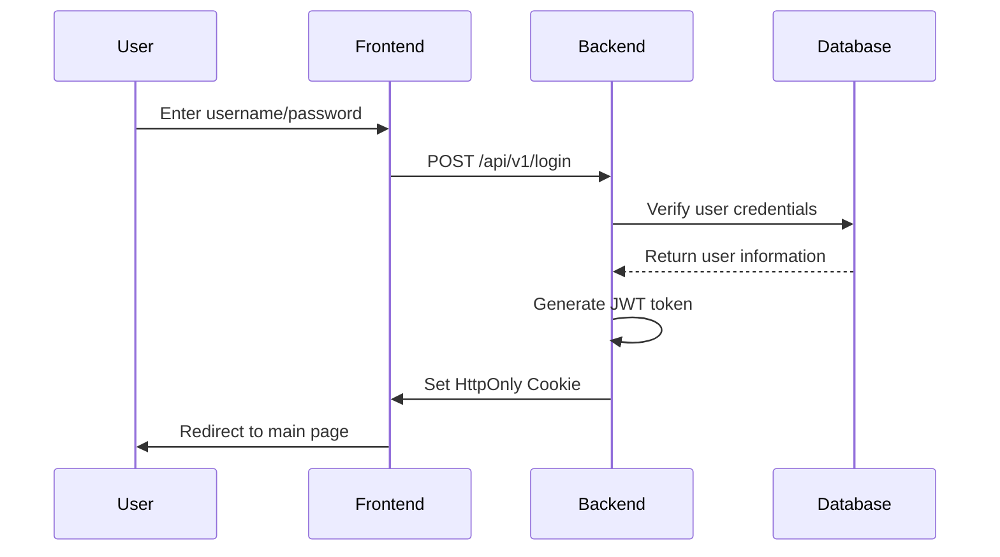
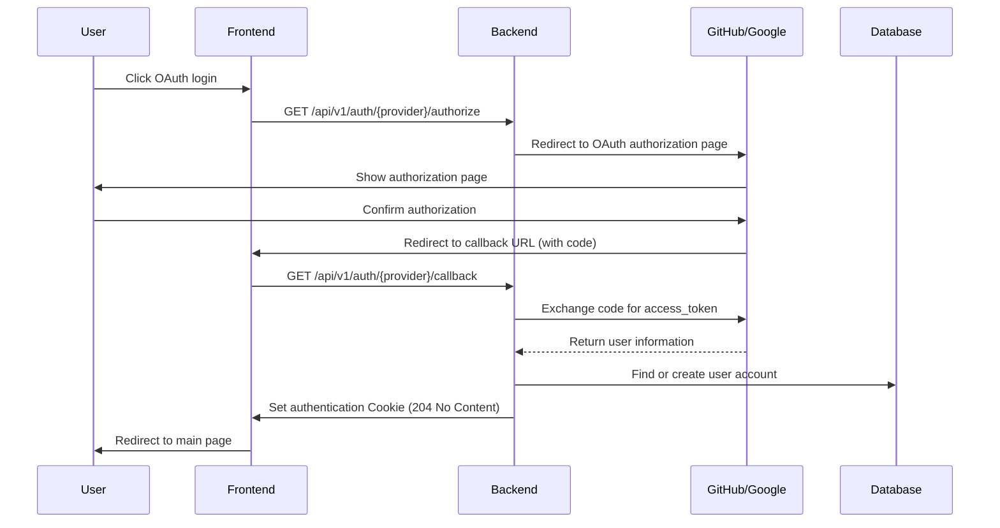

# ApeRAG Authentication System Architecture Documentation

## Overview

ApeRAG adopts a Cookie-based authentication system that supports local username/password authentication and OAuth2 social login (GitHub, Google). The system is built on the FastAPI-Users library, providing complete user management and authentication functionality.

## Core Architecture

### Technology Stack
- **Backend**: FastAPI + FastAPI-Users + SQLAlchemy + PostgreSQL
- **Frontend**: React + TypeScript + Ant Design + UmiJS
- **Authentication**: JWT + HttpOnly Cookie + OAuth 2.0
- **Security**: bcrypt password encryption + CSRF protection

### Authentication Methods
1. **Local Authentication**: Username/password login
2. **OAuth Social Login**: GitHub and Google third-party login
3. **API Key Authentication**: For programmatic access

## Data Models

### User Table (User)
```python
class User(Base):
    id: str                    # User ID
    username: str              # Username (unique)
    email: str                 # Email (unique)
    hashed_password: str       # bcrypt encrypted password
    role: Role                 # User role (ADMIN/RW/RO)
    is_active: bool            # Is active
    is_verified: bool          # Is verified
    date_joined: datetime      # Registration time
```

### OAuth Account Table (OAuthAccount)
```python
class OAuthAccount(Base):
    id: str                    # OAuth account ID
    user_id: str               # Associated user ID
    oauth_name: str            # OAuth provider name
    account_id: str            # Third-party account ID
    account_email: str         # Third-party account email
    access_token: str          # Access token
```

### API Key Table (ApiKey)
```python
class ApiKey(Base):
    id: str                    # API key ID
    key: str                   # API key value
    user: str                  # Associated user ID
    description: str           # Description
    status: ApiKeyStatus       # Status (ACTIVE/DELETED)
    is_system: bool            # Is system generated
    last_used_at: datetime     # Last used time
```

## Authentication Flow

### 1. Local Authentication Flow



### 2. OAuth Authentication Flow



Reference: https://github.com/fastapi-users/fastapi-users/issues/434

#### OAuth API Description

OAuth authentication involves two key APIs that are automatically generated by FastAPI-Users:

1. **Authorization Endpoint** (`/api/v1/auth/{provider}/authorize`)
   - Generates OAuth authorization URL
   - Includes state parameter to prevent CSRF attacks
   - Redirects user to third-party OAuth provider

2. **Callback Endpoint** (`/api/v1/auth/{provider}/callback`)
   - Handles OAuth provider callback requests
   - Exchanges authorization code for access token
   - Retrieves user information and creates/logs in user
   - Sets authentication Cookie and returns 204 No Content

## Core Components

### 1. FastAPI-Users Configuration

#### JWT Strategy
```python
COOKIE_MAX_AGE = 86400  # 24 hours

def get_jwt_strategy() -> JWTStrategy:
    return JWTStrategy(secret=settings.jwt_secret, lifetime_seconds=COOKIE_MAX_AGE)
```

#### Cookie Transport
```python
cookie_transport = CookieTransport(
    cookie_name="session", 
    cookie_max_age=COOKIE_MAX_AGE,
    cookie_secure=False,      # Set to False in development
    cookie_httponly=True,     # Prevent XSS attacks
    cookie_samesite="lax"     # Prevent CSRF attacks
)
```

#### Authentication Backend
```python
auth_backend = AuthenticationBackend(
    name="cookie",
    transport=cookie_transport,
    get_strategy=get_jwt_strategy,
)
```

### 2. User Manager
```python
class UserManager(BaseUserManager[User, str]):
    async def on_after_register(self, user: User, request: Optional[Request] = None):
        # Set first registered user as admin
        user_count = await async_db_ops.query_user_count()
        if user_count == 1 and user.role != Role.ADMIN:
            user.role = Role.ADMIN
```

### 3. OAuth Client Configuration
```python
# GitHub OAuth
if is_github_oauth_enabled():
    github_oauth_client = GitHubOAuth2(
        settings.github_oauth_client_id, 
        settings.github_oauth_client_secret
    )
    github_oauth_router = get_oauth_router(
        github_oauth_client,
        auth_backend,
        get_user_manager,
        settings.jwt_secret,
        redirect_url=settings.oauth_redirect_url,  # Callback URL configuration
        associate_by_email=True,                   # Associate accounts by email
        is_verified_by_default=True,               # Verify users by default
    )
```

#### OAuth Route Generation
FastAPI-Users' `get_oauth_router` function automatically generates the following routes:
- `GET /auth/{provider}/authorize` - Get authorization URL
- `GET /auth/{provider}/callback` - Handle OAuth callback

## API Interfaces

### Authentication Related Interfaces

#### 1. Get Configuration Information
```http
GET /api/v1/config
```
**Response**: Configuration information containing available login methods

#### 2. Local Login
```http
POST /api/v1/login
Content-Type: application/json

{
  "username": "user@example.com",
  "password": "password123"
}
```
**Response**: User information + set session cookie

#### 3. User Registration
```http
POST /api/v1/register
Content-Type: application/json

{
  "username": "newuser",
  "email": "user@example.com", 
  "password": "password123",
  "token": "invitation_token"  // Required for invitation mode
}
```

#### 4. Logout
```http
POST /api/v1/logout
```
**Response**: Clear session cookie

#### 5. Get Current User
```http
GET /api/v1/user
Cookie: session=jwt_token
```

#### 6. Change Password
```http
POST /api/v1/change-password
Content-Type: application/json

{
  "username": "user@example.com",
  "old_password": "old_password",
  "new_password": "new_password"
}
```

### OAuth Interfaces

#### 1. OAuth Authorization
```http
GET /api/v1/auth/{provider}/authorize
```
**Response**: 
```json
{
  "authorization_url": "https://github.com/login/oauth/authorize?..."
}
```

#### 2. OAuth Callback
```http
GET /api/v1/auth/{provider}/callback?code=xxx&state=yyy
```
**Response**: 204 No Content + set authentication Cookie

**Note**: These two OAuth APIs are automatically generated by FastAPI-Users and do not need manual implementation.

### User Management Interfaces

#### 1. List Users
```http
GET /api/v1/users
```

#### 2. Delete User
```http
DELETE /api/v1/users/{user_id}
```

## Frontend Implementation

### 1. Login Page (`signin.tsx`)

#### Core Features
- Dynamically get available login methods
- Local login form handling
- OAuth login button handling

#### OAuth Login Implementation
```typescript
// GitHub login
onClick={async () => {
  try {
    localStorage.setItem('oauth_provider', 'github');
    const response = await fetch('/api/v1/auth/github/authorize');
    const data = await response.json();
    if (data.authorization_url) {
      window.location.href = data.authorization_url;
    }
  } catch (error) {
    console.error('GitHub OAuth error:', error);
  }
}}
```

### 2. OAuth Callback Page (`oauth-callback.tsx`)

#### Core Features
- Parse URL parameters (code, state, etc.)
- Determine OAuth provider
- Call backend callback interface
- Handle authentication results

#### Implementation Logic
```typescript
const handleOAuth = async () => {
  // Get OAuth parameters
  const code = searchParams.get('code');
  const state = searchParams.get('state');
  
  // Determine provider
  let provider = localStorage.getItem('oauth_provider') || 'github';
  
  // Call callback interface
  const callbackUrl = `/api/v1/auth/${provider}/callback?code=${code}&state=${state}`;
  const response = await fetch(callbackUrl, {
    method: 'GET',
    credentials: 'include',
  });
  
  // Handle response
  if (response.status === 204) {
    navigate('/');  // Authentication successful
  }
};
```

## Authentication Middleware

### 1. Current User Retrieval
```python
async def current_user(
    request: Request, 
    session: AsyncSessionDep, 
    user: User = Depends(fastapi_users.current_user(optional=True))
) -> Optional[User]:
    # Prioritize JWT/Cookie authentication
    if user:
        return user
    
    # Fallback to API Key authentication
    api_user = await authenticate_api_key(request, session)
    if api_user:
        return api_user
    
    return None
```

### 2. API Key Authentication
```python
async def authenticate_api_key(request: Request, session: AsyncSessionDep) -> Optional[User]:
    authorization = request.headers.get("Authorization")
    if not authorization or not authorization.startswith("Bearer "):
        return None
    
    api_key = authorization.split(" ")[1]
    # Find and validate API Key
    # Update last used time
    # Return associated user
```

## Configuration

### Environment Variables
```bash
# JWT secret
JWT_SECRET=your-super-secret-key

# OAuth callback URL
OAUTH_REDIRECT_URL=http://127.0.0.1:3000/web/oauth-callback

# GitHub OAuth
GITHUB_OAUTH_CLIENT_ID=your-github-client-id
GITHUB_OAUTH_CLIENT_SECRET=your-github-client-secret

# Google OAuth  
GOOGLE_OAUTH_CLIENT_ID=your-google-client-id
GOOGLE_OAUTH_CLIENT_SECRET=your-google-client-secret

# Registration mode
REGISTER_MODE=invitation  # unlimited/invitation
```

### OAuth Application Configuration

OAuth providers need to configure the following key information:

#### Required Configuration Items
- **Client ID**: OAuth application client identifier
- **Client Secret**: OAuth application client secret
- **Callback URL**: Callback address after OAuth authorization completion
- **Scopes**: Requested permission scope (usually includes user basic information and email)

#### GitHub OAuth Application Configuration
1. Visit [GitHub Developer Settings](https://github.com/settings/developers)
2. Click "New OAuth App" to create a new application
3. Fill in application information:
   - **Application name**: ApeRAG
   - **Homepage URL**: `http://127.0.0.1:3000`
   - **Authorization callback URL**: `http://127.0.0.1:3000/web/oauth-callback`
4. Get Client ID and Client Secret after creation
5. Default permission scope: `user:email` (get user basic information and email)

#### Google OAuth Application Configuration
1. Visit [Google Cloud Console](https://console.cloud.google.com/)
2. Create a project or select an existing project
3. Enable Google+ API or Google People API
4. Create OAuth 2.0 client ID:
   - Application type: Web application
   - Authorized redirect URI: `http://127.0.0.1:3000/web/oauth-callback`
5. Get client ID and client secret
6. Default permission scope: `openid email profile` (get user basic information)

#### Callback URL Description
- Callback URL must match exactly with OAuth application configuration
- Development environment: `http://127.0.0.1:3000/web/oauth-callback`
- Production environment: `https://yourdomain.com/web/oauth-callback`
- ApeRAG frontend BASE_PATH is `/web`, so callback URL includes this prefix

## Security Features

### 1. JWT Token Security
- Strong key signing (HMAC-SHA256)
- 24-hour validity period
- HttpOnly Cookie transmission, prevents XSS
- SameSite=Lax, prevents CSRF

### 2. Password Security
- bcrypt encryption storage
- Random salt values
- Password strength validation

### 3. OAuth Security
- State parameter prevents CSRF
- Standard authorization code flow
- Secure token storage

### 4. API Key Security
- Random generation (sk- prefix)
- Usage tracking
- Status management

## Permission Control

### User Roles
- **ADMIN**: Administrator, has all permissions
- **RW**: Read-write user, can create and modify resources
- **RO**: Read-only user, can only view resources

### Permission Check
```python
async def get_current_admin(user: User = Depends(get_current_active_user)) -> User:
    if user.role != Role.ADMIN:
        raise HTTPException(status_code=403, detail="Only admin members can perform this action")
    return user
```

## Registration Modes

### 1. Open Registration (unlimited)
- Anyone can register directly
- First registered user automatically becomes administrator

### 2. Invitation Registration (invitation)
- Requires administrator to send invitation
- Validated through invitation token

## Troubleshooting

### Common Issues

#### 1. OAuth Callback Failure
- Check if callback URL configuration matches
- Verify OAuth application configuration
- Check browser console logs

#### 2. Cookie Authentication Failure
- Check JWT_SECRET configuration
- Verify Cookie domain settings
- Confirm browser Cookie policy

#### 3. API Key Authentication Failure
- Verify Authorization header format: `Bearer sk-xxx`
- Check API Key status
- Confirm user association relationship

### Debugging Methods
1. Check backend logs: `tail -f logs/aperag.log`
2. Check browser developer tools
3. Verify database user and OAuth account data
4. Test API interface responses

## Summary

The ApeRAG authentication system is built on FastAPI-Users, providing secure and flexible multiple authentication methods. The system supports local authentication and OAuth social login, adopts JWT+Cookie stateless authentication mechanism, and has good security and scalability. Through reasonable permission control and registration mode configuration, it can meet the usage requirements of different scenarios.
