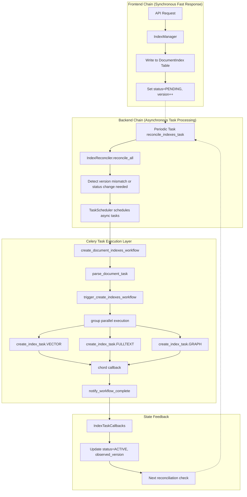

# ApeRAG Indexing Pipeline Architecture Design

## Overview

ApeRAG's indexing pipeline architecture adopts a dual-chain design pattern, separating index management into Frontend Chain and Backend Chain, implementing asynchronous document indexing through state-driven reconciliation. The frontend chain handles fast user operation responses and sets desired index states, while the backend chain detects state differences through a periodic reconciler and schedules asynchronous tasks to execute actual indexing operations.

> 🚀 **Deep Dive**: To understand the detailed Graph Index creation process, continue reading [Graph Index Creation Process Technical Documentation](./graph_index_creation.md)

## Architecture Overview



## Core Design Principles

### 1. Dual Chain Separation

**Frontend Chain**：
- **Goal**: Fast response to user operations without blocking API requests
- **Implementation**: Only operates on database tables, sets desired state, returns immediately
- **Code**: `IndexManager` in `aperag/index/manager.py`

**Backend Chain**：
- **Goal**: Asynchronously execute time-consuming indexing operations with retry and error recovery support
- **Implementation**: Continuously scans state differences through periodic tasks and schedules async tasks
- **Code**: `IndexReconciler` in `aperag/index/reconciler.py`

### 2. Single Status State-Driven Reconciliation

Records index state and version for each document index through the `DocumentIndex` database table:

```python
class DocumentIndex(BaseModel):
    document_id: str
    index_type: DocumentIndexType  # VECTOR/FULLTEXT/GRAPH
    status: DocumentIndexStatus    # PENDING/CREATING/ACTIVE/DELETING/DELETION_IN_PROGRESS/FAILED
    version: int                   # Version number, increment to trigger rebuild
    observed_version: int          # Last processed version
```

Key Status Meanings:
- **PENDING**: Awaiting processing (create/update needed)
- **CREATING**: Task claimed, creation/update in progress
- **ACTIVE**: Index is up-to-date and ready for use
- **DELETING**: Deletion has been requested
- **DELETION_IN_PROGRESS**: Task claimed, deletion in progress
- **FAILED**: The last operation failed

The reconciler periodically scans all records and triggers corresponding operations based on:
- Version mismatch: `observed_version < version` indicates need for update
- Version = 1 with observed_version = 0: indicates need for initial creation
- Status = DELETING: indicates need for deletion

### 3. TaskScheduler Abstraction Layer Design

**Design Advantages**：
- **Business Logic and Task System Decoupling**: Reconciler only cares about "what operations to execute", not "what system to execute with"
- **Multi-scheduler Support**: Can switch between Celery, Prefect/Airflow and other workflow engines
- **Test-friendly**: Can use different schedulers for testing environments

```python
# Abstract interface
class TaskScheduler(ABC):
    def schedule_create_index(self, document_id: str, index_types: List[str], context: dict = None) -> str
    def schedule_update_index(self, document_id: str, index_types: List[str], context: dict = None) -> str  
    def schedule_delete_index(self, document_id: str, index_types: List[str]) -> str

# Reconciler uses abstract interface
class IndexReconciler:
    def __init__(self, scheduler_type: str = "celery"):
        self.task_scheduler = create_task_scheduler(scheduler_type)
    
    def _reconcile_document_operations(self, document_id: str, claimed_indexes: List[dict]):
        # Only calls abstract interface, doesn't care about specific implementation
        if create_types:
            self.task_scheduler.schedule_create_index(document_id, create_types, context)
        if update_types:
            self.task_scheduler.schedule_update_index(document_id, update_types, context)
```

**Celery Task Entry Point and Business Code Separation**：
- Celery task functions (`config/celery_tasks.py`): Handle task scheduling, parameter serialization, error retry
- Business logic (`aperag/tasks/document.py`): Handle specific index creation logic
- This separation enables independent testing of business logic and facilitates migration between different task systems

### 4. Create vs Update Operation Distinction

The system clearly distinguishes between create and update operations:

**Create Operations** (version = 1, observed_version = 0):
- For new documents or new index types
- Uses `schedule_create_index` and `create_index_task`
- Initial index creation from scratch

**Update Operations** (version > 1, observed_version < version):
- For existing indexes that need rebuilding
- Uses `schedule_update_index` and `update_index_task`
- Updates existing index with new content

This distinction allows for different processing strategies and optimizations for each operation type.

## Asynchronous Task System

### Current Asynchronous Task List

ApeRAG currently defines the following asynchronous tasks, each with clear responsibility division:

| Task Name | Function | Retry Count | Location |
|-----------|----------|-------------|----------|
| `parse_document_task` | Parse document content, extract text and metadata | 3 times | config/celery_tasks.py |
| `create_index_task` | Create single type index (VECTOR/FULLTEXT/GRAPH) | 3 times | config/celery_tasks.py |
| `update_index_task` | Update single type index | 3 times | config/celery_tasks.py |
| `delete_index_task` | Delete single type index | 3 times | config/celery_tasks.py |
| `trigger_create_indexes_workflow` | Dynamic fan-out for index creation tasks | No retry | config/celery_tasks.py |
| `trigger_update_indexes_workflow` | Dynamic fan-out for index update tasks | No retry | config/celery_tasks.py |
| `trigger_delete_indexes_workflow` | Dynamic fan-out for index deletion tasks | No retry | config/celery_tasks.py |
| `notify_workflow_complete` | Aggregate workflow results and notify completion | No retry | config/celery_tasks.py |
| `reconcile_indexes_task` | Periodic reconciler task | No retry | config/celery_tasks.py |

### Task Design Principles

1. **Fine-grained Tasks**: Each index type (VECTOR/FULLTEXT/GRAPH) is an independent task, supporting individual retries
2. **Dynamic Orchestration**: Use trigger tasks to decide which index tasks to execute at runtime
3. **Layered Retry**: Business tasks support retry, orchestration tasks don't retry
4. **State Callbacks**: Each task calls back to update database state upon completion
5. **Version Validation**: Tasks validate version numbers to prevent stale operations

### Concurrent Execution Design

#### Celery Group + Chord Pattern

Use Celery's `group` for parallel execution and `chord` for result aggregation:

```python
# Group: Execute multiple index tasks in parallel with context
parallel_index_tasks = group([
    create_index_task.s(document_id, index_type, parsed_data_dict, context)
    for index_type in index_types
])

# Chord: Execute callback after all parallel tasks complete
workflow_chord = chord(
    parallel_index_tasks,
    notify_workflow_complete.s(document_id, "create", index_types)
)
```

#### Task Chaining Mechanism

Use Celery's `chain` for task chaining and `signature` for parameter passing:

```python
# Chained execution: parse -> dynamic fan-out with context
workflow_chain = chain(
    parse_document_task.s(document_id),
    trigger_create_indexes_workflow.s(document_id, index_types, context)
)
```

#### Parameter Passing and Context Flow

```python
# Context includes version information for each index type
context = {
    "VECTOR_version": 2,
    "FULLTEXT_version": 1,
    "GRAPH_version": 3
}

# Each index task extracts its specific version from context
def create_index_task(document_id, index_type, parsed_data_dict, context):
    target_version = context.get(f'{index_type}_version')
    # Validate version before processing
```

## Specific Execution Flow Examples

### Index Creation Execution Flow

Taking user document upload triggering index creation as example:

```python
# 1. Frontend Chain (Synchronous, millisecond-level)
API Call -> IndexManager.create_indexes()
    ↓
Write DocumentIndex table records:
{
    document_id: "doc123",
    index_type: "VECTOR", 
    status: "PENDING",
    version: 1,
    observed_version: 0
}
    ↓ 
API returns 200 immediately

# 2. Backend Chain (Asynchronous, minute-level)
Periodic task reconcile_indexes_task (executes every 30 seconds) 
    ↓
IndexReconciler.reconcile_all()
    ↓
Detects version=1, observed_version=0 (create operation needed)
    ↓
CeleryTaskScheduler.schedule_create_index(doc123, ["VECTOR", "FULLTEXT", "GRAPH"], context)
    ↓
create_document_indexes_workflow.delay()

# 3. Celery Task Execution (Asynchronous, minutes to hours)
parse_document_task("doc123")
├── Download document file to local temp directory
├── Call docparser to parse document content  
├── Return ParsedDocumentData.to_dict()
└── Update status="CREATING"
    ↓
trigger_create_indexes_workflow(parsed_data, "doc123", ["VECTOR", "FULLTEXT", "GRAPH"], context)
├── Create group parallel tasks with version context
└── Start chord waiting
    ↓
Parallel execution:
├── create_index_task("doc123", "VECTOR", parsed_data, context)
│   ├── Extract VECTOR_version from context
│   ├── Validate version still matches database
│   ├── Call vector_indexer.create_index()
│   ├── Generate embeddings and store in vector database
│   └── Callback IndexTaskCallbacks.on_index_created(target_version)
├── create_index_task("doc123", "FULLTEXT", parsed_data, context)  
│   ├── Extract FULLTEXT_version from context
│   ├── Validate version still matches database
│   ├── Call fulltext_indexer.create_index()
│   ├── Build full-text search index
│   └── Callback IndexTaskCallbacks.on_index_created(target_version)
└── create_index_task("doc123", "GRAPH", parsed_data, context)
    ├── Extract GRAPH_version from context
    ├── Validate version still matches database
    ├── Call graph_indexer.create_index()
    ├── Build knowledge graph
    └── Callback IndexTaskCallbacks.on_index_created(target_version)
    ↓
notify_workflow_complete([result1, result2, result3], "doc123", "create", ["VECTOR", "FULLTEXT", "GRAPH"])
├── Aggregate all index task results
├── Log workflow completion
└── Return WorkflowResult
```

### Index Update Execution Flow

User modifies document content triggering index update:

```python
# 1. Frontend Chain
API Call -> IndexManager.rebuild_indexes()
    ↓
All existing index records version field +1:
version: 1 -> 2 (triggers rebuild)
    ↓
API returns immediately

# 2. Backend Chain
reconcile_indexes_task detects version mismatch
    ↓
version=2, observed_version=1, version > 1 (update operation needed)
    ↓
schedule_update_index() -> update_document_indexes_workflow()

# 3. Task Execution (similar to creation but with update tasks)
parse_document_task -> trigger_update_indexes_workflow -> parallel update_index_task
```

### Index Deletion Execution Flow

User deletes document triggering index deletion:

```python
# 1. Frontend Chain  
API Call -> IndexManager.delete_indexes()
    ↓
Set status="DELETING"
    ↓
API returns immediately

# 2. Backend Chain
Detects status=DELETING
    ↓
schedule_delete_index() -> delete_document_indexes_workflow()

# 3. Task Execution (no parsing needed)
trigger_delete_indexes_workflow -> parallel delete_index_task
├── Delete embeddings from vector database
├── Delete documents from full-text search engine
└── Delete nodes and relationships from knowledge graph
```

## Exception Handling Mechanism

### Task-level Exception Handling

Each Celery task is configured with automatic retry:

```python
@current_app.task(bind=True, autoretry_for=(Exception,), retry_kwargs={'max_retries': 3, 'countdown': 60})
def create_index_task(self, document_id: str, index_type: str, parsed_data_dict: dict, context: dict = None):
    try:
        # Extract and validate version from context
        target_version = context.get(f'{index_type}_version') if context else None
        
        # Double-check version still matches database before processing
        # ... version validation logic ...
        
        # Business logic
        result = document_index_task.create_index(document_id, index_type, parsed_data)
        if result.success:
            self._handle_index_success(document_id, index_type, target_version, result.data)
        else:
            # Business logic failure but don't throw exception to avoid meaningless retry
            if self.request.retries >= self.max_retries:
                self._handle_index_failure(document_id, index_type, result.error)
        return result.to_dict()
    except Exception as e:
        # Only mark as failed after retry attempts are exhausted
        if self.request.retries >= self.max_retries:
            self._handle_index_failure(document_id, index_type, str(e))
        raise  # Continue throwing exception to trigger retry
```

### Workflow-level Exception Handling

Aggregate errors through `notify_workflow_complete`:

```python
def notify_workflow_complete(self, index_results: List[dict], document_id: str, operation: str, index_types: List[str]):
    successful_tasks = []
    failed_tasks = []
    
    for result_dict in index_results:
        result = IndexTaskResult.from_dict(result_dict)
        if result.success:
            successful_tasks.append(result.index_type)
        else:
            failed_tasks.append(f"{result.index_type}: {result.error}")
    
    # Determine overall status
    if not failed_tasks:
        status = TaskStatus.SUCCESS  # All successful
    elif successful_tasks:
        status = TaskStatus.PARTIAL_SUCCESS  # Partial success
    else:
        status = TaskStatus.FAILED  # All failed
```

### State Management and Error Recovery

Track errors through database state with version validation:

```python
class IndexTaskCallbacks:
    @staticmethod
    def on_index_created(document_id: str, index_type: str, target_version: int, index_data: str = None):
        """Task success callback with version validation"""
        # Use atomic update with version validation
        update_stmt = (
            update(DocumentIndex)
            .where(
                and_(
                    DocumentIndex.document_id == document_id,
                    DocumentIndex.index_type == DocumentIndexType(index_type),
                    DocumentIndex.status == DocumentIndexStatus.CREATING,
                    DocumentIndex.version == target_version,  # Critical: validate version
                )
            )
            .values(
                status=DocumentIndexStatus.ACTIVE,
                observed_version=target_version,  # Mark this version as processed
                index_data=index_data,
                error_message=None,
            )
        )
```

### Error Recovery Strategies

1. **Automatic Retry**: Task-level 3 automatic retries to handle temporary network or resource issues
2. **Version Validation**: Prevents stale operations through version checking at task execution time
3. **State Reset**: Users can manually reset failed state to trigger re-execution
4. **Partial Retry**: Only retry failed index types without affecting successful indexes
5. **Degraded Handling**: Some index failures don't affect document searchability (e.g., graph index failure but vector index success)

## Code Organization Structure

### Directory Structure

```
aperag/
├── index/                    # Index management core module
│   ├── manager.py           # Index manager (frontend operations)
│   ├── reconciler.py        # Backend reconciler
│   ├── base.py             # Indexer base class definition
│   ├── vector_index.py     # Vector index implementation
│   ├── fulltext_index.py   # Full-text index implementation
│   └── graph_index.py      # Graph index implementation
├── tasks/                   # Task-related modules
│   ├── models.py           # Task data structure definitions
│   ├── scheduler.py        # Task scheduler abstraction layer
│   ├── document.py         # Document processing business logic
│   └── utils.py            # Task utility functions
└── db/
    └── models.py           # Database model definitions

config/
└── celery_tasks.py         # Celery task definitions
```

### Core Interface Design

#### Index Management Interface
```python
# aperag/index/manager.py
class IndexManager:
    def create_indexes(self, document_id, index_types, created_by, session)
    def rebuild_indexes(self, document_id, index_types, created_by, session) 
    def delete_indexes(self, document_id, index_types, session)
```

#### Reconciler Interface
```python
# aperag/index/reconciler.py
class IndexReconciler:
    def reconcile_all(self)  # Main reconciliation loop
    def _get_indexes_needing_reconciliation(self, session)  # Get indexes needing reconciliation
    def _reconcile_single_document(self, document_id, operations)  # Process single document
```

#### Indexer Interface
```python
# aperag/index/base.py
class BaseIndexer(ABC):
    def create_index(self, document_id, content, doc_parts, collection, **kwargs)
    def update_index(self, document_id, content, doc_parts, collection, **kwargs)
    def delete_index(self, document_id, collection, **kwargs)
    def is_enabled(self, collection)
```

### Data Flow Design

#### Task Data Structures
```python
# aperag/tasks/models.py
@dataclass
class ParsedDocumentData:
    """Document parsing result, carries data needed by all index tasks"""
    document_id: str
    collection_id: str
    content: str              # Parsed text content
    doc_parts: List[Any]      # Chunked document segments
    file_path: str           # Local file path
    local_doc_info: LocalDocumentInfo  # Temporary file information

@dataclass 
class IndexTaskResult:
    """Single index task execution result"""
    status: TaskStatus
    index_type: str
    document_id: str
    success: bool
    data: Optional[Dict[str, Any]]    # Index metadata (e.g., vector count)
    error: Optional[str]

@dataclass
class WorkflowResult:
    """Entire workflow execution result"""
    workflow_id: str
    document_id: str
    operation: str            # create/update/delete
    status: TaskStatus
    successful_indexes: List[str]
    failed_indexes: List[str]
    index_results: List[IndexTaskResult]
```

## Current Implementation Status

### Simplified Architecture Features

1. **Removed Distributed Locking**: Current implementation focuses on correctness through version validation rather than distributed locks for external resource concurrency
2. **Single Status Model**: Simplified from dual-state (desired/actual) to single status with version tracking
3. **Clear Operation Separation**: Explicit distinction between create (v=1) and update (v>1) operations
4. **Version-based Validation**: Prevents stale operations through version checking at task execution time

### Future Considerations

1. **Concurrency Control**: While distributed locking has been removed for simplicity, future implementations may need to address concurrent operations on external systems (vector databases, search engines, etc.)
2. **Performance Optimization**: The current architecture prioritizes correctness and simplicity over maximum performance
3. **Monitoring Enhancements**: Additional monitoring and alerting capabilities may be added as the system scales

## Summary

ApeRAG's indexing pipeline architecture achieves efficient document indexing through the following technical design:

### Core Advantages

1. **Fast Response**: Frontend chain only operates on database, API response time controlled at millisecond level
2. **Strong Processing Capability**: Backend asynchronous processing supports large-scale document indexing, improving throughput through parallel tasks
3. **Good Error Recovery**: Multi-level retry mechanisms and version-based state management, supporting graceful handling of partial failure scenarios
4. **Strong System Decoupling**: TaskScheduler abstraction layer decouples business logic from specific task systems
5. **Version Consistency**: Version validation prevents stale operations and ensures data consistency

### Technical Features

1. **State-driven**: Achieves eventual consistency through detection of version mismatches and status changes
2. **Dynamic Orchestration**: Dynamically creates index tasks at runtime based on document parsing results, avoiding static workflow limitations
3. **Batch Optimization**: Multiple index tasks for the same document share parsing results, reducing redundant computation
4. **Layered Design**: Task scheduling, business logic, and index implementation are decoupled in layers for easy testing and maintenance
5. **Operation Distinction**: Clear separation of create vs update operations allows for optimized processing strategies

This architecture provides good performance and scalability support for high-concurrency document indexing scenarios while ensuring system reliability and maintainability.

---

## Related Documents

- 🚀 [Graph Index Creation Process Technical Documentation](./graph_index_creation.md) - Deep dive into the detailed graph index construction process
- 📋 [索引链路架构设计](./indexing_architecture_zh.md) - Chinese Version 