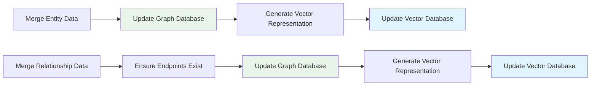
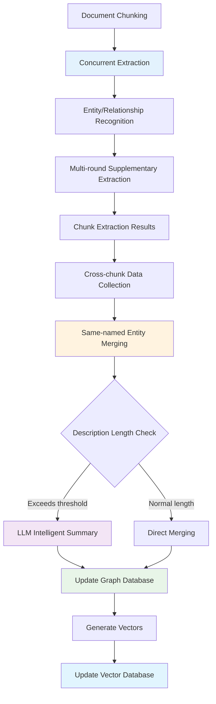

# LightRAG Entity Extraction and Merging Mechanism

> 📖 **Supplementary Reading**: This document is a technical supplement to [Indexing Architecture Design](./indexing_architecture.md), focusing on the entity extraction and merging mechanisms in the Graph Index creation process.

## Overview

This document details the working principles of two core functions in the LightRAG system:
- `extract_entities`: Extract entities and relationships from text chunks
- `merge_nodes_and_edges`: Merge extraction results and update knowledge graph

These two functions constitute the core components of the [Graph Index Creation Process](./graph_index_creation.md), responsible for converting unstructured text into structured knowledge graphs.

## Entity Extraction Mechanism (extract_entities)

### Core Workflow

#### 1. Concurrent Processing Strategy
```python
# Use semaphore to control concurrency, avoiding LLM service overload
semaphore = asyncio.Semaphore(llm_model_max_async)

# Create async tasks for each text chunk
tasks = [
    asyncio.create_task(_process_single_content(chunk, context))
    for chunk in ordered_chunks
]

# Wait for all tasks to complete with exception handling
done, pending = await asyncio.wait(tasks, return_when=asyncio.FIRST_EXCEPTION)
```

**Concurrent Task Input Format**:
```python
# Input for a single processing task
chunk_input = {
    "content": "Text content to process",
    "chunk_key": "chunk_unique_identifier", 
    "file_path": "source_file_path",
    "context": {
        "entity_extraction_prompt": "Entity extraction prompt",
        "continue_extraction_prompt": "Continue extraction prompt",
        "extraction_config": {...}
    }
}
```

**Single Task Output Format**:
```python
# Return value of _process_single_content function
task_result = (
    maybe_nodes,    # Dict[str, List[Dict]] - candidate entities
    maybe_edges     # Dict[Tuple[str, str], List[Dict]] - candidate relationships
)

# Example output structure
maybe_nodes = {
    "John": [{
        "entity_name": "John",
        "entity_type": "Person", 
        "description": "Chief Technology Officer",
        "source_id": "chunk_001",
        "file_path": "/docs/company.txt"
    }],
    "ABC Corp": [{
        "entity_name": "ABC Corp",
        "entity_type": "Organization",
        "description": "Technology company",
        "source_id": "chunk_001", 
        "file_path": "/docs/company.txt"
    }]
}

maybe_edges = {
    ("John", "ABC Corp"): [{
        "src_id": "John",
        "tgt_id": "ABC Corp",
        "weight": 1.0,
        "description": "John is the CTO of ABC Corp",
        "keywords": "work, position, leadership",
        "source_id": "chunk_001",
        "file_path": "/docs/company.txt"
    }]
}
```

#### 2. Multi-round Extraction Mechanism (Gleaning)
LightRAG employs a multi-round extraction strategy to improve entity recognition completeness:

1. **Initial Extraction**: Use entity extraction prompts for first-time extraction
2. **Supplementary Extraction**: Discover missed entities through "continue extraction" prompts
3. **Stop Decision**: LLM autonomously determines whether to continue extraction

```python
for glean_index in range(entity_extract_max_gleaning):
    # Supplementary extraction: only accept new entity names
    glean_result = await use_llm_func(continue_prompt, history_messages=history)
    
    # Merge results (deduplication)
    for entity_name, entities in glean_nodes.items():
        if entity_name not in maybe_nodes:  # Only accept new entities
            maybe_nodes[entity_name].extend(entities)
    
    # Determine whether to continue
    if_continue = await use_llm_func(if_loop_prompt, history_messages=history)
    if if_continue.strip().lower() != "yes":
        break
```

**Initial Extraction Stage Output**:
```python
# Raw results from the first extraction round
initial_extraction = {
    "entities": [
        {
            "entity_name": "John",
            "entity_type": "Person",
            "description": "Chief Technology Officer" 
        },
        {
            "entity_name": "ABC Corp", 
            "entity_type": "Organization",
            "description": "Technology company"
        }
    ],
    "relationships": [
        {
            "src_id": "John",
            "tgt_id": "ABC Corp",
            "description": "Employment relationship",
            "keywords": "employee, company"
        }
    ]
}
```

**Supplementary Extraction Stage Output**:
```python
# Incremental results from each supplementary extraction round
glean_extraction = {
    "round": 2,  # Extraction round number
    "new_entities": [
        {
            "entity_name": "Product Department",  # Must be a completely new entity name
            "entity_type": "Department", 
            "description": "Product development department at ABC Corp"
        }
    ],
    "new_relationships": [
        {
            "src_id": "John",
            "tgt_id": "Product Department",  # Must be a completely new relationship pair
            "description": "Management relationship",
            "keywords": "responsible, manage"
        }
    ],
    "continue_extraction": "no"  # LLM decision on whether to continue
}

# Key Constraints: Gleaning stage only accepts newly discovered entities and relationships
# - Existing entity names are ignored: if entity_name not in maybe_nodes
# - Existing relationship pairs are ignored: if edge_key not in maybe_edges
# - Does NOT supplement or merge descriptions for existing entities
```

**Multi-round Extraction Chunk Result**:
```python
# Complete results after multi-round extraction for a single chunk (gleaning only adds new entities, no merging)
final_chunk_result = {
    "chunk_id": "chunk_001",
    "total_rounds": 2,
    "maybe_nodes": {
        "John": [{  # Entity from initial extraction
            "entity_name": "John",
            "entity_type": "Person",
            "description": "Chief Technology Officer",
            "source_id": "chunk_001",
            "file_path": "/docs/company.txt"
        }],
        "Product Department": [{  # New entity discovered in gleaning stage
            "entity_name": "Product Department",
            "entity_type": "Department", 
            "description": "Product development department at ABC Corp",
            "source_id": "chunk_001",
            "file_path": "/docs/company.txt"
        }]
        # Note: gleaning does NOT merge John's descriptions, only adds new entities
    },
    "maybe_edges": {
        ("John", "ABC Corp"): [{  # Relationship from initial extraction
            "src_id": "John",
            "tgt_id": "ABC Corp",
            "weight": 1.0,
            "description": "John is the CTO of ABC Corp",
            "source_id": "chunk_001"
        }],
        ("John", "Product Department"): [{  # New relationship discovered in gleaning stage
            "src_id": "John",
            "tgt_id": "Product Department",
            "weight": 1.0, 
            "description": "John manages the Product Department",
            "source_id": "chunk_001"
        }]
    }
}

# Important Note: Gleaning Stage Merge Rules
# - Only accepts new entity names: if entity_name not in maybe_nodes
# - Does NOT merge multiple description fragments of existing entities
# - True description merging and weight accumulation happens in merge stage
```

#### 3. Extraction Result Format

**Entity Format**:
```python
{
    "entity_name": "Standardized entity name",
    "entity_type": "Entity type",
    "description": "Entity description",
    "source_id": "chunk_key",
    "file_path": "File path"
}
```

**Relationship Format**:
```python
{
    "src_id": "Source entity",
    "tgt_id": "Target entity", 
    "weight": 1.0,  # Relationship weight, see detailed explanation below
    "description": "Relationship description",
    "keywords": "Keywords",
    "source_id": "chunk_key",
    "file_path": "File path"
}
```

#### Relationship Weight Mechanism Explained

**Weight Purpose**:
- 🎯 **Relationship Strength Indicator**: Higher values indicate stronger or more frequent relationships between entities
- 📊 **Graph Query Optimization**: Prioritize high-weight relationships during retrieval to improve result quality
- 🔍 **Path Computation**: Used as edge importance weights in graph traversal algorithms
- 📈 **Knowledge Evolution**: Track degree of relationship repetition across different documents

**Initial Weight Calculation**:
```python
# Each newly extracted relationship defaults to weight 1.0
initial_weight = 1.0

# Special case: LLM may output relationships with weights
if "weight" in extracted_relation:
    initial_weight = float(extracted_relation["weight"])
else:
    initial_weight = 1.0  # Default base weight
```

**Weight Accumulation Rules**:
- ✅ **Within-Document Repetition**: Same relationship appearing in different chunks of the same document accumulates weight
- 🔄 **Cross-Document Reinforcement**: Same relationship appearing in different documents continues to accumulate weight
- 📊 **Frequency Reflection**: Final weight = total occurrences of the relationship across all documents

**Weight Calculation Example**:
```python
# Suppose relationship "John" -> "works_at" -> "ABC Corp" appears in:
# Document1, chunk1: weight = 1.0
# Document1, chunk3: weight = 1.0  
# Document2, chunk1: weight = 1.0
# Final weight: 1.0 + 1.0 + 1.0 = 3.0

final_weight = sum([edge["weight"] for edge in same_relation_edges])
```

### Key Design Features

#### Independent Chunk Processing
Each text chunk is independently extracted, with results returned as:
```python
chunk_results = [
    (chunk1_nodes, chunk1_edges),  # First chunk extraction results
    (chunk2_nodes, chunk2_edges),  # Second chunk extraction results
    # ... more chunk results
]
```

**Design Advantages**:
- 🚀 **Concurrent Efficiency**: Text chunks can be processed completely in parallel
- 💾 **Memory Friendly**: Avoid building huge intermediate merged results
- 🛡️ **Error Isolation**: Single chunk failure doesn't affect other chunks
- 🔧 **Processing Flexibility**: Different strategies can be applied to different chunks

**Data Characteristics**:
- ⚠️ **Contains Duplicates**: Same entity may be repeatedly extracted across multiple chunks
- 📊 **Scattered Data**: Complete entity information is scattered across different chunks

#### Gleaning vs Merge Stage Differences

**Gleaning Stage (within chunk)**:
- 🎯 **Goal**: Discover more entities and relationships within a single chunk
- 🔍 **Strategy**: Only add newly discovered entity names and relationship pairs
- ❌ **No Merging**: Does not merge descriptions of existing entities or accumulate relationship weights
- 📝 **Code Logic**: `if entity_name not in maybe_nodes` 

**Merge Stage (cross-chunk)**:
- 🎯 **Goal**: Merge all chunk results into final knowledge graph
- 🔍 **Strategy**: Merge all description fragments of same-named entities, accumulate relationship weights
- ✅ **Complete Merging**: Description concatenation, weight accumulation, intelligent summarization
- 📝 **Code Logic**: `all_nodes[entity_name].extend(entities)`

## Entity Merging Mechanism (merge_nodes_and_edges)

### Core Merging Strategy

#### 1. Cross-Chunk Data Collection
```python
# Collect all same-named entities and relationships
all_nodes = defaultdict(list)  # {entity_name: [entity1, entity2, ...]}
all_edges = defaultdict(list)  # {(src, tgt): [edge1, edge2, ...]}

for maybe_nodes, maybe_edges in chunk_results:
    # Merge same-named entities
    for entity_name, entities in maybe_nodes.items():
        all_nodes[entity_name].extend(entities)
    
    # Merge same-direction relationships
    for edge_key, edges in maybe_edges.items():
        sorted_key = tuple(sorted(edge_key))  # Unify direction
        all_edges[sorted_key].extend(edges)
```

**Data Collection Stage Input Format**:
```python
# Collection of extraction results from multiple chunks
chunk_results = [
    # Results from Chunk 1
    (chunk1_maybe_nodes, chunk1_maybe_edges),
    # Results from Chunk 2  
    (chunk2_maybe_nodes, chunk2_maybe_edges),
    # ... more chunk results
]

# Example single chunk result
chunk1_maybe_nodes = {
    "John": [{
        "entity_name": "John",
        "entity_type": "Person",
        "description": "Chief Technology Officer",
        "source_id": "chunk_001"
    }]
}

chunk2_maybe_nodes = {
    "John": [{  # Same entity repeated in different chunks
        "entity_name": "John", 
        "entity_type": "Person",
        "description": "Product Manager",
        "source_id": "chunk_002"
    }]
}
```

**Data Collection Stage Output Format**:
```python
# Aggregated data after cross-chunk collection
all_nodes = {
    "John": [
        {
            "entity_name": "John",
            "entity_type": "Person", 
            "description": "Chief Technology Officer",
            "source_id": "chunk_001",
            "file_path": "/docs/company.txt"
        },
        {
            "entity_name": "John",
            "entity_type": "Person",
            "description": "Product Manager", 
            "source_id": "chunk_002",
            "file_path": "/docs/company.txt"
        }
        # Multiple description fragments of the same entity awaiting merge
    ],
    "ABC Corp": [
        {
            "entity_name": "ABC Corp",
            "entity_type": "Organization",
            "description": "Technology company",
            "source_id": "chunk_001"
        }
    ]
}

all_edges = {
    ("ABC Corp", "John"): [  # Key sorted to unify direction
        {
            "src_id": "John",
            "tgt_id": "ABC Corp", 
            "weight": 1.0,
            "description": "Employment relationship",
            "source_id": "chunk_001"
        },
        {
            "src_id": "John",
            "tgt_id": "ABC Corp",
            "weight": 1.0, 
            "description": "Management relationship",
            "source_id": "chunk_002"
        }
        # Multiple occurrences of same relationship awaiting weight accumulation
    ]
}
```

#### 2. Entity Merging Rules

**Type Selection**: Choose the most frequently occurring entity type
```python
entity_type = Counter([
    entity["entity_type"] for entity in entities
]).most_common(1)[0][0]
```

**Description Merging**: Use separators to join, deduplicate and sort
```python
descriptions = [entity["description"] for entity in entities]
if existing_entity:
    descriptions.extend(existing_entity["description"].split(GRAPH_FIELD_SEP))

merged_description = GRAPH_FIELD_SEP.join(sorted(set(descriptions)))
```

**Intelligent Summarization**: Automatically generate summaries when description fragments are too many
```python
fragment_count = merged_description.count(GRAPH_FIELD_SEP) + 1

if fragment_count >= force_llm_summary_threshold:
    # Use LLM to generate summary, compress long descriptions
    merged_description = await llm_summarize(
        entity_name, merged_description, max_tokens
    )
```

#### 3. Relationship Merging Rules

**Weight Accumulation**: Reflect enhancement of relationship strength
```python
total_weight = sum([edge["weight"] for edge in edges])
if existing_edge:
    total_weight += existing_edge["weight"]
```

**Description Aggregation**: Similar to entity description merging strategy
```python
# Relationship description merging example
edge_descriptions = [edge["description"] for edge in edges]
if existing_edge:
    edge_descriptions.extend(existing_edge["description"].split(GRAPH_FIELD_SEP))

merged_description = GRAPH_FIELD_SEP.join(sorted(set(edge_descriptions)))
```

**Keyword Deduplication**: Extract and merge all keywords
```python
# Keyword merging example
all_keywords = []
for edge in edges:
    if edge.get("keywords"):
        all_keywords.extend(edge["keywords"].split(", "))

merged_keywords = ", ".join(sorted(set(all_keywords)))
```

**Final Merging Rules Output Format**:

**Entity Merging Output**:
```python
# Final entity format after merging rules processing
merged_entity = {
    "entity_name": "John",
    "entity_type": "Person",  # Type selected based on frequency
    "description": "Chief Technology Officer§Product Manager§Project Manager",  # Descriptions joined with § separator
    "source_chunks": ["chunk_001", "chunk_002", "chunk_003"],  # Source chunk list
    "file_paths": ["/docs/company.txt", "/docs/team.txt"],  # Source file list
    "mention_count": 3,  # Number of chunks mentioning this entity
    "created_at": "2024-01-01T00:00:00Z",
    "updated_at": "2024-01-01T12:00:00Z"
}
```

**Relationship Merging Output**:
```python
# Final relationship format after merging rules processing  
merged_relationship = {
    "src_id": "John",
    "tgt_id": "ABC Corp",
    "weight": 3.0,  # Accumulated weight (1.0 + 1.0 + 1.0)
    "description": "Employment relationship§Management relationship§Leadership relationship",  # Descriptions joined with § separator
    "keywords": "employee, company, management, responsible, leadership",  # Deduplicated merged keywords
    "source_chunks": ["chunk_001", "chunk_002"],  # Chunks where relationship appears
    "file_paths": ["/docs/company.txt"],  # Files where relationship appears
    "mention_count": 2,  # Number of times relationship was mentioned
    "created_at": "2024-01-01T00:00:00Z", 
    "updated_at": "2024-01-01T12:00:00Z"
}
```

#### 4. Database Update Process



**Final Database Storage Format**:

**Graph Database Entity Storage Format**:
```python
# Entity node stored in graph database
graph_entity_node = {
    "id": "John",  # Entity name as node ID
    "entity_type": "Person",
    "description": "Chief Technology Officer§Product Manager§Project Manager",
    "source_chunks": ["chunk_001", "chunk_002", "chunk_003"],
    "file_paths": ["/docs/company.txt", "/docs/team.txt"], 
    "mention_count": 3,
    "workspace": "collection_12345",  # Workspace isolation
    "created_at": "2024-01-01T00:00:00Z",
    "updated_at": "2024-01-01T12:00:00Z"
}
```

**Graph Database Relationship Storage Format**:
```python
# Relationship edge stored in graph database
graph_relationship_edge = {
    "source": "John",  # Source node ID
    "target": "ABC Corp",  # Target node ID
    "weight": 3.0,
    "description": "Employment relationship§Management relationship§Leadership relationship",
    "keywords": "employee, company, management, responsible, leadership",
    "source_chunks": ["chunk_001", "chunk_002"],
    "file_paths": ["/docs/company.txt"],
    "mention_count": 2,
    "workspace": "collection_12345",
    "created_at": "2024-01-01T00:00:00Z",
    "updated_at": "2024-01-01T12:00:00Z"
}
```

**Vector Database Storage Format**:
```python
# Entity vector stored in vector database
vector_entity_record = {
    "id": "entity_John_collection_12345",  # Unique vector record ID
    "entity_name": "John",
    "content": "John is a Person who serves as Chief Technology Officer, Product Manager, and Project Manager",  # Text for vectorization
    "content_vector": [0.1, 0.2, ..., 0.9],  # 1024-dimensional vector representation
    "workspace": "collection_12345",
    "storage_type": "entity",  # Distinguish entity/relationship vectors
    "metadata": {
        "entity_type": "Person",
        "mention_count": 3,
        "file_paths": ["/docs/company.txt", "/docs/team.txt"]
    }
}

# Relationship vector stored in vector database
vector_relationship_record = {
    "id": "relation_John_ABC_Corp_collection_12345",
    "relationship": "John -> ABC Corp", 
    "content": "John has an employment relationship, management relationship, and leadership relationship with ABC Corp",
    "content_vector": [0.3, 0.4, ..., 0.8],
    "workspace": "collection_12345",
    "storage_type": "relationship",
    "metadata": {
        "weight": 3.0,
        "keywords": "employee, company, management, responsible, leadership",
        "mention_count": 2
    }
}
```

### Concurrency Control and Consistency

#### Workspace Isolation
```python
# Use workspace for multi-tenant isolation
lock_manager = get_lock_manager()
entity_lock = f"entity:{entity_name}:{workspace}"
relation_lock = f"relation:{src_id}:{tgt_id}:{workspace}"

async with lock_manager.lock(entity_lock):
    # Atomic read-merge-write operations
    existing = await graph_db.get_node(entity_name)
    merged_entity = merge_entity_data(existing, new_entities)
    await graph_db.upsert_node(entity_name, merged_entity)
```

#### Lock Granularity Optimization
- **Entity-level Locking**: Each entity locked independently, avoiding global competition
- **Relationship-level Locking**: Each relationship pair processed independently
- **Sorted Lock Acquisition**: Prevent deadlocks, ensure consistent lock acquisition order

## Performance Optimization Features

### 1. Connected Component Concurrency
Intelligent grouping based on graph topology analysis:
- 🧠 **Topology Analysis**: Use BFS algorithm to discover independent entity groups
- ⚡ **Parallel Processing**: Different connected components merge completely in parallel
- 🔒 **Zero Lock Competition**: No shared entities between components, avoiding lock conflicts

### 2. Memory and I/O Optimization
- 📦 **Batch Processing**: Process by connected components in batches, control memory peaks
- 🔄 **Connection Reuse**: Database connection pools reduce connection overhead
- 📊 **Batch Operations**: Use batch database operations whenever possible

### 3. Intelligent Summarization Strategy
- 🎯 **Threshold Control**: Only call LLM for summary generation when necessary
- ⚖️ **Performance Balance**: Avoid frequent LLM calls affecting performance
- 💡 **Information Preservation**: Retain key information during summarization

## Data Flow Overview



## Key Technical Features

### 1. Incremental Update Design
- ✅ **Non-destructive Merging**: New information enhances rather than replaces existing data
- 📈 **Weight Accumulation**: Relationship strength increases with repeated occurrences
- 🔍 **Information Aggregation**: Multi-source descriptions provide more comprehensive entity profiles

### 2. Fault Tolerance and Recovery
- 🛡️ **Exception Isolation**: Individual task failures don't affect overall process
- 🔄 **Auto-completion**: Automatically create missing relationship endpoint entities
- ✔️ **Data Validation**: Strict format and content validation mechanisms

### 3. Scalability Support
- 🏗️ **Modular Design**: Extraction and merging logic completely decoupled
- 🔌 **Interface Standards**: Support different graph databases and vector storage
- 📊 **Monitoring Friendly**: Complete logging and performance metrics

## Summary

LightRAG's entity extraction and merging mechanism achieves efficient knowledge graph construction through the following innovations:

1. **🚀 High-concurrency Extraction**: Chunk parallel processing + multi-round supplementary extraction, ensuring accuracy and efficiency
2. **🧠 Intelligent Merging**: Connected component-based concurrency optimization, maximizing parallel processing capability  
3. **📊 Incremental Updates**: Non-destructive data merging, supporting continuous evolution of knowledge graphs
4. **🔒 Concurrent Safety**: Fine-grained lock mechanism + workspace isolation, ensuring multi-tenant data security
5. **⚡ Performance Optimization**: Intelligent summarization + batch operations, balancing accuracy and processing speed

These technical features enable LightRAG to achieve efficient knowledge graph construction for large-scale documents while ensuring data quality.

---

## Related Documents

- 📋 [Indexing Architecture Design](./indexing_architecture.md) - Overall architecture design
- 🏗️ [Graph Index Creation Process](./graph_index_creation.md) - Detailed graph index construction process
- 📖 [LightRAG 实体提取与合并机制详解](./lightrag_entity_extraction_and_merging_zh.md) - Chinese Version 