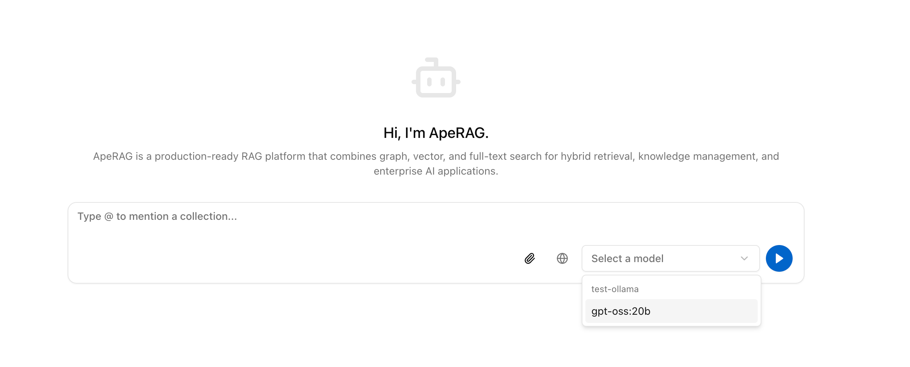
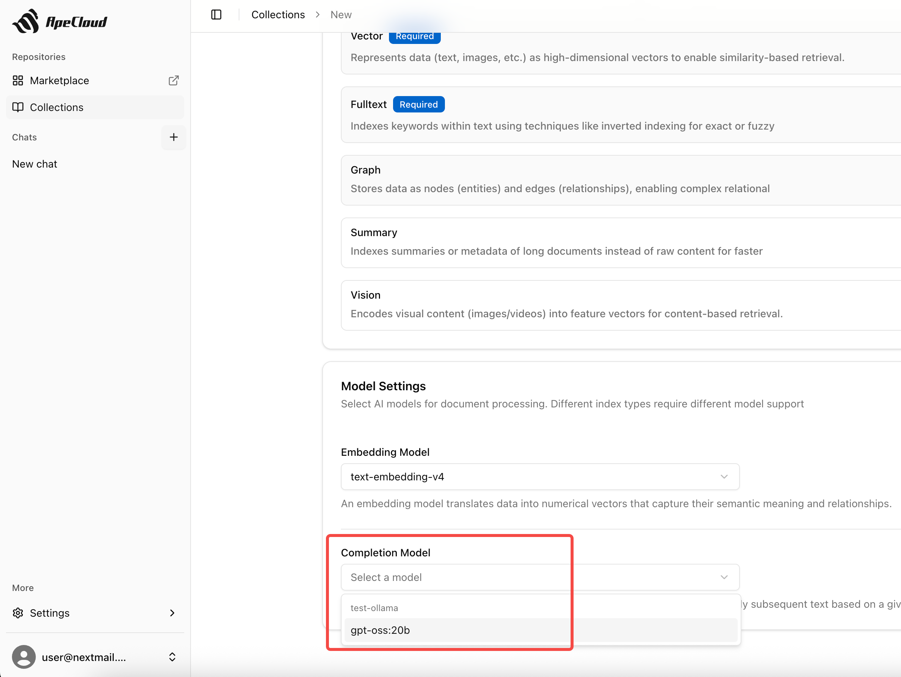

# How to Configure Local Ollama with ApeRAG

This guide shows how to configure local Ollama models in your ApeRAG deployment.

## Prerequisites

- ApeRAG running locally
- [Ollama](https://ollama.ai/) installed and running locally
- Ollama models downloaded

## Step 1: Add Ollama Provider

Navigate to **Settings > Models** in your ApeRAG interface and click **"Add Provider"**.

Enter a provider name (e.g., "local-ollama") and set the **Base URL** to: `http://localhost:11434/v1`

Click **Save**.

## Step 2: Add Ollama Models

Click the **three dots** on the right side of your newly created provider and select **"Models"** to enter the model management page.

Click **"Add Model"** and configure:
- **Model Name**: Enter your model name (e.g., `gpt-oss:20b`)
- **Model Type**: Select `Completion`
- **LLM Provider**: Select `openai` (Ollama is OpenAI-compatible)

Click **Save**.

## Step 3: Enable Model Usage

You'll notice each model has two toggle switches: **Agent** and **Collection**. You can enable both:

- **Agent**: Allows the model to be used for answering questions
- **Collection**: Allows the model to be used when building Collection indexes

## Step 4: Enable Ollama Provider

Return to the Providers page and click the **three dots** on the right side of your Ollama provider, then select **"Enable"**.

When prompted for an API key, enter any random string since Ollama is self-hosted and doesn't require actual authentication.

Your Ollama models should now appear in the models list, ready for use.

## Usage

Once configured, your local Ollama models will be available:

- **For Collections**: Select Ollama models in LLM settings when creating or configuring collections
- **For Chat**: Choose Ollama models in the chat interface for conversations

Your local Ollama models are now ready to use with ApeRAG!
