# ApeRAG 系统架构

## 1. 什么是 ApeRAG

ApeRAG 是一个**开放的、Agentic 的 Graph RAG 平台**。它不仅仅是一个简单的向量检索系统，而是将知识图谱、多模态检索和智能 Agent 深度融合的生产级解决方案。

传统的 RAG 系统主要依赖向量相似度检索，虽然能找到语义相关的内容，但往往缺乏对知识之间关系的理解。ApeRAG 的核心创新在于：

- **Graph RAG**：从文档中自动提取实体（人物、地点、概念）和关系，构建知识图谱，理解知识之间的关联
- **Agentic**：内置智能 Agent，能够自主规划、调用工具、多轮对话，提供更智能的问答体验
- **开放集成**：通过 **RESTful API** 和 **MCP 协议**对外暴露能力，可以轻松集成到 Dify、Claude、Cursor 等外部系统

### 核心优势

与传统 RAG 方案相比，ApeRAG 提供了：

- **更强的文档处理能力**：支持 PDF、Word、Excel 等多种格式，能处理复杂的表格、公式、图片
- **多种检索方式**：向量检索、全文检索、图谱检索，三者互补，各取所长
- **知识关联理解**：通过知识图谱理解概念之间的关系，而不仅仅是文本相似度
- **开放的集成能力**：RESTful API + MCP 协议，可以作为 Dify、Claude Desktop、Cursor 的知识后端
- **生产级架构**：异步处理、多存储、高并发，可以直接用于生产环境

### 整体架构一览

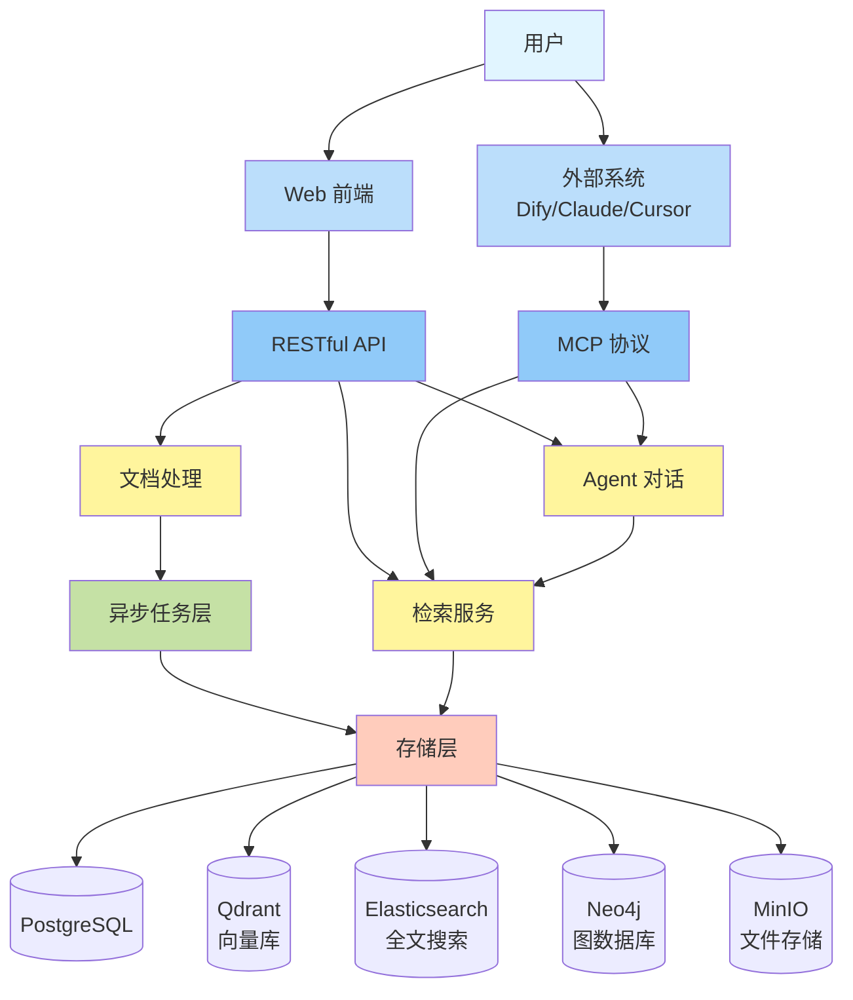

## 2. 系统分层架构

ApeRAG 采用清晰的分层设计，每一层各司其职：

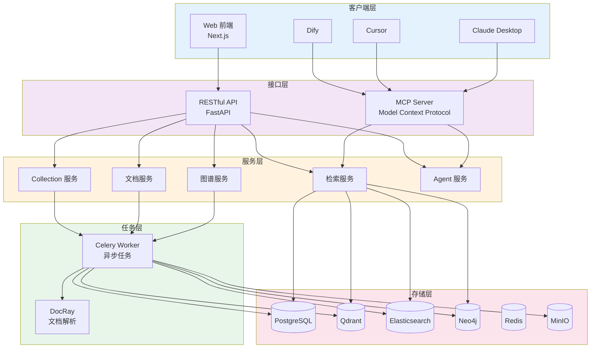

**各层职责说明**：

- **客户端层**：多种接入方式，Web UI 用于管理，MCP 客户端（Dify、Cursor、Claude 等）用于集成
- **接口层**：RESTful API（传统 HTTP 接口）和 MCP Server（AI 工具协议）并行提供服务
- **服务层**：核心业务逻辑，协调各种资源完成具体功能
- **任务层**：处理耗时操作（文档解析、索引构建），保证 API 快速响应
- **存储层**：多种存储系统，针对不同数据类型选择最优方案

## 3. 文档处理全流程

这是 ApeRAG 的核心能力之一。从一个 PDF 文件上传，到最终可以被检索，经历了一系列精心设计的处理步骤。

### 3.1 文档上传与解析

当你上传一个文档时，ApeRAG 会自动识别格式并选择合适的解析器：

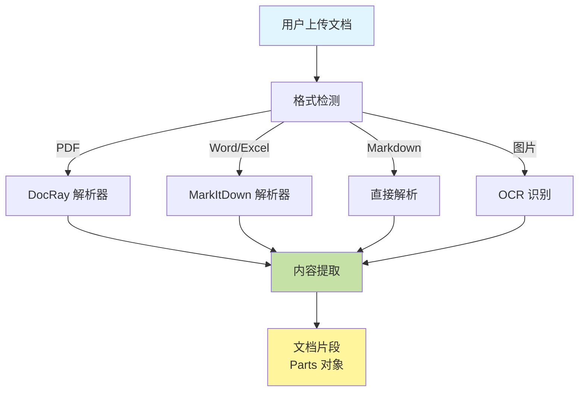

**DocRay/MinerU 的强大之处**：

- 能准确识别复杂 PDF 的表格结构，保留表格内容的完整性
- 提取 LaTeX 数学公式，保持公式的可读性
- 对扫描版 PDF 进行 OCR，支持中英文混排
- 识别文档中的图片区域，支持图片内容理解

### 3.2 智能分块策略

文档解析后，需要切分成合适大小的块（chunk）。这个步骤很关键，分块太大会影响检索精度，太小会丢失上下文。

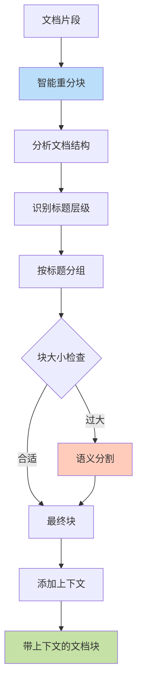

**分块策略的特点**：

- **保持语义完整性**：尽量不在句子中间切断
- **保留标题上下文**：每个块都知道自己属于哪个章节
- **层级化分割**：先按段落分，不行再按句子分，最后才按字符分
- **智能合并**：相邻的小标题块会被合并，避免信息碎片化

分块参数配置：
- 默认块大小：1200 tokens（约 800-1000 个中文字符）
- 重叠大小：100 tokens（保证上下文连续性）

### 3.3 多索引并行构建

文档分块后，会同时创建多种索引。每种索引有不同的用途，互相补充：

| 索引类型 | 适用场景 | 存储位置 | 检索方式 |
|---------|---------|---------|---------|
| **向量索引** | 语义相似问题，比如"如何优化性能" | Qdrant | 余弦相似度 |
| **全文索引** | 精确关键词搜索，比如"PostgreSQL 配置" | Elasticsearch | BM25 算法 |
| **图谱索引** | 关系型问题，比如"A 和 B 有什么联系" | PostgreSQL/Neo4j | 图遍历 |
| **摘要索引** | 快速了解文档概要 | PostgreSQL | 向量匹配 |
| **视觉索引** | 图片内容搜索 | Qdrant | 多模态向量 |

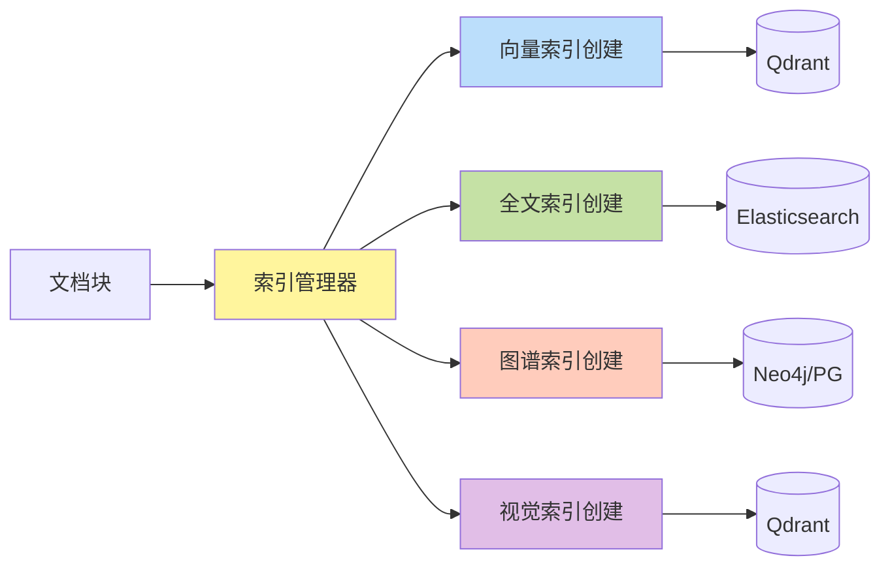

**并行构建的优势**：
- 不同索引可以同时构建，提高速度
- 某个索引失败不影响其他索引
- 可以按需启用特定类型的索引

### 3.4 知识图谱构建

图谱索引是 ApeRAG 的核心特色，它能从文档中提取结构化的知识。

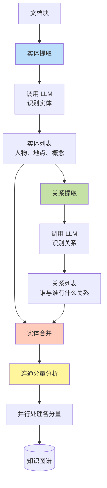

**图谱构建的关键步骤**：

1. **实体提取**：LLM 从文档块中识别出有意义的实体
   - 示例：从"张三在北京的清华大学学习人工智能"中提取
   - 实体：张三（人物）、北京（地点）、清华大学（组织）、人工智能（概念）

2. **关系提取**：识别实体之间的关系
   - 示例：张三 --学习--> 人工智能，张三 --就读于--> 清华大学

3. **实体合并**：同一实体可能有不同的表述，需要归一化
   - 示例："LightRAG"、"light rag"、"Light-RAG" → 合并为统一实体

4. **连通分量优化**：把图谱分成独立的子图，并行处理
   - 性能提升：2-3 倍吞吐量

**为什么需要连通分量优化？**

假设你有 100 篇文档，它们讨论不同的主题。关于"数据库"的实体和关于"机器学习"的实体之间没有连接，可以独立处理。连通分量算法会找出这些独立的"知识岛"，然后并行处理，大大提高速度。

### 3.5 异步任务系统

文档处理是一个耗时的操作，ApeRAG 采用"双链路架构"来保证用户体验：

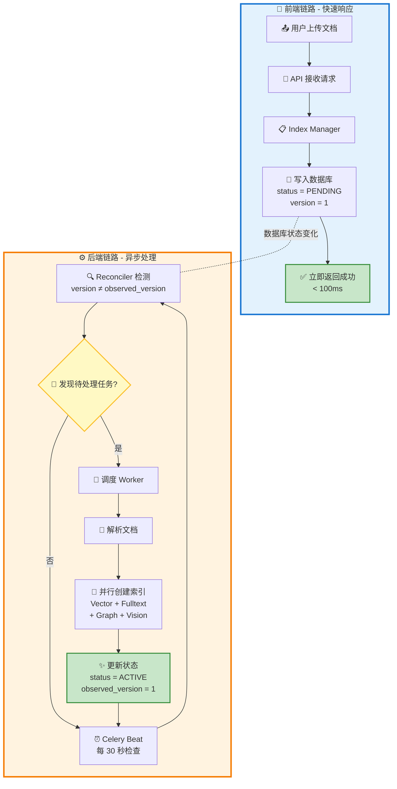

**双链路的好处**：

- **前端快速响应**：用户上传文档后，API 在 100ms 内返回，不需要等待处理完成
- **后端异步处理**：真正的处理工作在后台慢慢做，不阻塞用户操作
- **自动重试**：如果处理失败，系统会自动重试，保证最终成功
- **状态可查**：用户可以随时查看文档处理进度

**索引状态机**：

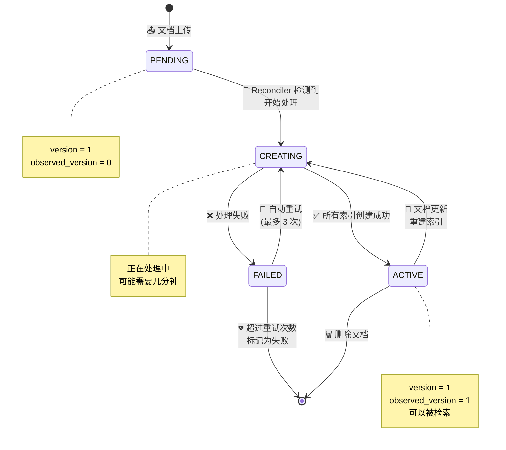

## 4. 检索问答全流程

有了索引之后,用户就可以提问了。ApeRAG 的检索系统会智能地选择合适的检索策略。

### 4.1 混合检索系统

不同类型的问题适合用不同的检索方式。ApeRAG 会同时使用多种检索策略，然后融合结果：

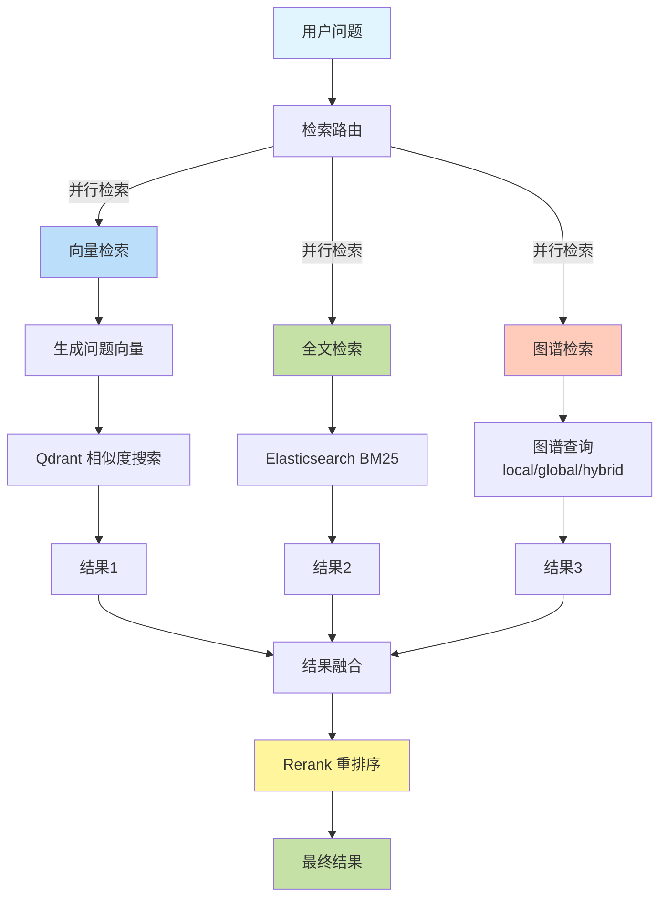

**检索策略说明**：

- **向量检索**：用于语义相似的问题
  - 问："如何提升系统性能？"
  - 能找到："优化数据库查询"、"使用缓存"等相关内容
  
- **全文检索**：用于精确关键词匹配
  - 问："PostgreSQL 的配置文件在哪？"
  - 能找到包含"PostgreSQL"和"配置文件"的精确段落
  
- **图谱检索**：用于关系型问题
  - 问："LightRAG 和 Neo4j 有什么关系？"
  - 会查询图谱中这两个实体的连接路径

**结果融合策略**：

不同检索方式的结果需要合并。ApeRAG 使用 Rerank 模型对所有候选结果重新打分：

1. 收集所有检索结果（可能有重复）
2. 去重，保留最相关的片段
3. 使用 Rerank 模型评估每个片段与问题的相关性
4. 按新的分数重新排序
5. 返回 Top-K 结果

### 4.2 知识图谱查询

图谱检索有三种模式，适用于不同类型的问题：

| 模式 | 适用场景 | 查询方式 | 示例问题 |
|------|---------|---------|---------|
| **local** | 查询某个实体的局部信息 | 向量匹配相似实体 → 获取邻居节点 | "张三的个人信息" |
| **global** | 查询整体关系和模式 | 向量匹配相似关系 → 获取关联路径 | "公司的组织架构是怎样的" |
| **hybrid** | 综合性问题 | local + global 结合 | "张三在公司的角色和职责" |

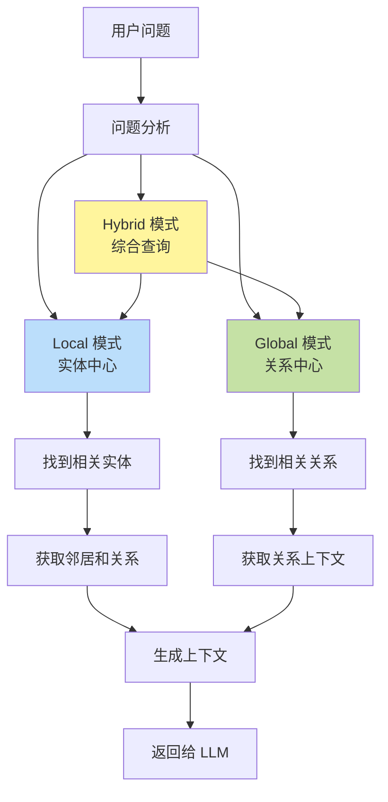

**实际例子**：

假设知识图谱中有：
- 实体：张三（人物）、数据库团队（组织）、PostgreSQL（技术）
- 关系：张三 --属于--> 数据库团队，张三 --擅长--> PostgreSQL

问题："张三负责什么？"

1. **Local 模式**：
   - 找到"张三"实体
   - 获取所有直接相连的节点
   - 返回："张三属于数据库团队，擅长 PostgreSQL"

2. **Global 模式**：
   - 找到相关的关系模式："负责"、"属于"
   - 返回整个团队的结构和职责分工

3. **Hybrid 模式**：
   - 同时使用上述两种方式
   - 给出更全面的答案

### 4.3 Agent 对话系统

Agent 是 ApeRAG 的智能助手，它能调用各种工具来回答问题。

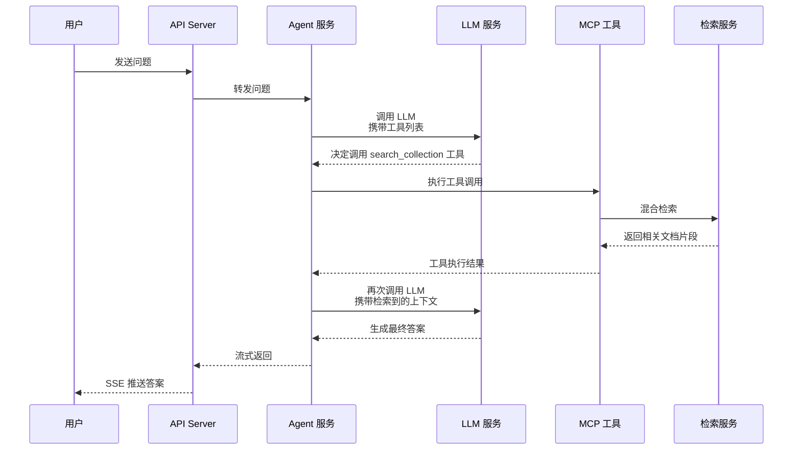

**Agent 的工作流程**：

1. **接收问题**：用户发送一个问题

2. **工具决策**：LLM 分析问题，决定需要调用哪些工具
   - 可能的工具：search_collection（检索知识库）、web_search（搜索网络）、web_read（读取网页）等

3. **执行工具**：Agent 调用对应的工具
   - 示例：search_collection 会触发混合检索，返回相关文档

4. **生成答案**：LLM 基于检索到的上下文生成答案

5. **流式返回**：答案通过 SSE（Server-Sent Events）实时推送给用户，不用等待全部生成完毕

**MCP 协议的作用**：

MCP（Model Context Protocol）是一个标准化的工具协议，让 AI 助手（如 Claude Desktop、Cursor）能够方便地调用 ApeRAG 的能力。通过 MCP，外部 AI 工具可以：
- 列出你的知识库
- 搜索知识库内容
- 读取网页内容
- 搜索互联网

**对话示例**：

```
用户：ApeRAG 的图谱索引是怎么工作的？

Agent 思考：需要检索知识库
↓
调用工具：search_collection(query="图谱索引工作原理", collection_id="aperag-docs")
↓
检索结果：返回关于图谱构建、实体提取、关系抽取的文档片段
↓
Agent 回答：ApeRAG 的图谱索引通过以下步骤工作...（基于检索到的内容生成）
```

## 5. 存储架构

ApeRAG 采用多存储架构，为不同类型的数据选择最合适的存储方案。

### 5.1 存储选型决策

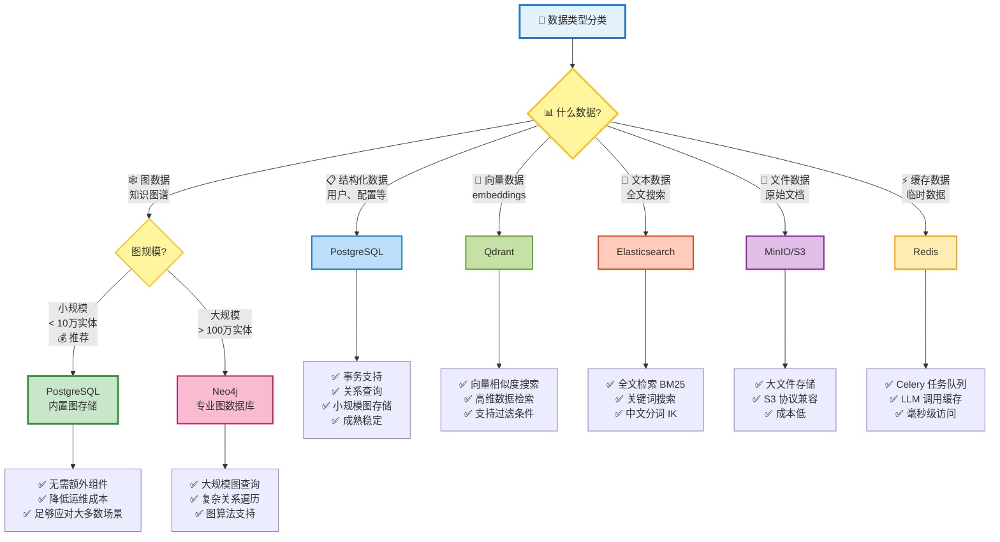

### 5.2 数据流向

不同的数据在系统中流转到不同的存储：

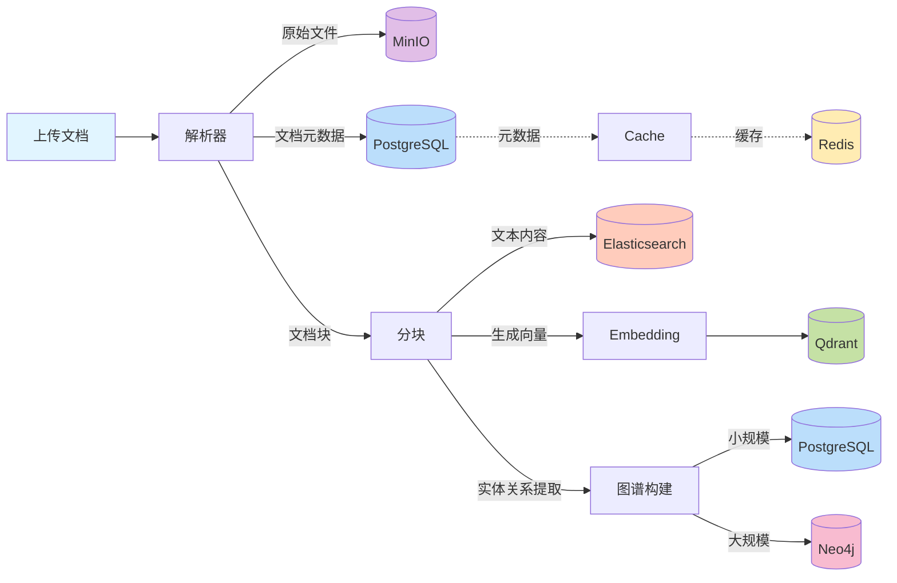

### 5.3 核心存储系统

**PostgreSQL**（主数据库）

存储内容：
- 用户信息、权限、配置
- Collection（知识库）元数据
- 文档元数据和索引状态
- 对话历史
- 小规模知识图谱（< 10 万实体）

为什么选择：
- 强大的事务支持，保证数据一致性
- 成熟稳定，运维成本低
- pgvector 扩展，支持向量存储
- 可以承载小规模图数据，不需要额外的图数据库

**Qdrant**（向量数据库）

存储内容：
- 文档块的 embedding 向量
- 实体和关系的向量表示
- 图片的多模态向量

为什么选择：
- 专门为向量检索优化，速度快
- 支持过滤条件，可以结合元数据筛选
- 支持集群部署，可以水平扩展

**Elasticsearch**（全文搜索）

存储内容：
- 文档块的文本内容
- 支持中文分词（IK Analyzer）

为什么选择：
- BM25 算法对关键词搜索效果好
- 支持复杂的查询和聚合
- 自带高亮显示

**MinIO**（对象存储）

存储内容：
- 原始文档文件（PDF、Word 等）
- 解析后的中间结果
- 上传的临时文件

为什么选择：
- S3 协议兼容，可以替换为云存储
- 存储成本低
- 支持大文件

**图数据库选择：PostgreSQL vs Neo4j**

ApeRAG 支持两种图数据库方案：

**PostgreSQL**（默认，推荐用于小规模）

存储内容：
- 知识图谱（< 10 万实体）
- 图节点和边的关系数据

推荐理由：
- 无需额外部署，降低运维成本
- 性能足够应对大多数场景
- 事务支持完善，数据一致性有保障
- 可以和其他业务数据共用一个数据库

**Neo4j**（可选，用于大规模）

存储内容：
- 大规模知识图谱（> 100 万实体）

什么时候需要：
- 实体数量超过 10 万，PostgreSQL 查询性能下降
- 需要复杂的图遍历查询（多跳关系）
- 需要使用图算法（PageRank、社区发现等）

**总结**：对于大多数企业应用，PostgreSQL 完全够用。只有在知识图谱规模非常大时，才需要考虑 Neo4j。

**Redis**（缓存和队列）

存储内容：
- Celery 任务队列
- LLM 调用缓存
- 用户会话缓存

为什么选择：
- 速度极快，适合高频访问
- 支持多种数据结构
- 可以做任务队列的 Broker

## 6. 技术亮点

### 6.1 无状态 LightRAG 重构

**背景问题**：

原版 LightRAG 使用全局状态，所有任务共享一个实例。这在多用户、多 Collection 的场景下会导致数据混乱和并发冲突。

**ApeRAG 的解决方案**：

- 每个任务创建独立的 LightRAG 实例
- 通过 `workspace` 参数隔离不同 Collection 的数据
- 实体命名规范：`entity:{name}:{workspace}`
- 关系命名规范：`relationship:{src}:{tgt}:{workspace}`

这样，不同用户的图谱数据不会互相干扰，真正实现了多租户隔离。

### 6.2 双链异步架构

**传统做法的问题**：

用户上传文档后，API 需要等待解析、索引构建全部完成才能返回，可能要等几分钟甚至更久。

**双链架构的优势**：

- **前端链路**：API 只负责写状态到数据库，100ms 内返回
- **后端链路**：Reconciler 定时检测状态变化，调度异步任务
- **版本控制**：通过 version 和 observed_version 实现幂等性
- **自动重试**：任务失败后自动重试，保证最终一致性

这个设计灵感来自 Kubernetes 的 Reconciler 模式，非常适合处理长时间运行的任务。

### 6.3 连通分量并发优化

**问题**：

知识图谱构建时,需要合并相似的实体。如果串行处理,速度很慢。如果全部并行,又会有锁竞争问题。

**解决方案**：

使用连通分量算法,把图谱分成多个独立的子图：

1. 构建实体关系邻接表
2. BFS 遍历找出所有连通分量
3. 不同分量之间没有连接，可以完全并行处理
4. 同一分量内部串行处理（避免冲突）

**效果**：

- 性能提升 2-3 倍
- 零锁竞争
- 对于多样化的文档集合效果最好

### 6.4 Provider 抽象模式

ApeRAG 支持 100+ 种 LLM 提供商（OpenAI、Claude、Gemini、国产大模型等）。如何统一管理？

**设计思路**：

- 定义统一的 Provider 接口
- 每个提供商实现自己的 Provider
- 通过 LiteLLM 库做适配

这样，切换模型只需要改配置，不需要改代码。同样的模式也应用在：
- Embedding Service（支持多种向量模型）
- Rerank Service（支持多种重排序模型）
- Web Search Service（DuckDuckGo、JINA 等）

### 6.5 多模态索引支持

除了文本，ApeRAG 也能处理图片：

**Vision Index 的两条路径**：

1. **纯视觉向量**：使用多模态模型（如 CLIP）直接生成图片向量
2. **视觉转文本**：使用 VLM 生成图片描述 + OCR 识别文字 → 文本向量化

**融合策略**：

- 文本检索结果和视觉检索结果分开排序
- 通过 Rerank 模型统一打分
- 最终合并展示

## 7. 总结

ApeRAG 通过以下设计实现了生产级的 RAG 能力：

**核心优势**：
- **强大的文档处理**：支持多格式、复杂布局、表格公式
- **知识图谱融合**：不仅是向量匹配，还能理解知识关联
- **多种检索方式**：向量、全文、图谱三管齐下
- **异步架构**：快速响应，后台处理，用户体验好
- **生产级设计**：多存储、高并发、易扩展

**技术创新**：
- 无状态 LightRAG，真正的多租户支持
- 双链异步架构，API 响应 < 100ms
- 连通分量并发优化，图谱构建快 2-3 倍
- Provider 抽象，支持 100+ LLM

**适用场景**：
- 企业知识库搜索
- 技术文档问答
- 客服机器人
- 研究论文分析
- 任何需要理解文档并提供智能问答的场景

整个系统的设计理念是：**让复杂的事情变简单，让简单的事情变自动**。用户只需要上传文档，剩下的一切都由 ApeRAG 自动完成。
