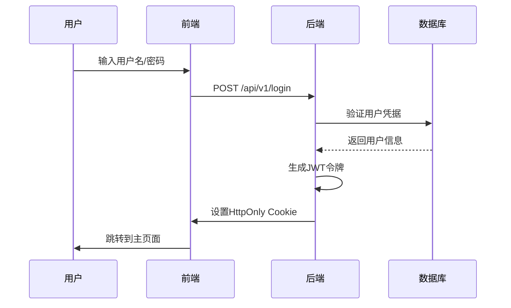
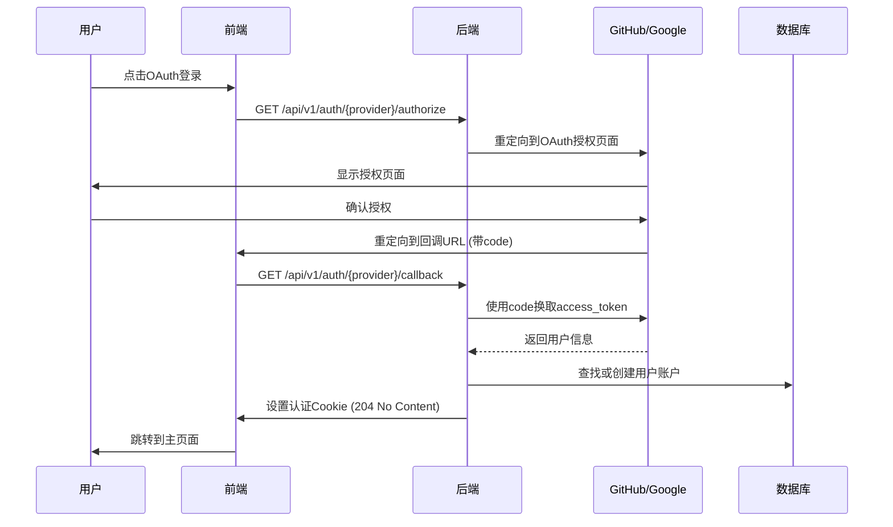

# ApeRAG 认证系统架构文档

## 概述

ApeRAG 采用基于 Cookie 的认证系统，支持本地用户名/密码认证和 OAuth2 社交登录（GitHub、Google）。系统基于 FastAPI-Users 库构建，提供完整的用户管理和认证功能。

## 核心架构

### 技术栈
- **后端**: FastAPI + FastAPI-Users + SQLAlchemy + PostgreSQL
- **前端**: React + TypeScript + Ant Design + UmiJS
- **认证**: JWT + HttpOnly Cookie + OAuth 2.0
- **安全**: bcrypt 密码加密 + CSRF 保护

### 认证方式
1. **本地认证**: 用户名/密码登录
2. **OAuth 社交登录**: GitHub 和 Google 第三方登录
3. **API Key 认证**: 用于程序化访问

## 数据模型

### 用户表 (User)
```python
class User(Base):
    id: str                    # 用户ID
    username: str              # 用户名（唯一）
    email: str                 # 邮箱（唯一）
    hashed_password: str       # bcrypt加密密码
    role: Role                 # 用户角色（ADMIN/RW/RO）
    is_active: bool            # 是否激活
    is_verified: bool          # 是否验证
    date_joined: datetime      # 注册时间
```

### OAuth账户表 (OAuthAccount)
```python
class OAuthAccount(Base):
    id: str                    # OAuth账户ID
    user_id: str               # 关联用户ID
    oauth_name: str            # OAuth提供商名称
    account_id: str            # 第三方账户ID
    account_email: str         # 第三方账户邮箱
    access_token: str          # 访问令牌
```

### API密钥表 (ApiKey)
```python
class ApiKey(Base):
    id: str                    # API密钥ID
    key: str                   # API密钥值
    user: str                  # 关联用户ID
    description: str           # 描述
    status: ApiKeyStatus       # 状态（ACTIVE/DELETED）
    is_system: bool            # 是否系统生成
    last_used_at: datetime     # 最后使用时间
```

## 认证流程

### 1. 本地认证流程



### 2. OAuth认证流程



参考：https://github.com/fastapi-users/fastapi-users/issues/434

#### OAuth API说明

OAuth认证涉及两个关键API，这些API由FastAPI-Users自动生成：

1. **授权端点** (`/api/v1/auth/{provider}/authorize`)
   - 生成OAuth授权URL
   - 包含state参数防止CSRF攻击
   - 重定向用户到第三方OAuth提供商

2. **回调端点** (`/api/v1/auth/{provider}/callback`)
   - 处理OAuth提供商的回调请求
   - 使用authorization code换取access token
   - 获取用户信息并创建/登录用户
   - 设置认证Cookie并返回204 No Content

## 核心组件

### 1. FastAPI-Users 配置

#### JWT策略
```python
COOKIE_MAX_AGE = 86400  # 24小时

def get_jwt_strategy() -> JWTStrategy:
    return JWTStrategy(secret=settings.jwt_secret, lifetime_seconds=COOKIE_MAX_AGE)
```

#### Cookie传输
```python
cookie_transport = CookieTransport(
    cookie_name="session", 
    cookie_max_age=COOKIE_MAX_AGE,
    cookie_secure=False,      # 开发环境设为False
    cookie_httponly=True,     # 防止XSS攻击
    cookie_samesite="lax"     # 防止CSRF攻击
)
```

#### 认证后端
```python
auth_backend = AuthenticationBackend(
    name="cookie",
    transport=cookie_transport,
    get_strategy=get_jwt_strategy,
)
```

### 2. 用户管理器
```python
class UserManager(BaseUserManager[User, str]):
    async def on_after_register(self, user: User, request: Optional[Request] = None):
        # 设置第一个注册用户为管理员
        user_count = await async_db_ops.query_user_count()
        if user_count == 1 and user.role != Role.ADMIN:
            user.role = Role.ADMIN
```

### 3. OAuth客户端配置
```python
# GitHub OAuth
if is_github_oauth_enabled():
    github_oauth_client = GitHubOAuth2(
        settings.github_oauth_client_id, 
        settings.github_oauth_client_secret
    )
    github_oauth_router = get_oauth_router(
        github_oauth_client,
        auth_backend,
        get_user_manager,
        settings.jwt_secret,
        redirect_url=settings.oauth_redirect_url,  # 回调URL配置
        associate_by_email=True,                   # 通过邮箱关联账户
        is_verified_by_default=True,               # 默认验证用户
    )
```

#### OAuth路由生成
FastAPI-Users的`get_oauth_router`函数会自动生成以下路由：
- `GET /auth/{provider}/authorize` - 获取授权URL
- `GET /auth/{provider}/callback` - 处理OAuth回调

## API接口

### 认证相关接口

#### 1. 获取配置信息
```http
GET /api/v1/config
```
**响应**: 包含可用登录方式的配置信息

#### 2. 本地登录
```http
POST /api/v1/login
Content-Type: application/json

{
  "username": "user@example.com",
  "password": "password123"
}
```
**响应**: 用户信息 + 设置session cookie

#### 3. 用户注册
```http
POST /api/v1/register
Content-Type: application/json

{
  "username": "newuser",
  "email": "user@example.com", 
  "password": "password123",
  "token": "invitation_token"  // 邀请制时必需
}
```

#### 4. 登出
```http
POST /api/v1/logout
```
**响应**: 清除session cookie

#### 5. 获取当前用户
```http
GET /api/v1/user
Cookie: session=jwt_token
```

#### 6. 修改密码
```http
POST /api/v1/change-password
Content-Type: application/json

{
  "username": "user@example.com",
  "old_password": "old_password",
  "new_password": "new_password"
}
```

### OAuth接口

#### 1. OAuth授权
```http
GET /api/v1/auth/{provider}/authorize
```
**响应**: 
```json
{
  "authorization_url": "https://github.com/login/oauth/authorize?..."
}
```

#### 2. OAuth回调
```http
GET /api/v1/auth/{provider}/callback?code=xxx&state=yyy
```
**响应**: 204 No Content + 设置认证Cookie

**注意**: 这两个OAuth API由FastAPI-Users自动生成，无需手动实现。

### 用户管理接口

#### 1. 列出用户
```http
GET /api/v1/users
```

#### 2. 删除用户
```http
DELETE /api/v1/users/{user_id}
```

## 前端实现

### 1. 登录页面 (`signin.tsx`)

#### 核心功能
- 动态获取可用登录方式
- 本地登录表单处理
- OAuth登录按钮处理

#### OAuth登录实现
```typescript
// GitHub登录
onClick={async () => {
  try {
    localStorage.setItem('oauth_provider', 'github');
    const response = await fetch('/api/v1/auth/github/authorize');
    const data = await response.json();
    if (data.authorization_url) {
      window.location.href = data.authorization_url;
    }
  } catch (error) {
    console.error('GitHub OAuth error:', error);
  }
}}
```

### 2. OAuth回调页面 (`oauth-callback.tsx`)

#### 核心功能
- 解析URL参数（code、state等）
- 确定OAuth提供商
- 调用后端回调接口
- 处理认证结果

#### 实现逻辑
```typescript
const handleOAuth = async () => {
  // 获取OAuth参数
  const code = searchParams.get('code');
  const state = searchParams.get('state');
  
  // 确定提供商
  let provider = localStorage.getItem('oauth_provider') || 'github';
  
  // 调用回调接口
  const callbackUrl = `/api/v1/auth/${provider}/callback?code=${code}&state=${state}`;
  const response = await fetch(callbackUrl, {
    method: 'GET',
    credentials: 'include',
  });
  
  // 处理响应
  if (response.status === 204) {
    navigate('/');  // 认证成功
  }
};
```

## 认证中间件

### 1. 当前用户获取
```python
async def current_user(
    request: Request, 
    session: AsyncSessionDep, 
    user: User = Depends(fastapi_users.current_user(optional=True))
) -> Optional[User]:
    # 优先使用JWT/Cookie认证
    if user:
        return user
    
    # 回退到API Key认证
    api_user = await authenticate_api_key(request, session)
    if api_user:
        return api_user
    
    return None
```

### 2. API Key认证
```python
async def authenticate_api_key(request: Request, session: AsyncSessionDep) -> Optional[User]:
    authorization = request.headers.get("Authorization")
    if not authorization or not authorization.startswith("Bearer "):
        return None
    
    api_key = authorization.split(" ")[1]
    # 查找并验证API Key
    # 更新最后使用时间
    # 返回关联用户
```

## 配置说明

### 环境变量
```bash
# JWT密钥
JWT_SECRET=your-super-secret-key

# OAuth回调URL
OAUTH_REDIRECT_URL=http://127.0.0.1:3000/web/oauth-callback

# GitHub OAuth
GITHUB_OAUTH_CLIENT_ID=your-github-client-id
GITHUB_OAUTH_CLIENT_SECRET=your-github-client-secret

# Google OAuth  
GOOGLE_OAUTH_CLIENT_ID=your-google-client-id
GOOGLE_OAUTH_CLIENT_SECRET=your-google-client-secret

# 注册模式
REGISTER_MODE=invitation  # unlimited/invitation
```

### OAuth应用配置

OAuth提供商需要配置以下关键信息：

#### 必需配置项
- **Client ID**: OAuth应用的客户端标识符
- **Client Secret**: OAuth应用的客户端密钥
- **Callback URL**: OAuth授权完成后的回调地址
- **Scopes**: 请求的权限范围（通常包含用户基本信息和邮箱）

#### GitHub OAuth应用配置
1. 访问 [GitHub Developer Settings](https://github.com/settings/developers)
2. 点击 "New OAuth App" 创建新应用
3. 填写应用信息：
   - **Application name**: ApeRAG
   - **Homepage URL**: `http://127.0.0.1:3000`
   - **Authorization callback URL**: `http://127.0.0.1:3000/web/oauth-callback`
4. 创建后获取 Client ID 和 Client Secret
5. 默认权限范围: `user:email`（获取用户基本信息和邮箱）

#### Google OAuth应用配置
1. 访问 [Google Cloud Console](https://console.cloud.google.com/)
2. 创建项目或选择现有项目
3. 启用 Google+ API 或 Google People API
4. 创建 OAuth 2.0 客户端ID：
   - 应用类型: Web应用
   - 授权重定向URI: `http://127.0.0.1:3000/web/oauth-callback`
5. 获取客户端ID和客户端密钥
6. 默认权限范围: `openid email profile`（获取用户基本信息）

#### 回调URL说明
- 回调URL必须与OAuth应用配置中的完全一致
- 开发环境: `http://127.0.0.1:3000/web/oauth-callback`
- 生产环境: `https://yourdomain.com/web/oauth-callback`
- ApeRAG前端的BASE_PATH是`/web`，所以回调URL包含此前缀

## 安全特性

### 1. JWT令牌安全
- 使用强密钥签名（HMAC-SHA256）
- 24小时有效期
- HttpOnly Cookie传输，防止XSS
- SameSite=Lax，防止CSRF

### 2. 密码安全
- bcrypt加密存储
- 随机盐值
- 密码强度验证

### 3. OAuth安全
- State参数防CSRF
- 标准授权码流程
- 令牌安全存储

### 4. API Key安全
- 随机生成（sk-前缀）
- 使用跟踪
- 状态管理

## 权限控制

### 用户角色
- **ADMIN**: 管理员，拥有所有权限
- **RW**: 读写用户，可创建和修改资源
- **RO**: 只读用户，仅可查看资源

### 权限检查
```python
async def get_current_admin(user: User = Depends(get_current_active_user)) -> User:
    if user.role != Role.ADMIN:
        raise HTTPException(status_code=403, detail="Only admin members can perform this action")
    return user
```

## 注册模式

### 1. 开放注册 (unlimited)
- 任何人都可以直接注册
- 第一个注册用户自动成为管理员

### 2. 邀请制注册 (invitation)
- 需要管理员发送邀请
- 通过邀请令牌验证

## 故障排除

### 常见问题

#### 1. OAuth回调失败
- 检查回调URL配置是否匹配
- 验证OAuth应用配置
- 查看浏览器控制台日志

#### 2. Cookie认证失败
- 检查JWT_SECRET配置
- 验证Cookie域名设置
- 确认浏览器Cookie策略

#### 3. API Key认证失败
- 验证Authorization头格式: `Bearer sk-xxx`
- 检查API Key状态
- 确认用户关联关系

### 调试方法
1. 查看后端日志: `tail -f logs/aperag.log`
2. 检查浏览器开发者工具
3. 验证数据库用户和OAuth账户数据
4. 测试API接口响应

## 总结

ApeRAG认证系统基于FastAPI-Users构建，提供了安全、灵活的多种认证方式。系统支持本地认证和OAuth社交登录，采用JWT+Cookie的无状态认证机制，具有良好的安全性和扩展性。通过合理的权限控制和注册模式配置，能够满足不同场景的使用需求。
