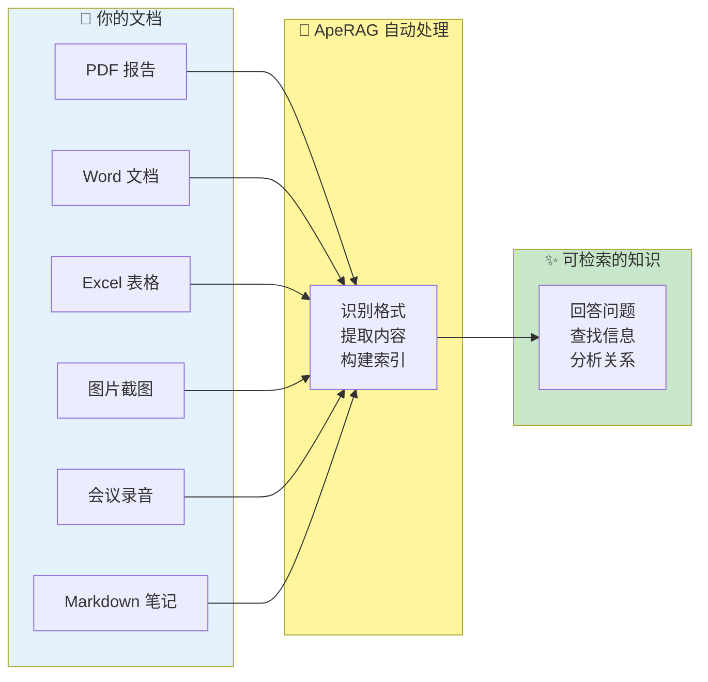
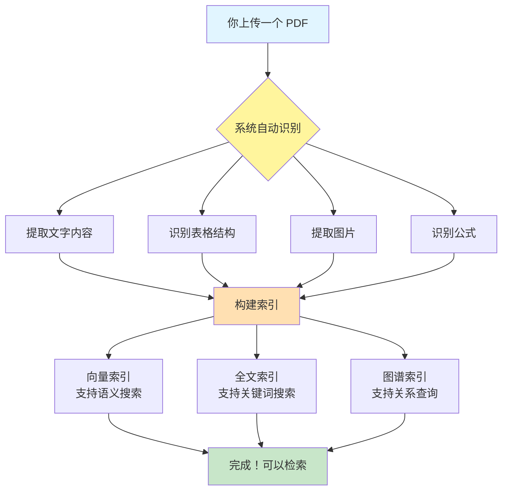
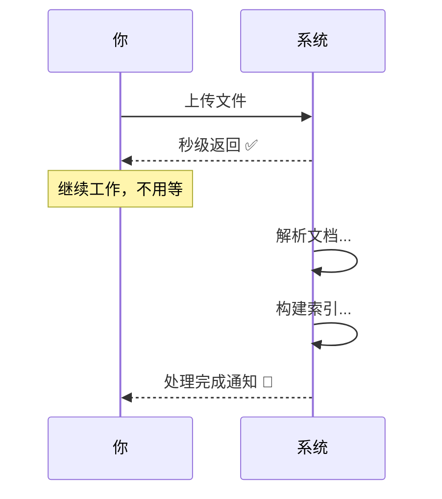
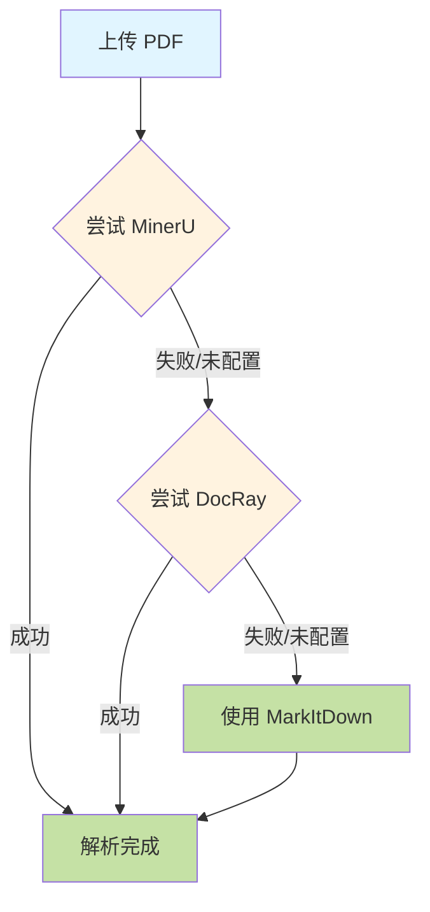
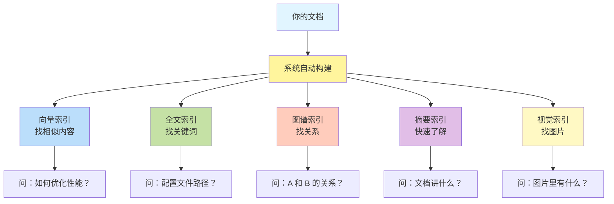

# 文档上传设计

## 1. 文档上传是什么

文档上传是 ApeRAG 的入口功能，让你可以把各种格式的文档添加到知识库中，系统会自动处理、索引，让这些知识可以被检索和对话。

### 1.1 能上传什么

ApeRAG 支持 20+ 种文档格式，基本涵盖了日常工作中的所有文件类型：



**文档类型**：

| 类别 | 格式 | 典型用途 |
|------|------|---------|
| **办公文档** | PDF, Word, PPT, Excel | 年度报告、会议纪要、数据表格 |
| **文本文件** | TXT, MD, HTML, JSON | 技术文档、笔记、配置文件 |
| **图片** | PNG, JPG, GIF | 产品截图、设计稿、图表 |
| **音频** | MP3, WAV, M4A | 会议录音、采访录音 |
| **压缩包** | ZIP, TAR, GZ | 批量文档打包 |

### 1.2 上传后发生什么



**简单来说**：你只管上传文件，系统自动帮你处理好一切！

## 2. 实际应用场景

看看文档上传在实际工作中的应用。

### 2.1 企业知识库建设

**场景**：公司要建立内部知识库。

**上传内容**：
- 📋 制度文档：员工手册、考勤制度、报销流程
- 📊 业务资料：产品介绍、销售数据、财务报表
- 🔧 技术文档：系统架构、API 文档、部署指南
- 📁 项目资料：项目方案、会议记录、复盘总结

**使用效果**：

```
员工提问："出差报销流程是什么？"
系统：从《财务制度.pdf》找到报销流程章节

新人提问："公司的产品有哪些？"
系统：从《产品手册.pptx》提取产品列表

技术同学："这个 API 怎么调用？"
系统：从《API文档.md》找到调用示例
```

### 2.2 研究资料整理

**场景**：研究生整理论文和学习资料。

**上传内容**：
- 📖 学术论文 PDF
- 📝 读书笔记 Markdown
- 🎓 课程讲义 PPT
- 📊 实验数据 Excel

**使用效果**：

```
问："Graph RAG 相关的研究有哪些？"
答：从多篇论文中找到相关内容

问："某个作者的主要贡献是什么？"
答：分析论文，总结作者的研究方向
```

### 2.3 个人知识管理

**场景**：程序员积累技术笔记。

**上传内容**：
- 💻 学习笔记 Markdown
- 📸 技术截图 PNG
- 🎬 教程录屏转的音频
- 📚 技术书籍 PDF

**使用效果**：

```
问："之前怎么解决过 Redis 连接问题？"
答：从笔记《Redis问题排查.md》找到解决方案

问："某个技术的最佳实践是什么？"
答：从多个文档中总结最佳实践
```

### 2.4 多模态内容处理

**场景**：产品团队的设计资料。

**上传内容**：
- 🎨 UI 设计稿（图片）
- 📋 产品 PRD（Word）
- 🎤 用户访谈录音
- 📊 数据分析报告（Excel）

**系统处理**：
- 设计稿 → OCR 提取文字 + Vision 理解设计意图
- PRD → 提取产品需求和功能点
- 录音 → 转文字，提取用户反馈
- 数据报告 → 提取关键指标

**结果**：所有内容融合在一起，可以综合检索！

## 3. 上传体验

### 3.1 批量上传很简单

假设你要上传 50 个公司文档：

**Step 1：选择文件（10 秒）**

```
点击"上传文档" → 选择 50 个 PDF → 点击"开始上传"
```

**Step 2：快速上传（30 秒）**

```
进度条：1/50, 2/50, 3/50... 50/50 ✅
所有文件秒传到暂存区，不需要等待处理
```

**Step 3：预览确认（1 分钟）**

```
查看上传的文件列表：
- ✅ 年度报告.pdf (5.2 MB)
- ✅ 产品手册.pdf (3.1 MB)
- ❌ 个人笔记.pdf (不该上传的) → 取消勾选
- ✅ 技术文档.pdf (2.8 MB)
...

点击"保存到知识库"
```

**Step 4：后台处理（5-30 分钟）**

```
系统自动处理：
- 解析文档内容
- 构建多种索引
- 你可以继续其他工作，不需要等待
```

**Step 5：完成通知**

```
通知："49 个文档处理完成，现在可以检索了"
```

### 3.2 处理时间参考

不同大小的文档，处理速度不同：

| 文档类型 | 大小 | 上传时间 | 处理时间 | 示例 |
|---------|------|---------|---------|------|
| 🏃 小文档 | < 5 页 | < 1 秒 | 1-3 分钟 | 通知、邮件 |
| 🚶 中型文档 | 10-50 页 | < 3 秒 | 3-10 分钟 | 报告、手册 |
| 🐌 大型文档 | 100+ 页 | < 10 秒 | 10-30 分钟 | 书籍、论文集 |

**关键点**：
- ✅ 上传总是很快（秒级）
- ⏳ 处理在后台进行（不阻塞）
- 📊 可以实时查看处理进度

### 3.3 实时进度查看

上传后可以随时查看文档状态：

```
文档列表：

📄 annual_report.pdf
   状态：处理中 (60%)
   ├─ ✅ 文档解析：完成
   ├─ ✅ 向量索引：完成
   ├─ 🔄 全文索引：进行中
   └─ ⏳ 图谱索引：等待中

📄 product_manual.pdf
   状态：已完成 ✅
   可以检索

📄 meeting_notes.pdf
   状态：失败 ❌
   错误：文件损坏
   操作：重新上传
```

## 4. 核心特性

ApeRAG 的文档上传有一些独特的特性，让使用更加方便。

### 4.1 暂存区设计

**核心理念**：先传后选，给你"后悔"的机会。

**就像网购**：

```
网购流程：
1. 加入购物车（暂存）
2. 查看购物车，删除不想要的
3. 提交订单（确认）

文档上传：
1. 上传到暂存区（快速上传）
2. 查看列表，取消不需要的
3. 保存到知识库（确认添加）
```

**好处**：

- ✅ **快速上传**：20 个文件 5 秒传完，不用等处理
- ✅ **选择性添加**：上传 100 个，只保存需要的 80 个
- ✅ **节省配额**：暂存区的文件不占配额
- ✅ **纠错方便**：发现错误直接取消，不用删除

### 4.2 智能处理

**自动识别格式**：

系统会自动识别文件类型，选择最合适的处理方式：

- 📄 PDF → 提取文字、表格、图片、公式
- 📋 Word → 转换格式、提取内容
- 📊 Excel → 识别表格结构
- 🎨 图片 → OCR 文字 + 理解内容
- 🎤 音频 → 转录成文字

**你不需要做任何额外操作**，系统自动处理！

### 4.3 后台处理

上传完成后，系统在后台自动处理：



**优势**：
- 不用等待，上传完就能干别的
- 系统自动重试失败的文档
- 实时查看处理进度

### 4.4 自动清理

暂存区的文件 7 天没确认会自动清理，防止占用存储空间。

## 5. 文档解析原理

上传后，系统需要把文档"读懂"。不同格式有不同的处理方式。

### 5.1 解析器工作流程

系统有多个解析器，会自动选择最合适的：



**解析器优先级**：

1. **MinerU**：最强大，商业 API，需要付费
   - 擅长：复杂 PDF、学术论文、带公式的文档
   
2. **DocRay**：开源，免费，布局分析强
   - 擅长：表格、图表、多列排版
   
3. **MarkItDown**：通用，兜底，支持所有格式
   - 擅长：简单文档、文本文件

**自动降级**的好处：
- 优先用最好的解析器
- 不行就自动换下一个
- 总有一个能处理成功

**例子 1：复杂 PDF**

```
上传：年度报告.pdf (50 页，有表格和图表)
    ↓
DocRay 解析器自动：
- 📝 提取所有文字内容
- 📊 识别表格，保持结构
- 🎨 提取图片和图表
- 📐 识别 LaTeX 公式
    ↓
得到：
- 完整的 Markdown 文档
- 50 张页面截图（如果需要视觉索引）
```

**例子 2：图片截图**

```
上传：product_screenshot.png
    ↓
ImageParser 自动：
- 📸 OCR 识别图片中的文字
- 👁️ Vision AI 理解图片内容
    ↓
得到：
- 文字："产品名称：ApeRAG，版本：2.0..."
- 描述："这是一个产品介绍页面，包含产品名称、版本号和功能列表"
```

**例子 3：会议录音**

```
上传：meeting.mp3 (30 分钟)
    ↓
AudioParser 自动：
- 🎤 语音转文字（STT）
- 📝 生成会议记录
    ↓
得到：
- "会议开始。主持人张三：大家好，今天讨论产品规划..."
- 完整的会议文字记录
```

### 5.3 重复文件处理

系统会自动检测重复上传：

```
第一次上传 report.pdf → 创建新文档 ✅
第二次上传 report.pdf (内容相同) → 返回已存在文档 ✅
第三次上传 report.pdf (内容不同) → 提示冲突，需重命名 ⚠️
```

**优势**：
- 避免重复文档
- 网络重传不会创建多个文档
- 节省存储空间

## 6. 索引构建

文档解析后，系统会自动构建多种索引，让你可以用不同方式检索。

### 6.1 为什么需要多种索引

不同的问题需要不同的检索方式：

```
问："如何优化数据库性能？"
→ 需要：向量索引（语义相似搜索）

问："PostgreSQL 配置文件在哪？"
→ 需要：全文索引（精确关键词搜索）

问："张三和李四是什么关系？"
→ 需要：图谱索引（关系查询）

问："这个文档主要讲什么？"
→ 需要：摘要索引（快速概览）

问："这张图片里有什么？"
→ 需要：视觉索引（图片内容搜索）
```

### 6.2 五种索引



**索引对比**：

| 索引 | 必须 | 适合问题 | 速度 |
|------|------|---------|------|
| 向量 | ✅ | 语义相似 | 快 |
| 全文 | ✅ | 精确关键词 | 快 |
| 图谱 | ❌ | 关系查询 | 慢 |
| 摘要 | ❌ | 快速了解 | 中 |
| 视觉 | ❌ | 图片内容 | 中 |

**推荐配置**：

- 💰 节省成本：只启用向量 + 全文
- ⚡ 追求速度：禁用图谱（最慢）
- 🎯 功能完整：全部启用

### 6.3 并行构建

多种索引可以同时构建，节省时间：

```
文档解析完成
    ↓
5 种索引同时开始构建：
- 向量索引：1 分钟 
- 全文索引：30 秒
- 图谱索引：10 分钟 ⏱️ (最慢)
- 摘要索引：3 分钟
- 视觉索引：2 分钟
    ↓
总时间：10 分钟（最慢的那个）
如果串行：16.5 分钟

节省：40% 时间！
```

### 6.4 自动重试

如果某个索引构建失败，系统会自动重试：

```
第 1 次：1 分钟后重试
第 2 次：5 分钟后重试
第 3 次：15 分钟后重试
仍失败 → 标记为失败，通知用户
```

大部分临时错误（网络问题、服务重启）都能自动恢复！

## 7. 技术实现

> 💡 **阅读建议**：这一章是技术细节，主要面向开发者和运维人员。普通用户可以跳过。

### 7.1 存储架构

**文件存储位置**：

```
本地存储（开发）：
.objects/user-xxx/collection-xxx/doc-xxx/
    ├── original.pdf
    └── images/page_0.png

云存储（生产）：
s3://bucket/user-xxx/collection-xxx/doc-xxx/
    ├── original.pdf
    └── images/page_0.png
```

**配置**：

```bash
# 本地存储
export OBJECT_STORE_TYPE=local

# 云存储（S3/MinIO）
export OBJECT_STORE_TYPE=s3
export OBJECT_STORE_S3_BUCKET=aperag
```

### 7.2 解析器配置

**启用不同解析器**：

```bash
# DocRay（推荐，免费，效果好）
export USE_DOC_RAY=true
export DOCRAY_HOST=http://docray:8639

# MinerU（可选，付费，精度最高）
export USE_MINERU_API=false
export MINERU_API_TOKEN=your_token

# MarkItDown（默认启用，兜底）
export USE_MARKITDOWN=true
```

**选择建议**：
- 💰 免费方案：DocRay + MarkItDown
- 🎯 高精度：MinerU + DocRay + MarkItDown

### 7.3 索引配置

在 Collection 配置中控制启用哪些索引：

```json
{
  "enable_vector": true,          // 向量索引（必选）
  "enable_fulltext": true,        // 全文索引（必选）
  "enable_knowledge_graph": true, // 图谱索引（可选）
  "enable_summary": false,        // 摘要索引（可选）
  "enable_vision": false          // 视觉索引（可选）
}
```

### 7.4 性能调优

**文件大小限制**：

```bash
export MAX_DOCUMENT_SIZE=104857600  # 100 MB
export MAX_EXTRACTED_SIZE=5368709120  # 5 GB
```

**并发设置**：

```bash
export CELERY_WORKER_CONCURRENCY=16  # 并发处理 16 个文档
export CELERY_TASK_TIME_LIMIT=3600   # 单个任务超时 1 小时
```

**配额设置**：

```bash
export MAX_DOCUMENT_COUNT=1000  # 用户最多 1000 个文档
export MAX_DOCUMENT_COUNT_PER_COLLECTION=100  # 单集合最多 100 个
```

## 8. 常见问题

### 8.1 文件上传失败？

**可能原因和解决方法**：

| 问题 | 原因 | 解决方法 |
|------|------|---------|
| 文件太大 | 超过 100 MB | 压缩或分割文件 |
| 格式不支持 | 特殊格式 | 转换成 PDF 或其他常见格式 |
| 同名冲突 | 已存在同名不同内容文件 | 重命名文件 |
| 配额已满 | 达到文档数量上限 | 删除旧文档或升级配额 |

### 8.2 文档处理失败？

系统会自动重试 3 次，如果仍失败：

```
查看错误信息 → 根据提示修复 → 重新上传 → 系统自动重试
```

常见错误：
- 文件损坏 → 重新制作文件
- 内容无法识别 → 尝试转换格式
- 临时网络问题 → 系统会自动重试

### 8.3 如何加快处理速度？

**方法 1**：禁用不需要的索引

```json
{
  "enable_knowledge_graph": false  // 图谱最慢，可选禁用
}
```

**方法 2**：使用更快的 LLM 模型

在 Collection 配置中选择响应更快的模型。

### 8.4 暂存区文件会丢失吗？

- ✅ 7 天内：不会丢失，可以随时确认
- ⚠️ 7 天后：自动清理（节省存储）
- 💡 建议：上传后及时确认

## 9. 总结

ApeRAG 的文档上传让你可以轻松地把各种格式的文档添加到知识库。

### 核心优势

1. ✅ **支持 20+ 种格式**：PDF、Word、Excel、图片、音频等
2. ✅ **秒级上传响应**：不用等待，立即返回
3. ✅ **暂存区设计**：先传后选，避免误操作
4. ✅ **智能解析**：自动识别格式，选择最佳解析器
5. ✅ **多索引构建**：同时构建 5 种索引，满足不同检索需求
6. ✅ **后台处理**：异步执行，不阻塞用户
7. ✅ **自动重试**：失败自动重试，提高成功率
8. ✅ **配额管理**：确认时才消耗，合理控制资源

### 性能表现

| 操作 | 时间 |
|------|------|
| 上传 100 个文件 | < 1 分钟 |
| 确认添加 | < 1 秒 |
| 小文档处理（< 10 页） | 1-3 分钟 |
| 中型文档（10-50 页） | 3-10 分钟 |
| 大型文档（100+ 页） | 10-30 分钟 |

### 适用场景

- 📚 企业知识库建设
- 🔬 研究资料整理
- 📖 个人笔记管理
- 🎓 学习资料归档

整个系统既**简单易用**，又**功能强大**，适合各种规模的知识管理需求。

---

## 相关文档

- 📋 [系统架构](./architecture.md) - ApeRAG 整体架构设计
- 📖 [图索引构建流程](./graph_index_creation.md) - 图谱索引详解
- 🔗 [索引链路架构](./indexing_architecture.md) - 完整索引流程
