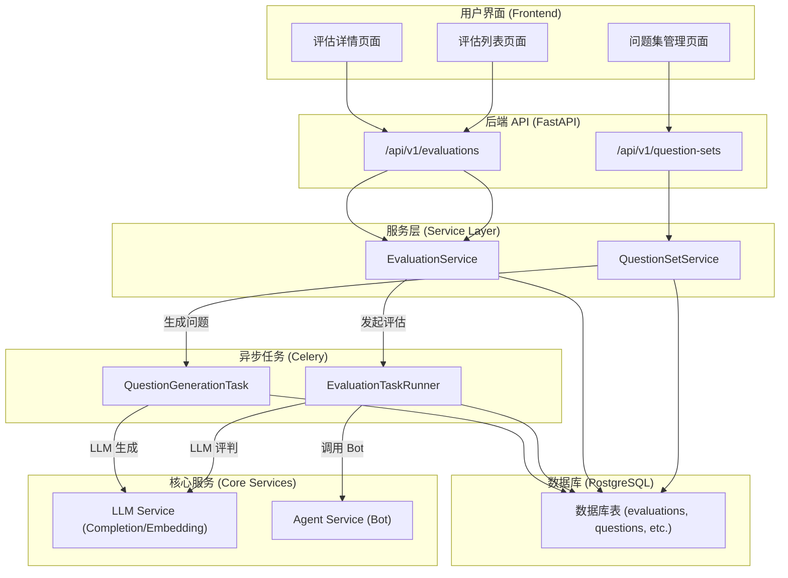

# ApeRAG 自动化评估功能设计文档

## 1. 概述

本文档旨在为 ApeRAG 设计并实现一个全面的自动化评估功能。该功能的核心目标是允许用户通过自定义的数据集和问题集，对 RAG 应用的效果进行量化评估、跟踪和分析。这将形成一个实验和迭代改进的闭环，帮助用户持续优化他们的 RAG 应用。

### 1.1 核心功能范围 (MVP)

- **问题集管理**: 提供独立的 UI 界面，支持对问题集（包含问题和标准答案）的增删改查及文件上传。
- **问题集自动生成**: 在用户只提供数据集（Collection）的情况下，利用 LLM 从文档中生成事实性问题和推理性问题及其标准答案。
- **评估任务管理**: 用户可以选择数据集、问题集、Bot/Agent 和 LLM 模型，发起一次评估任务。
- **异步评估执行**: 评估任务在后台异步执行，支持查看进度，并为未来实现暂停/恢复功能奠定基础。
- **LLM 自动评判**: RAG 的回答将由指定的 LLM 根据标准答案进行打分（5分制），并给出评判理由。
- **评估结果可视化**:
    - **评估列表页**: 展示所有历史和正在进行的评估任务。
    - **评估详情页**: 展示评估的总体摘要（如总得分、完成度）和每个问题的详细对比（问题、标准答案、RAG 回答、LLM 评判结果、引用来源等）。

### 1.2 设计原则

- **架构一致性**: 遵循项目现有的双链路、状态驱动的异步处理架构（参考 `indexing_architecture`），将评估任务作为一种后台工作流进行管理。
- **模块化与可扩展性**: 将问题集管理、评估执行、LLM 评判等功能解耦，设计可扩展的接口以支持未来更多的评估方法和模型。
- **用户体验**: 提供清晰、直观的 UI 界面，简化评估流程，并提供详尽的结果展示，帮助用户快速定位问题。

## 2. 数据库 Schema 设计

为了支持评估功能，我们需要新增三张核心数据表。

### 2.1 新增表设计

**表1: `question_sets` - 问题集表**

存储用户创建或上传的问题集。

```sql
CREATE TABLE question_sets (
    id VARCHAR(24) PRIMARY KEY DEFAULT ('qs_' || substr(md5(random()::text), 1, 16)),
    user_id VARCHAR(24) NOT NULL,          -- 关联 users 表
    collection_id VARCHAR(24),             -- 可选，如果问题集是针对特定数据集生成的
    name VARCHAR(255) NOT NULL,            -- 问题集名称
    description TEXT,                      -- 问题集描述
    question_count INTEGER NOT NULL DEFAULT 0, -- 问题数量

    gmt_created TIMESTAMP WITH TIME ZONE NOT NULL DEFAULT NOW(),
    gmt_updated TIMESTAMP WITH TIME ZONE NOT NULL DEFAULT NOW(),
    gmt_deleted TIMESTAMP WITH TIME ZONE NULL
);

CREATE INDEX idx_question_sets_user_id ON question_sets(user_id);
CREATE INDEX idx_question_sets_collection_id ON question_sets(collection_id);
```

**表2: `questions` - 问题表**

存储问题集中的具体问题和标准答案。

```sql
CREATE TABLE questions (
    id VARCHAR(24) PRIMARY KEY DEFAULT ('q_' || substr(md5(random()::text), 1, 16)),
    question_set_id VARCHAR(24) NOT NULL,  -- 关联 question_sets 表
    question_type VARCHAR(50) NOT NULL,    -- 问题类型: 'FACTUAL', 'INFERENTIAL', 'USER_DEFINED'
    question_text TEXT NOT NULL,           -- 问题内容
    ground_truth TEXT NOT NULL,            -- 标准答案

    gmt_created TIMESTAMP WITH TIME ZONE NOT NULL DEFAULT NOW(),
    gmt_updated TIMESTAMP WITH TIME ZONE NOT NULL DEFAULT NOW(),
    gmt_deleted TIMESTAMP WITH TIME ZONE NULL
);

CREATE INDEX idx_questions_question_set_id ON questions(question_set_id);
```

**表3: `evaluations` - 评估任务表**

记录每一次评估任务的配置、状态和总体结果。

```sql
CREATE TABLE evaluations (
    id VARCHAR(24) PRIMARY KEY DEFAULT ('eval_' || substr(md5(random()::text), 1, 16)),
    user_id VARCHAR(24) NOT NULL,
    name VARCHAR(255) NOT NULL,            -- 本次评估的名称

    -- 评估配置
    collection_id VARCHAR(24) NOT NULL,    -- 使用的数据集
    question_set_id VARCHAR(24) NOT NULL,  -- 使用的问题集
    bot_id VARCHAR(24) NOT NULL,           -- 使用的 Bot/Agent
    judge_llm_model_id VARCHAR(255) NOT NULL, -- 用于评判的 LLM 模型

    -- 状态管理 (参考 Indexing 架构)
    status VARCHAR(50) NOT NULL DEFAULT 'PENDING', -- PENDING, RUNNING, PAUSED, COMPLETED, FAILED
    progress INTEGER NOT NULL DEFAULT 0,   -- 进度百分比
    total_questions INTEGER NOT NULL DEFAULT 0,
    completed_questions INTEGER NOT NULL DEFAULT 0,

    -- 总体结果
    average_score NUMERIC(3, 2),           -- 平均分

    gmt_created TIMESTAMP WITH TIME ZONE NOT NULL DEFAULT NOW(),
    gmt_updated TIMESTAMP WITH TIME ZONE NOT NULL DEFAULT NOW(),
    gmt_deleted TIMESTAMP WITH TIME ZONE NULL
);

CREATE INDEX idx_evaluations_user_id ON evaluations(user_id);
CREATE INDEX idx_evaluations_status ON evaluations(status);
```

**表4: `evaluation_results` - 评估结果详情表**

记录评估任务中每个问题的详细结果。

```sql
CREATE TABLE evaluation_results (
    id VARCHAR(24) PRIMARY KEY DEFAULT ('res_' || substr(md5(random()::text), 1, 16)),
    evaluation_id VARCHAR(24) NOT NULL,    -- 关联 evaluations 表
    question_id VARCHAR(24) NOT NULL,      -- 关联 questions 表

    -- RAG 回答详情
    rag_answer TEXT,                       -- RAG 的回答
    rag_answer_sources JSONB,              -- RAG 回答引用的来源 (documents, etc.)
    rag_tool_calls JSONB,                  -- RAG 过程中的工具调用

    -- LLM 评判结果
    llm_judge_score INTEGER,               -- 1-5 分
    llm_judge_reasoning TEXT,              -- LLM 给出的打分理由

    gmt_created TIMESTAMP WITH TIME ZONE NOT NULL DEFAULT NOW(),
    gmt_updated TIMESTAMP WITH TIME ZONE NOT NULL DEFAULT NOW()
);

CREATE INDEX idx_evaluation_results_evaluation_id ON evaluation_results(evaluation_id);
```

## 3. 系统架构与业务流程

### 3.1 技术架构图



### 3.2 核心业务流程

**流程1: 创建问题集 (富客户端模式)**
1.  **进入创建页面**: 用户在“评估”功能区进入“问题集”管理，并点击“新建问题集”，进入一个富客户端编辑界面。
2.  **动态编辑问题列表**:
    -   **手动编辑**: 页面核心是一个可编辑的问题列表，用户可以直接在列表中增、删、改问题和标准答案。
    -   **从文件导入**: 用户点击“导入文件”按钮，选择本地的 CSV 或 JSON 文件。前端直接解析文件内容，将其转换为问题项并追加到当前列表中，此过程不涉及后端文件上传。UI 会提供清晰的文件格式说明。
    -   **从 Collection 生成**: 用户点击“生成问题”按钮，弹出一个配置界面。
        -   用户选择一个已有的 Collection、指定生成用的 LLM、问题数量，并可以按需修改生成 Prompt。
        -   点击“生成”后，前端调用 `POST /api/v1/question-sets/generate` 接口。
        -   后端异步或同步执行生成任务，并将生成的问题列表返回。
        -   用户在前端预览生成结果，确认后可将其导入到当前的问题列表中。
3.  **最终创建**:
    -   用户在主界面上填写问题集的名称和描述。
    -   当问题列表准备就绪后，用户点击“创建”按钮。
    -   前端将问题集元数据（名称、描述）和整个问题列表一次性通过 `POST /api/v1/question-sets` 接口提交给后端。
    -   后端服务接收到请求后，在单个事务中创建 `question_sets` 记录和所有对应的 `questions` 记录。

**流程2: 发起评估**
1.  用户在“评估”页面点击“新建评估”。
2.  选择一个 Collection、一个 Question Set、一个 Bot 和一个用于评判的 LLM。
3.  后端 `EvaluationService` 创建一条 `evaluations` 记录，初始状态为 `PENDING`。
4.  一个后台定时任务（类似 `IndexReconciler`）发现 `PENDING` 状态的评估，并触发 `EvaluationTaskRunner`。

**流程3: 异步评估执行**
1.  `EvaluationTaskRunner` 启动，将评估状态更新为 `RUNNING`。
2.  任务遍历问题集中的每一个问题。
3.  对于每个问题，调用 `AgentService`（即指定的 Bot）获取 RAG 回答。
4.  记录 RAG 回答、来源、工具调用等信息。
5.  调用 `LLMService`，将（原问题、标准答案、RAG回答）发送给评判 LLM，获取评分和理由。
6.  将详细结果写入 `evaluation_results` 表。
7.  更新 `evaluations` 表的进度（`completed_questions`）。
8.  所有问题处理完毕后，计算总分，将评估状态更新为 `COMPLETED`。

**流程4: 查看评估结果**
1.  用户在“评估列表”页看到所有评估任务及其状态和进度。
2.  对于进行中的任务，前端可以定时轮询 API 获取最新进度。
3.  点击进入详情页，前端获取评估的总体信息和已完成问题的详细结果列表，进行可视化展示。

## 4. 后端设计 (API & Service)

### 4.1 API 端点设计

**问题集管理 (`/api/v1/question-sets`)**
- `GET /`: 获取当前用户的所有问题集。
- `POST /`: 创建一个包含完整问题列表的新问题集。请求体将包含问题集的元数据和问题数组。
- `POST /generate`: 根据指定的 Collection 和配置，调用 LLM 实时生成问题列表并返回，不直接创建问题集。
- `GET /{qs_id}`: 获取问题集详情及其所有问题。
- `PUT /{qs_id}`: 更新问题集信息（元数据）。
- `DELETE /{qs_id}`: 删除问题集。
- `POST /{qs_id}/questions`: (保留) 在已存在的问题集中新增问题。
- `PUT /questions/{q_id}`: 修改单个问题。
- `DELETE /questions/{q_id}`: 删除单个问题。
- **注意**: `POST /upload` 接口将不再需要，文件解析在前端完成。

**评估管理 (`/api/v1/evaluations`)**
- `GET /`: 获取所有评估任务列表。
- `POST /`: 创建并启动一个新的评估任务。
- `GET /{eval_id}`: 获取评估任务的详情（包括总体结果和已完成问题的结果）。
- `DELETE /{eval_id}`: 删除一个评估任务及其结果。
- `POST /{eval_id}/pause`: (未来) 暂停一个评估任务。
- `POST /{eval_id}/resume`: (未来) 恢复一个评估任务。

### 4.2 服务层设计

**`QuestionSetService`**
- 负责问题集和问题的 CRUD 业务逻辑。
- 包含触发问题生成任务的逻辑。

**`EvaluationService`**
- 负责评估任务的 CRUD 业务逻辑。
- 核心职责是创建评估记录，并与异步任务系统解耦。状态变更由任务回调或调谐器处理。

## 5. LLM 评判与问题生成

### 5.1 LLM 评判 Prompt

将使用一个结构化的 Prompt 来引导 LLM 进行打分。

```text
你是一个客观、严谨的 RAG 系统回答质量评估专家。请根据以下信息，对 RAG 系统的回答进行评分。

**评分标准 (5分制):**
- 5分 (完美回答): 事实100%准确，完全基于来源，全面回答了问题，无任何冗余，语言流畅。
- 4分 (高质量回答): 绝大部分信息准确，可能有极微小瑕疵，基本完整，可读性好。
- 3分 (中等质量回答): 包含部分正确信息，但也有明显错误或遗漏，需要用户自行辨别。
- 2分 (低质量回答): 包含大量错误信息，或未能解决问题，可能会误导用户。
- 1分 (错误或无法回答): 完全错误，产生幻觉，或拒绝回答。

**待评估信息:**
1.  **原始问题:**
    ```
    {question}
    ```
2.  **标准答案 (Ground Truth):**
    ```
    {ground_truth}
    ```
3.  **RAG 系统回答:**
    ```
    {rag_answer}
    ```

**你的任务:**
请以 JSON 格式输出你的评判结果，包含两个字段：`score` (1-5的整数) 和 `reasoning` (解释你打分原因的字符串)。

**输出示例:**
{
  "score": 4,
  "reasoning": "回答基本准确并涵盖了主要信息点，但遗漏了关于次要贡献者的细节。语言表达清晰，但可以更简洁一些。"
}
```

### 5.2 问题生成 Prompt

```text
你是一个善于提出问题的专家。请仔细阅读以下文档内容，并根据内容生成两种类型的问题和对应的标准答案。

**问题类型:**
1.  **事实性问题 (Factual)**: 可以直接从文本中找到明确答案的问题。
2.  **推理性问题 (Inferential)**: 需要结合文本中多个信息点进行推理、比较或总结才能得出答案的问题。

**文档内容:**
```
{document_content}
```

**你的任务:**
请根据以上文档，生成 {N} 个问题。请以 JSON 格式输出一个问题列表，每个问题对象包含三个字段: `question_type` ('FACTUAL' 或 'INFERENTIAL'), `question_text` (问题内容), 和 `ground_truth` (基于文档内容得到的标准答案)。

**输出示例:**
[
  {
    "question_type": "FACTUAL",
    "question_text": "文档中提到的项目启动于哪一年？",
    "ground_truth": "根据文档，该项目于2021年正式启动。"
  },
  {
    "question_type": "INFERENTIAL",
    "question_text": "项目早期阶段和后期阶段的主要挑战有何不同？",
    "ground_truth": "项目早期挑战主要是技术选型和团队组建，后期挑战则转变为系统性能优化和市场推广。"
  }
]
```

## 6. 前端设计

### 6.1 页面与路由

- `/evaluations`: 评估功能的根路径，包含二级导航。
- `/evaluations/list`: 评估任务列表页面。
- `/evaluations/new`: 创建新评估的表单页面。
- `/evaluations/{eval_id}`: 评估详情页。
- `/evaluations/question-sets`: 问题集列表页面。
- `/evaluations/question-sets/new`: 创建新问题集的富客户端页面。
- `/evaluations/question-sets/{qs_id}`: 问题集详情与编辑页面。

### 6.2 关键组件

- **`EvaluationList`**: 展示评估任务列表，包含状态、进度条和关键信息。
- **`ResultComparisonCard`**: 在详情页中，用于并排展示单个问题的标准答案、RAG 回答和 LLM 评判结果的卡片。
- **`QuestionSetList`**: 展示问题集列表。
- **`QuestionSetEditor`**: 创建和编辑问题集的富客户端组件。
    - **`EditableQuestionTable`**: 一个可交互的表格，用于手动增删改查问题列表。
    - **`FileUploadParser`**: 客户端文件解析器，支持 CSV/JSON，并能将结果填入表格。
    - **`QuestionGenerationModal`**: 一个模态框，封装了从 Collection 生成问题的交互流程。

## 7. 实施计划

### 第一阶段：后端基础与核心逻辑
1.  **数据库**: 创建 `question_sets`, `questions`, `evaluations`, `evaluation_results` 四张表及迁移脚本。
2.  **API & Service**: 实现问题集管理的完整 CRUD 后端接口。
3.  **评估任务创建**: 实现创建评估任务的 API，能在数据库中正确创建 `PENDING` 状态的记录。
4.  **异步任务框架**: 设计 `EvaluationTaskRunner` 的基本结构，实现从 `PENDING` 到 `RUNNING` 的状态流转。

### 第二阶段：评估执行与评判
1.  **RAG 调用**: 在 `EvaluationTaskRunner` 中实现调用 Agent Service 获取回答的逻辑。
2.  **LLM 评判**: 实现 `LLMJudge` 模块，封装评判 prompt 和逻辑，并在 Task Runner 中调用。
3.  **结果存储**: 将 RAG 回答和 LLM 评判结果正确写入 `evaluation_results` 表。
4.  **状态更新**: 完成从 `RUNNING` 到 `COMPLETED` / `FAILED` 的状态流转，并计算最终得分。

### 第三阶段：前端页面开发
1.  **问题集管理**: 开发 `/question-sets` 页面，实现完整的 UI 操作。
2.  **评估列表与创建**: 开发 `/evaluations` 和 `/evaluations/new` 页面。
3.  **评估详情页**: 开发 `/evaluations/{eval_id}` 页面，重点是 `ResultComparisonCard` 的可视化效果。实现进行中任务的自动刷新。

### 第四阶段：高级功能
1.  **问题自动生成**: 实现 `QuestionGenerationTask` 及对应的 Service 和 API。
2.  **文件上传**: 实现问题集的文件上传解析功能。
3.  **暂停/恢复**: (可选) 实现评估任务的暂停与恢复功能，这需要更复杂的状态管理。

这份设计文档为自动化评估功能提供了一个清晰、可行的蓝图。我们可以基于此分阶段进行开发。
