# 图索引构建流程

## 1. 什么是图索引

图索引（Graph Index）是 ApeRAG 的核心特色功能，它能从非结构化文本中自动提取出结构化的知识图谱。

### 1.1 一个简单的例子

想象一下，你有一份关于公司组织架构的文档，里面提到：

> "张三是数据库团队的负责人，他擅长 PostgreSQL 和 MySQL。李四在前端团队工作，经常和张三的团队协作开发后台管理系统。"

**从文档到知识图谱的转换**：

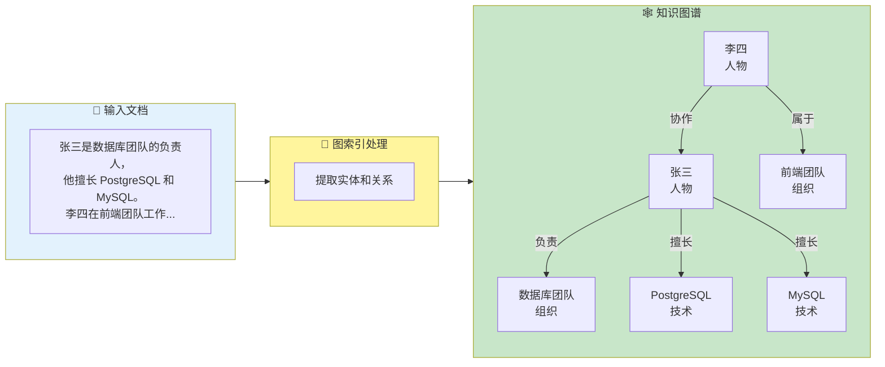

传统的向量检索只能找到"语义相似"的段落，但无法回答这些问题：
- 张三负责什么？
- 张三和李四是什么关系？
- 数据库团队都有哪些技术栈？

**图索引能做到**：精确回答这些需要理解"关系"的问题，因为它把隐藏在文本中的知识关系显性化了。

### 1.2 核心价值

与传统检索方式相比，图索引提供了独特的能力：

| 能力 | 向量检索 | 全文检索 | 图索引 |
|------|---------|---------|--------|
| 语义相似搜索 | ✅ 强 | ❌ 弱 | ✅ 强 |
| 精确关键词匹配 | ❌ 弱 | ✅ 强 | ✅ 中 |
| 关系查询 | ❌ 不支持 | ❌ 不支持 | ✅ 强 |
| 多跳推理 | ❌ 不支持 | ❌ 不支持 | ✅ 支持 |
| 适用问题 | "如何优化性能" | "PostgreSQL 配置" | "张三和李四的关系" |

**核心优势**：图索引让 AI 能够"理解"知识之间的关联，而不仅仅是文本的相似度。

## 2. 图索引能解决什么问题

图索引特别擅长处理那些需要"理解关系"的场景。让我们看看它在实际工作中的应用。

### 2.1 企业知识管理

**场景**：公司有大量文档，包括组织架构、项目资料、技术文档等。

**图索引的价值**：

- 📊 **组织关系**："张三的团队有哪些人？" → 快速找到团队成员
- 🔗 **协作关系**："谁和张三合作过？" → 发现工作网络
- 🛠️ **技能图谱**："谁擅长 PostgreSQL？" → 定位技术专家
- 📁 **项目历史**："张三参与过哪些项目？" → 追溯项目经验

**实际效果**：

```
问："数据库团队负责人是谁？"
传统检索：返回包含"数据库团队"和"负责人"的所有段落（可能几十条）
图索引：直接返回"张三" + 相关背景信息
```

### 2.2 研究与学习

**场景**：分析学术论文、技术文档，理解知识脉络。

**图索引的价值**：

- 👥 **作者网络**："这个作者和谁合作过？" → 发现研究团队
- 📖 **引用关系**："这篇论文引用了哪些文献？" → 追溯研究脉络
- 🔬 **技术演进**："这个技术是如何发展的？" → 理解技术历史
- 💡 **概念关联**："A 技术和 B 技术有什么关系？" → 连接知识点

### 2.3 产品与服务

**场景**：产品文档、用户手册、API 文档等。

**图索引的价值**：

- ⚙️ **功能依赖**："启用 A 功能需要先配置什么？" → 理解依赖关系
- 🔧 **配置关联**："这个配置项会影响哪些功能？" → 避免误操作
- 🐛 **问题诊断**："出现 X 错误可能是什么原因？" → 快速定位
- 📚 **API 关系**："这个 API 通常和哪些 API 一起使用？" → 学习最佳实践

### 2.4 对比：什么时候用图索引

不同的问题适合不同的检索方式：

| 问题类型 | 示例 | 最佳方案 |
|---------|------|---------|
| **概念理解** | "什么是 RAG？" | 向量检索 |
| **精确查找** | "PostgreSQL 配置文件路径" | 全文检索 |
| **关系查询** | "张三和李四什么关系？" | 图索引 ✨ |
| **多跳推理** | "张三团队用的技术栈" | 图索引 ✨ |
| **知识追溯** | "这个功能依赖哪些模块？" | 图索引 ✨ |

**最佳实践**：ApeRAG 同时支持向量检索、全文检索和图索引，可以根据问题类型智能选择或组合使用。

## 3. 构建流程概览

当你上传一个文档并启用图索引后，ApeRAG 会自动完成以下步骤。这里先给出一个简单的概览，具体细节在后面章节详细介绍。

### 3.1 五个关键步骤

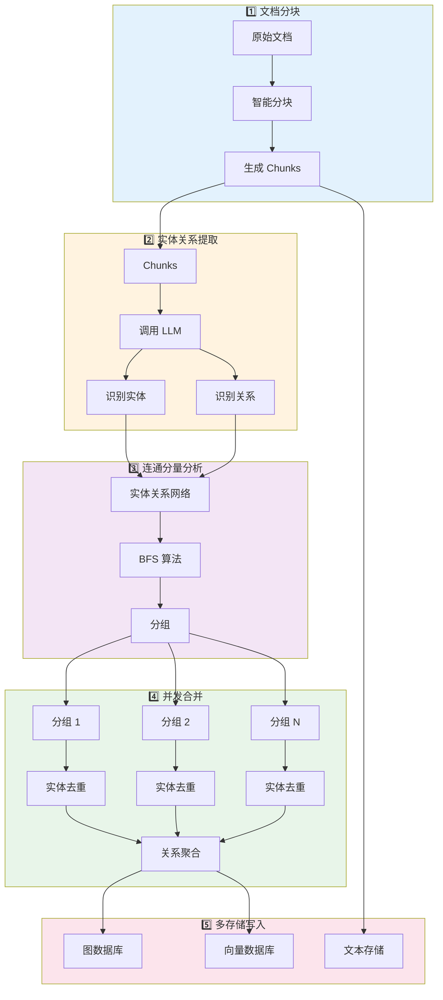

**简单来说**，就是：文档分块 → 提取实体关系 → 智能分组 → 并发合并 → 写入存储。

整个过程完全自动化，你只需要上传文档，系统会自动完成所有工作。

### 3.2 处理时间参考

不同规模的文档，处理时间大致如下：

| 文档大小 | 实体数量 | 处理时间 | 说明 |
|---------|---------|---------|------|
| 小型（< 5 页） | ~50 个 | 10-30 秒 | 公司通知、会议纪要 |
| 中型（10-50 页） | ~200 个 | 1-3 分钟 | 技术文档、产品手册 |
| 大型（100+ 页） | ~1000 个 | 5-15 分钟 | 研究报告、书籍 |

**影响因素**：
- LLM 响应速度（主要瓶颈）
- 文档复杂度（表格、图片多会慢一些）
- 并发设置（可以通过配置提速）

> 💡 **提示**：处理是异步的，你可以上传多个文档，系统会并行处理。

### 3.3 实时进度查看

你可以随时查看文档的处理进度：

```
文档状态：处理中
- ✅ 文档解析：完成
- ✅ 文档分块：完成（生成 25 个 chunks）
- 🔄 实体提取：进行中（15/25）
- ⏳ 关系提取：等待中
- ⏳ 图谱构建：等待中
```

处理完成后，文档状态会变为"活跃"，此时就可以进行图谱查询了。

## 4. 详细构建流程

前面介绍了图索引能做什么以及整体流程概览。如果你想了解更多技术细节，这一章会详细介绍每个步骤的具体实现。

> 💡 **阅读建议**：如果你只是想了解图索引的基本概念和用法，可以跳过这一章，直接看第 8 章的实际应用场景。

### 4.1 文档分块

第一步是把长文档切成合适大小的块（chunks）。

**为什么要分块？**
- LLM 有输入长度限制（通常几千到几万 tokens）
- 块太大：提取质量下降，LLM 容易"遗漏"信息
- 块太小：丢失上下文，无法理解完整语义

**智能分块策略**：

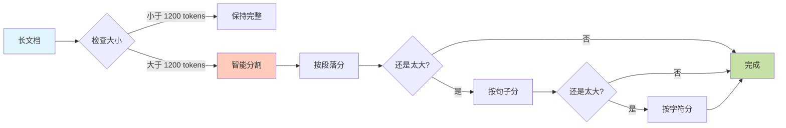

**分块参数**：
- 默认大小：1200 tokens（约 800-1000 个中文字）
- 重叠大小：100 tokens（保证上下文连续）
- 优先级：段落 > 句子 > 字符

### 4.2 实体关系提取

使用 LLM 从每个 chunk 中识别实体和关系。

**提取过程**：

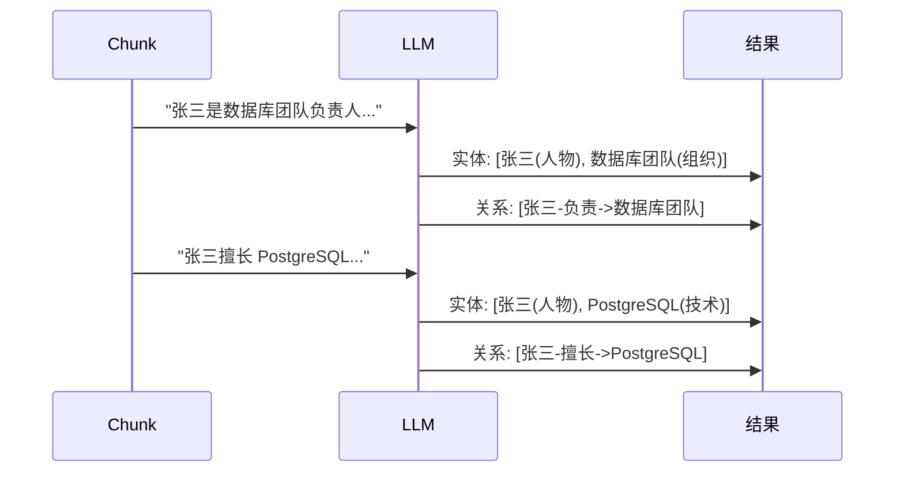

**并发优化**：多个 chunks 可以同时调用 LLM，默认并发 20 个请求。

### 4.3 连通分量分析

把实体关系网络分成独立的子图，实现并行处理。

**为什么需要这一步？**

技术团队的实体和财务部门的实体之间没有连接，可以完全并行处理！

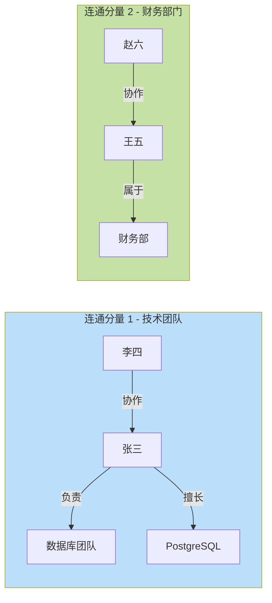

**性能提升**：3 个独立分量 = 3 倍加速！

### 4.4 并发合并

同名实体需要去重，相同关系需要聚合。

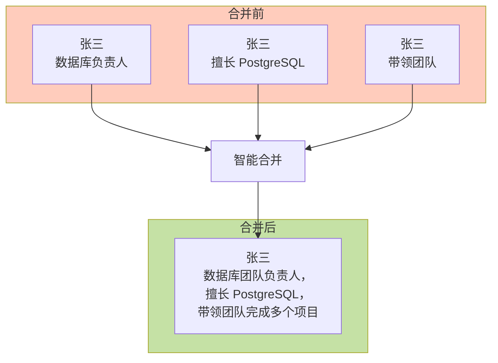

**细粒度锁**：只锁定正在合并的实体，其他实体可以并发处理。

### 4.5 多存储写入

知识图谱写入三个存储系统：

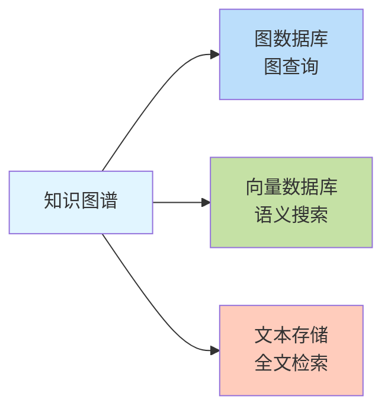

不同存储支持不同类型的查询，互相补充。

## 5. 核心技术设计

这一章介绍 ApeRAG 图索引的核心技术设计，包括数据隔离、并发控制等。

> 💡 **阅读建议**：这些是系统架构和实现细节，主要面向开发者和技术决策者。

### 5.1 workspace 数据隔离

每个 Collection 拥有独立的命名空间，实现完全的数据隔离。

**命名规范**：

```python
# 实体命名
entity:{entity_name}:{workspace}
# 示例
entity:张三:collection_abc123

# 关系命名
relationship:{source}:{target}:{workspace}
# 示例
relationship:张三:数据库团队:collection_abc123
```

**隔离效果**：

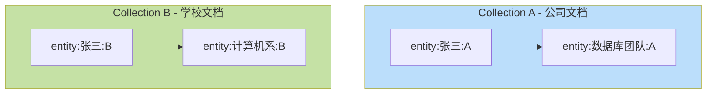

两个 Collection 中的"张三"完全独立，互不干扰！

### 5.2 无状态实例管理

每个处理任务创建独立的图索引实例，处理完成后销毁。

**生命周期管理**：

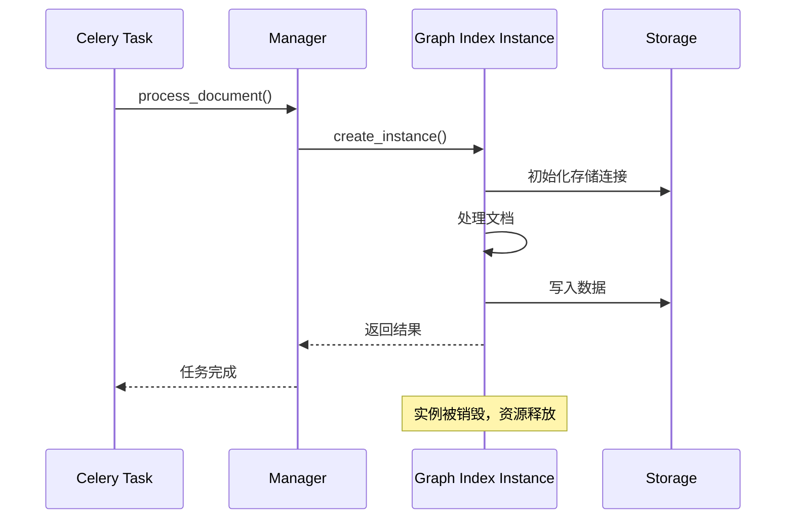

**优势**：

- ✅ 零状态污染：每个任务独立，不会互相干扰
- ✅ 自动资源管理：实例销毁时自动释放资源
- ✅ 易于扩展：可以同时运行多个 Worker

### 5.3 连通分量并发优化

通过图拓扑分析，实现智能并发处理。

**算法原理**：

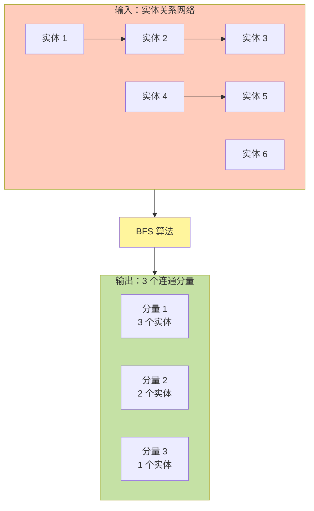

**性能提升**：3 个分量并发处理 = 3 倍加速！

### 5.4 细粒度并发控制

实现实体级别的精确锁定：

**锁的层次**：

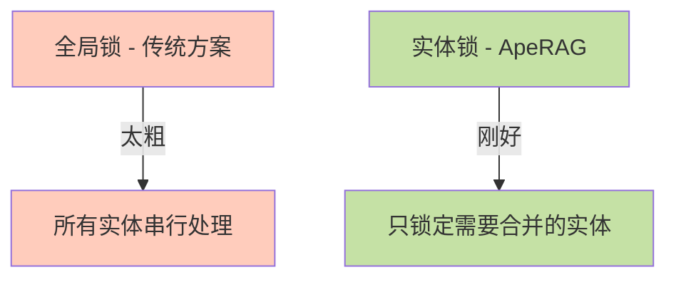

**锁策略**：
1. 提取阶段无锁：完全并行
2. 合并阶段加锁：只锁需要的实体
3. 排序获取锁：避免死锁

### 5.5 智能摘要生成

自动压缩过长的描述内容：

```python
if len(description) > 2000 tokens:
    summary = await llm_summarize(description)
else:
    summary = description
```

**效果**：2500 tokens 压缩到 200 tokens，保留核心信息。

### 5.6 多存储后端支持

ApeRAG 支持两种图数据库：Neo4j 和 PostgreSQL。

**如何选择？**

| 场景 | 推荐方案 | 原因 |
|------|---------|------|
| **小规模**（< 10万实体） | PostgreSQL | 运维简单，成本低 |
| **中等规模**（10-100万） | PostgreSQL 或 Neo4j | 根据查询复杂度选择 |
| **大规模**（> 100万） | Neo4j | 图查询性能更好 |
| **预算有限** | PostgreSQL | 无需额外部署 |
| **复杂图算法** | Neo4j | 内置图算法支持 |

**切换方式**：

```bash
# 使用 PostgreSQL（默认）
export GRAPH_INDEX_GRAPH_STORAGE=PGOpsSyncGraphStorage

# 使用 Neo4j
export GRAPH_INDEX_GRAPH_STORAGE=Neo4JSyncStorage
```

**性能对比**：

| 操作 | PostgreSQL | Neo4j |
|------|-----------|-------|
| **简单查询**（1-2跳） | 快 | 快 |
| **复杂查询**（3+跳） | 中 | 快 |
| **批量写入** | 快 | 中 |
| **图算法** | 需要自己实现 | 内置支持 |

## 6. 完整数据流

整个图索引构建过程是一个数据转换流水线，从非结构化文本到结构化知识图谱：

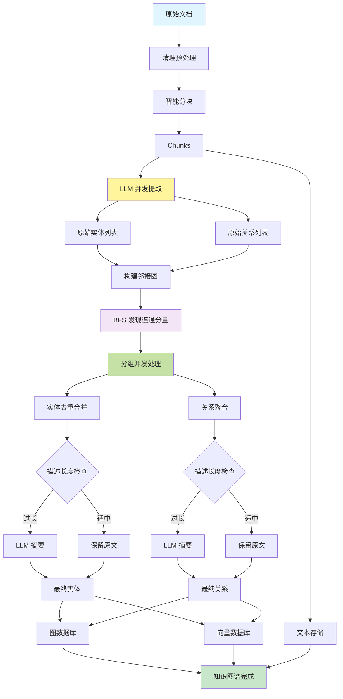

### 数据转换示例

让我们用一个具体例子，看看数据是如何一步步转换的：

**输入文档**：

```text
张三是数据库团队的负责人，他擅长 PostgreSQL 和 MySQL。
李四在前端团队工作，经常和张三的团队协作开发后台管理系统。
王五是财务部的会计，负责公司的财务报表。
```

**Step 1: 分块**

```json
[
  {
    "chunk_id": "chunk-001",
    "content": "张三是数据库团队的负责人，他擅长 PostgreSQL 和 MySQL。",
    "tokens": 25
  },
  {
    "chunk_id": "chunk-002",
    "content": "李四在前端团队工作，经常和张三的团队协作开发后台管理系统。",
    "tokens": 28
  },
  {
    "chunk_id": "chunk-003",
    "content": "王五是财务部的会计，负责公司的财务报表。",
    "tokens": 20
  }
]
```

**Step 2: 实体关系提取**

```json
{
  "entities": [
    {"name": "张三", "type": "人物", "source": "chunk-001"},
    {"name": "数据库团队", "type": "组织", "source": "chunk-001"},
    {"name": "PostgreSQL", "type": "技术", "source": "chunk-001"},
    {"name": "MySQL", "type": "技术", "source": "chunk-001"},
    {"name": "李四", "type": "人物", "source": "chunk-002"},
    {"name": "前端团队", "type": "组织", "source": "chunk-002"},
    {"name": "王五", "type": "人物", "source": "chunk-003"},
    {"name": "财务部", "type": "组织", "source": "chunk-003"}
  ],
  "relationships": [
    {"source": "张三", "target": "数据库团队", "relation": "负责"},
    {"source": "张三", "target": "PostgreSQL", "relation": "擅长"},
    {"source": "张三", "target": "MySQL", "relation": "擅长"},
    {"source": "李四", "target": "前端团队", "relation": "属于"},
    {"source": "李四", "target": "张三", "relation": "协作"},
    {"source": "王五", "target": "财务部", "relation": "属于"}
  ]
}
```

**Step 3: 连通分量分析**

```
连通分量 1（技术部门）：
- 实体：张三、李四、数据库团队、前端团队、PostgreSQL、MySQL
- 关系：6 条

连通分量 2（财务部门）：
- 实体：王五、财务部
- 关系：1 条
```

**Step 4: 并发合并**

两个分量可以并行处理！

**Step 5: 最终知识图谱**

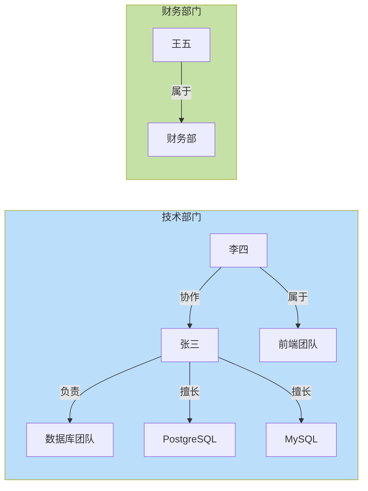

### 性能优化特性

1. **细粒度并发控制**
   - 实体级别的锁：`entity:张三:collection_abc`
   - 只在合并时加锁，提取时完全并行

2. **连通分量并发**
   - 技术部门和财务部门可以并行处理
   - 零锁竞争，充分利用多核 CPU

3. **智能摘要**
   - 描述 < 2000 tokens：保留原文
   - 描述 > 2000 tokens：LLM 摘要压缩

## 7. 性能优化策略

### 7.1 并发度控制

图索引构建涉及大量的 LLM 调用和数据库操作，需要合理控制并发度。

**并发层次**：

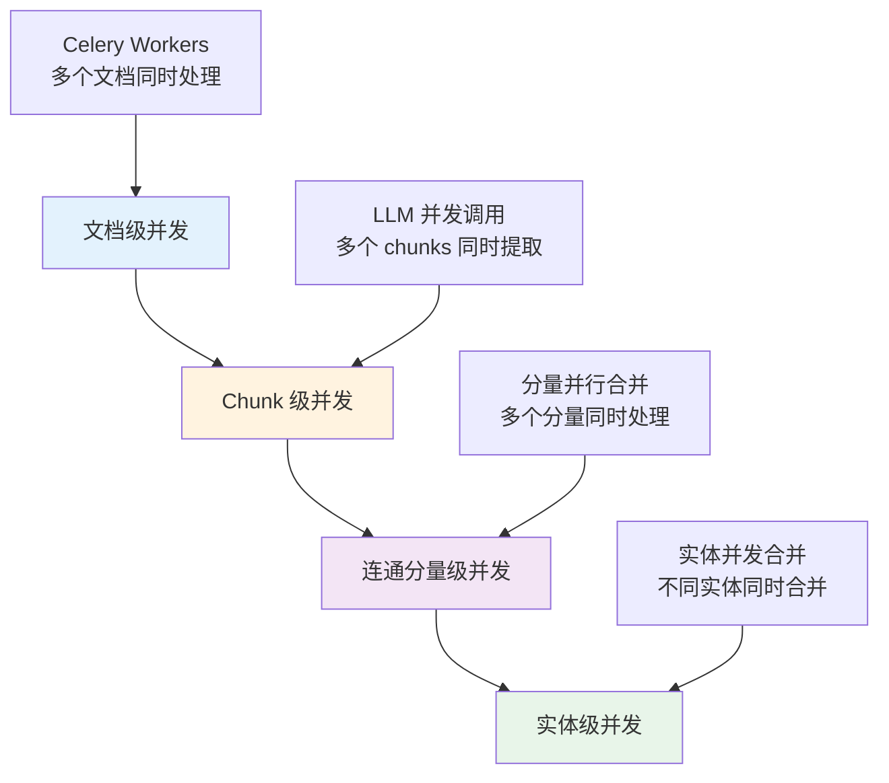

**并发参数配置**：

| 参数 | 默认值 | 说明 |
|------|--------|------|
| `llm_model_max_async` | 20 | LLM 并发调用数 |
| `embedding_func_max_async` | 16 | Embedding 并发调用数 |
| `max_batch_size` | 32 | 批量处理大小 |

**调优建议**：

```python
# 场景 1：LLM API 限流严格
llm_model_max_async = 5  # 降低并发，避免触发限流

# 场景 2：性能充足，想提速
llm_model_max_async = 50  # 提高并发，加快处理速度

# 场景 3：内存有限
max_batch_size = 16  # 减小批量大小，降低内存占用
```

### 7.2 LLM 调用优化

LLM 调用是最耗时的环节，主要优化策略：

1. **并发调用**：多个 chunks 同时提取（默认并发 20 个）
2. **批量处理**：减少 LLM 调用次数
3. **缓存复用**：相似描述复用摘要结果

**性能提升**：并发调用比串行快 4 倍。

### 7.3 存储优化

批量写入可以显著提升性能：

| 方式 | 100 个实体写入时间 |
|------|------------------|
| 逐个写入 | ~10 秒 |
| 批量写入（32 个/批） | ~1 秒 |

**优化效果**：10 倍速度提升！

### 7.4 内存优化

大文档处理的内存管理策略：

- 流式分块：不一次性加载整个文档
- 及时释放：处理完立即释放内存
- 分批处理：控制内存峰值

### 7.5 性能监控

系统会输出详细的性能统计：

```
图索引构建完成：
✓ 文档分块：10 个 chunks，耗时 0.5 秒
✓ 实体提取：120 个实体，耗时 25 秒
✓ 关系提取：85 个关系，耗时 25 秒
✓ 并发合并：耗时 15 秒
✓ 存储写入：耗时 2 秒
━━━━━━━━━━━━━━━━━━━━━━━━━
总耗时：42.7 秒
```

**瓶颈分析**：实体/关系提取占 60% 时间，可通过提高 LLM 并发度优化。

## 8. 配置参数

### 8.1 核心配置

图索引构建可以通过以下参数进行调优：

**分块参数**：

```python
# 分块大小（tokens）
CHUNK_TOKEN_SIZE = 1200

# 重叠大小（tokens）
CHUNK_OVERLAP_TOKEN_SIZE = 100
```

**调优建议**：
- 小文档（< 5000 tokens）：`CHUNK_TOKEN_SIZE = 800`
- 大文档（> 50000 tokens）：`CHUNK_TOKEN_SIZE = 1500`
- 需要更多上下文：增加 `CHUNK_OVERLAP_TOKEN_SIZE`

**并发参数**：

```python
# LLM 并发调用数
LLM_MODEL_MAX_ASYNC = 20

# Embedding 并发调用数
EMBEDDING_FUNC_MAX_ASYNC = 16

# 批量处理大小
MAX_BATCH_SIZE = 32
```

**调优建议**：
- LLM API 限流严格：降低 `LLM_MODEL_MAX_ASYNC` 到 5-10
- 性能充足想提速：提高到 50-100
- 内存有限：降低 `MAX_BATCH_SIZE` 到 16

**实体提取参数**：

```python
# 实体提取重试次数（0 = 只提取 1 次）
ENTITY_EXTRACT_MAX_GLEANING = 0

# 摘要最大 token 数
SUMMARY_TO_MAX_TOKENS = 2000

# 强制摘要的描述片段数
FORCE_LLM_SUMMARY_ON_MERGE = 10
```

**调优建议**：
- 提取质量重要：`ENTITY_EXTRACT_MAX_GLEANING = 1`（多提取一次）
- 追求速度：`ENTITY_EXTRACT_MAX_GLEANING = 0`
- 描述经常很长：降低 `SUMMARY_TO_MAX_TOKENS` 到 1000

### 8.2 知识图谱配置

在 Collection 配置中可以设置：

```json
{
  "knowledge_graph_config": {
    "language": "simplified chinese",
    "entity_types": [
      "organization",
      "person",
      "geo",
      "event",
      "product",
      "technology",
      "date",
      "category"
    ]
  }
}
```

**参数说明**：

- **language**：提取语言，影响 LLM 提示词
  - `simplified chinese`：简体中文
  - `English`：英文
  - `traditional chinese`：繁体中文

- **entity_types**：要提取的实体类型
  - 默认：8 种类型（组织、人物、地点、事件、产品、技术、日期、类别）
  - 可自定义：比如只提取人物和组织

### 8.3 存储配置

通过环境变量配置存储后端：

```bash
# KV 存储（键值对）
export GRAPH_INDEX_KV_STORAGE=PGOpsSyncKVStorage

# 向量存储
export GRAPH_INDEX_VECTOR_STORAGE=PGOpsSyncVectorStorage

# 图存储
export GRAPH_INDEX_GRAPH_STORAGE=Neo4JSyncStorage
# 或者使用 PostgreSQL
export GRAPH_INDEX_GRAPH_STORAGE=PGOpsSyncGraphStorage
```

**存储选择建议**：

| 场景 | KV 存储 | 向量存储 | 图存储 |
|------|---------|---------|--------|
| **默认** | PostgreSQL | PostgreSQL | PostgreSQL |
| **高性能向量搜索** | PostgreSQL | Qdrant | Neo4j |
| **大规模图谱** | PostgreSQL | Qdrant | Neo4j |
| **简单部署** | PostgreSQL | PostgreSQL | PostgreSQL |

### 8.4 完整配置示例

```bash
# 分块配置
export CHUNK_TOKEN_SIZE=1200
export CHUNK_OVERLAP_TOKEN_SIZE=100

# 并发配置
export LLM_MODEL_MAX_ASYNC=20
export MAX_BATCH_SIZE=32

# 提取配置
export ENTITY_EXTRACT_MAX_GLEANING=0
export SUMMARY_TO_MAX_TOKENS=2000

# 存储配置
export GRAPH_INDEX_KV_STORAGE=PGOpsSyncKVStorage
export GRAPH_INDEX_VECTOR_STORAGE=PGOpsSyncVectorStorage
export GRAPH_INDEX_GRAPH_STORAGE=PGOpsSyncGraphStorage

# 数据库连接（PostgreSQL）
export POSTGRES_HOST=127.0.0.1
export POSTGRES_PORT=5432
export POSTGRES_DB=aperag
export POSTGRES_USER=postgres
export POSTGRES_PASSWORD=your_password

# 数据库连接（Neo4j，可选）
export NEO4J_HOST=127.0.0.1
export NEO4J_PORT=7687
export NEO4J_USERNAME=neo4j
export NEO4J_PASSWORD=your_password
```

## 9. 实际应用场景

图索引特别适合以下场景：

### 9.1 企业知识库

**场景描述**：公司有大量的技术文档、组织架构、项目资料。

**图索引的价值**：

- ✅ 理解人员关系：谁和谁在一起工作过
- ✅ 追溯项目历史：哪些人参与了哪些项目
- ✅ 技术栈分析：哪个团队用什么技术
- ✅ 知识传承：某个领域的专家是谁

**查询示例**：

```
用户："张三参与过哪些项目？"
图索引：查询 张三 --参与--> 项目 的关系
结果：项目 A、项目 B、项目 C

用户："数据库团队都有哪些人？"
图索引：查询 人物 --属于--> 数据库团队 的关系
结果：张三、李四、王五
```

### 8.2 研究论文分析

**场景描述**：分析大量学术论文，理解研究脉络。

**图索引的价值**：

- ✅ 作者合作网络：谁和谁合作过
- ✅ 引用关系：哪些论文互相引用
- ✅ 研究主题：某个领域的核心概念
- ✅ 技术演进：技术如何发展的

**查询示例**：

```
用户："Graph RAG 相关的研究有哪些？"
图索引：查询 论文 --研究--> Graph RAG 的关系
结果：论文 A、论文 B、论文 C

用户："某作者和谁合作过？"
图索引：查询 作者 --合作--> 其他作者 的关系
结果：合作者列表及合作项目
```

### 8.3 产品文档

**场景描述**：软件产品的用户手册、API 文档。

**图索引的价值**：

- ✅ 功能依赖：某个功能依赖哪些其他功能
- ✅ API 关联：哪些 API 经常一起使用
- ✅ 配置关系：某个配置项影响哪些功能
- ✅ 问题诊断：出现某个错误可能是什么原因

**查询示例**：

```
用户："如何配置图索引？"
图索引：查询 配置项 --影响--> 图索引 的关系
结果：GRAPH_INDEX_GRAPH_STORAGE、knowledge_graph_config

用户："Neo4j 和 PostgreSQL 有什么区别？"
图索引：查询 Neo4j、PostgreSQL 的属性和关系
结果：性能对比、适用场景、配置方式
```

### 8.4 对话场景对比

让我们看看不同检索方式在实际对话中的表现：

**问题："张三和李四是什么关系？"**

| 检索方式 | 能否回答 | 回答质量 |
|---------|---------|---------|
| **纯向量检索** | ⚠️ 部分 | 找到提到两人的段落，但不清楚关系 |
| **纯全文检索** | ⚠️ 部分 | 找到包含"张三"和"李四"的段落 |
| **图索引** | ✅ 可以 | 直接返回：张三和李四是协作关系 |

**问题："PostgreSQL 配置文件在哪？"**

| 检索方式 | 能否回答 | 回答质量 |
|---------|---------|---------|
| **纯向量检索** | ✅ 可以 | 找到相关配置段落 |
| **纯全文检索** | ✅ 可以 | 精确匹配"PostgreSQL"和"配置" |
| **图索引** | ✅ 可以 | 找到 PostgreSQL --配置--> 文件 的关系 |

**问题："如何提升系统性能？"**

| 检索方式 | 能否回答 | 回答质量 |
|---------|---------|---------|
| **纯向量检索** | ✅ 强 | 找到所有性能优化相关内容 |
| **纯全文检索** | ⚠️ 中 | 需要精确关键词"性能"、"优化" |
| **图索引** | ✅ 强 | 找到 优化方法 --提升--> 性能 的关系 |

**最佳实践**：结合使用多种检索方式！

## 10. 总结

ApeRAG 的图索引提供了生产级的知识图谱构建能力，具有高性能、高可靠性和易扩展的特点。

### 关键特性

1. **workspace 数据隔离**：每个 Collection 完全独立，支持真正的多租户
2. **无状态架构**：每个任务独立实例，零状态污染
3. **连通分量并发**：智能并发策略，性能提升 2-3 倍
4. **细粒度锁管理**：实体级别的锁，最大化并发度
5. **智能摘要**：自动压缩过长描述，节省存储和提升检索效率
6. **多存储支持**：灵活选择 Neo4j 或 PostgreSQL

### 适用场景

- ✅ **企业知识库**：理解组织结构、人员关系、项目历史
- ✅ **研究论文分析**：作者合作网络、引用关系、研究脉络
- ✅ **产品文档**：功能依赖、配置关系、问题诊断
- ✅ **任何需要理解"关系"的场景**

### 性能表现

- 处理 10,000 个实体：约 2-5 分钟（取决于 LLM 速度）
- 连通分量并发：性能提升 2-3 倍
- 内存占用：约 400 MB（10,000 个实体）
- 存储空间：约 100 MB（10,000 个实体）

### 下一步

图索引构建完成后，就可以进行图谱检索了。ApeRAG 支持三种图谱查询模式：

- **Local 模式**：查询某个实体的局部信息
- **Global 模式**：查询整体关系和模式
- **Hybrid 模式**：综合性查询

详细的检索流程请参考 [系统架构文档](./architecture.md#42-知识图谱查询)。

---

## 相关文档

- 📋 [系统架构](./architecture.md) - ApeRAG 整体架构设计
- 📖 [实体提取与合并机制](./lightrag_entity_extraction_and_merging.md) - 核心算法详解
- 🔗 [连通分量优化](./connected_components_optimization.md) - 并发优化原理
- 🌐 [索引链路架构](./indexing_architecture.md) - 完整索引流程
