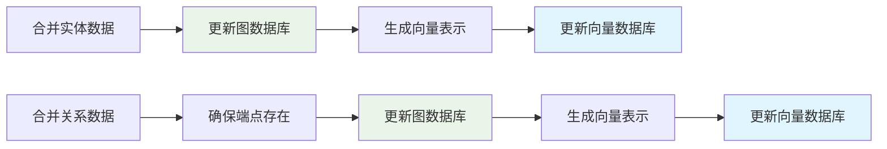
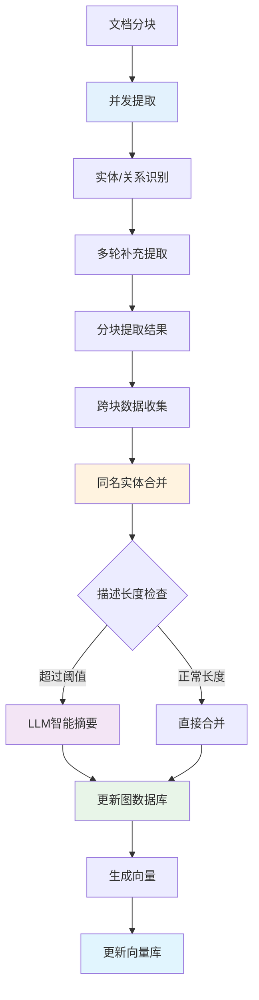

# LightRAG 实体提取与合并机制详解

> 📖 **补充阅读**：本文档是 [索引链路架构设计](./indexing_architecture_zh.md) 的技术细节补充，专注于 Graph Index 创建过程中的实体提取与合并机制。

## 概述

本文档详细介绍 LightRAG 系统中两个核心函数的工作原理：
- `extract_entities`: 从文本块中提取实体和关系
- `merge_nodes_and_edges`: 合并提取结果并更新知识图谱

这两个函数构成了 [Graph Index 创建流程](./graph_index_creation_zh.md) 的核心环节，负责将非结构化文本转换为结构化的知识图谱。

## 实体提取机制 (extract_entities)

### 核心工作流程

#### 1. 并发处理策略
```python
# 使用信号量控制并发数，避免LLM服务过载
semaphore = asyncio.Semaphore(llm_model_max_async)

# 为每个文本块创建异步任务
tasks = [
    asyncio.create_task(_process_single_content(chunk, context))
    for chunk in ordered_chunks
]

# 等待所有任务完成，支持异常处理
done, pending = await asyncio.wait(tasks, return_when=asyncio.FIRST_EXCEPTION)
```

**并发任务输入格式**：
```python
# 单个处理任务的输入
chunk_input = {
    "content": "要处理的文本内容",
    "chunk_key": "chunk_unique_identifier", 
    "file_path": "source_file_path",
    "context": {
        "entity_extraction_prompt": "实体提取提示词",
        "continue_extraction_prompt": "继续提取提示词",
        "extraction_config": {...}
    }
}
```

**单任务输出格式**：
```python
# _process_single_content 函数的返回值
task_result = (
    maybe_nodes,    # Dict[str, List[Dict]] - 候选实体
    maybe_edges     # Dict[Tuple[str, str], List[Dict]] - 候选关系
)

# 示例输出结构
maybe_nodes = {
    "张三": [{
        "entity_name": "张三",
        "entity_type": "人物", 
        "description": "公司技术总监",
        "source_id": "chunk_001",
        "file_path": "/docs/company.txt"
    }],
    "ABC公司": [{
        "entity_name": "ABC公司",
        "entity_type": "组织",
        "description": "科技公司",
        "source_id": "chunk_001", 
        "file_path": "/docs/company.txt"
    }]
}

maybe_edges = {
    ("张三", "ABC公司"): [{
        "src_id": "张三",
        "tgt_id": "ABC公司",
        "weight": 1.0,
        "description": "张三是ABC公司的技术总监",
        "keywords": "工作, 职位, 领导",
        "source_id": "chunk_001",
        "file_path": "/docs/company.txt"
    }]
}
```

#### 2. 多轮提取机制 (Gleaning)
LightRAG 采用多轮提取策略提高实体识别的完整性：

1. **初始提取**：使用实体提取提示词进行首次提取
2. **补充提取**：通过"继续提取"提示词发现遗漏的实体
3. **停止判断**：LLM 自主判断是否需要继续提取

```python
for glean_index in range(entity_extract_max_gleaning):
    # 补充提取：只接受新的实体名称
    glean_result = await use_llm_func(continue_prompt, history_messages=history)
    
    # 合并结果（去重）
    for entity_name, entities in glean_nodes.items():
        if entity_name not in maybe_nodes:  # 只接受新实体
            maybe_nodes[entity_name].extend(entities)
    
    # 判断是否继续
    if_continue = await use_llm_func(if_loop_prompt, history_messages=history)
    if if_continue.strip().lower() != "yes":
        break
```

**初始提取阶段产物**：
```python
# 第一轮提取的原始结果
initial_extraction = {
    "entities": [
        {
            "entity_name": "张三",
            "entity_type": "人物",
            "description": "技术总监" 
        },
        {
            "entity_name": "ABC公司", 
            "entity_type": "组织",
            "description": "科技公司"
        }
    ],
    "relationships": [
        {
            "src_id": "张三",
            "tgt_id": "ABC公司",
            "description": "工作关系",
            "keywords": "员工, 公司"
        }
    ]
}
```

**补充提取阶段产物**：
```python
# 每轮补充提取的增量结果
glean_extraction = {
    "round": 2,  # 提取轮次
    "new_entities": [
        {
            "entity_name": "产品部",  # 必须是全新的实体名称
            "entity_type": "部门", 
            "description": "ABC公司的产品开发部门"
        }
    ],
    "new_relationships": [
        {
            "src_id": "张三", 
            "tgt_id": "产品部",  # 必须是全新的关系对
            "description": "管理关系",
            "keywords": "负责, 管理"
        }
    ],
    "continue_extraction": "no"  # LLM判断是否继续
}

# 关键限制：gleaning阶段只接受新发现的实体和关系
# - 已存在的实体名称会被忽略：if entity_name not in maybe_nodes
# - 已存在的关系对会被忽略：if edge_key not in maybe_edges  
# - 不会对已有实体进行描述补充或合并
```

**多轮提取后的Chunk结果**：
```python
# 单个chunk经过多轮提取后的完整结果（gleaning只添加新实体，不合并）
final_chunk_result = {
    "chunk_id": "chunk_001", 
    "total_rounds": 2,
    "maybe_nodes": {
        "张三": [{  # 初始提取的实体
            "entity_name": "张三",
            "entity_type": "人物",
            "description": "技术总监",
            "source_id": "chunk_001",
            "file_path": "/docs/company.txt"
        }],
        "产品部": [{  # gleaning阶段新发现的实体
            "entity_name": "产品部",
            "entity_type": "部门", 
            "description": "ABC公司的产品开发部门",
            "source_id": "chunk_001",
            "file_path": "/docs/company.txt"
        }]
        # 注意：gleaning不会合并张三的描述，只添加新实体
    },
    "maybe_edges": {
        ("张三", "ABC公司"): [{  # 初始提取的关系
            "src_id": "张三",
            "tgt_id": "ABC公司",
            "weight": 1.0,
            "description": "张三是ABC公司的技术总监",
            "source_id": "chunk_001"
        }],
        ("张三", "产品部"): [{  # gleaning阶段新发现的关系
            "src_id": "张三",
            "tgt_id": "产品部",
            "weight": 1.0,
            "description": "张三负责管理产品部", 
            "source_id": "chunk_001"
        }]
    }
}

# 重要说明：gleaning阶段的合并规则
# - 只接受新的实体名称：if entity_name not in maybe_nodes
# - 不会合并已有实体的多个描述片段
# - 真正的描述合并和权重累加发生在merge阶段
```

#### 3. 提取结果格式

**实体格式**：
```python
{
    "entity_name": "标准化实体名称",
    "entity_type": "实体类型",
    "description": "实体描述",
    "source_id": "chunk_key",
    "file_path": "文件路径"
}
```

**关系格式**：
```python
{
    "src_id": "源实体",
    "tgt_id": "目标实体", 
    "weight": 1.0,  # 关系权重，详见下方说明
    "description": "关系描述",
    "keywords": "关键词",
    "source_id": "chunk_key",
    "file_path": "文件路径"
}
```

#### 关系权重 (weight) 机制详解

**权重的作用**：
- 🎯 **关系强度指标**：数值越大表示两实体间关系越重要或越频繁
- 📊 **图查询优化**：检索时优先返回高权重关系，提升结果质量
- 🔍 **路径计算**：图遍历算法中用作边的重要性权重
- 📈 **知识演化**：追踪关系在不同文档中的重复出现程度

**初始权重计算**：
```python
# 每个新提取的关系默认权重为 1.0
initial_weight = 1.0

# 特殊情况：LLM 可能输出带权重的关系
if "weight" in extracted_relation:
    initial_weight = float(extracted_relation["weight"])
else:
    initial_weight = 1.0  # 默认基础权重
```

**权重累积规则**：
- ✅ **同一文档内重复**：相同关系在同一文档的不同chunk中出现，权重累加
- 🔄 **跨文档强化**：相同关系在不同文档中出现，权重持续累积
- 📊 **频次反映**：最终权重 = 该关系在所有文档中的总出现次数

**权重计算示例**：
```python
# 假设关系 "张三" -> "工作于" -> "ABC公司" 在以下情况出现：
# 文档1, chunk1: weight = 1.0
# 文档1, chunk3: weight = 1.0  
# 文档2, chunk1: weight = 1.0
# 最终权重: 1.0 + 1.0 + 1.0 = 3.0

final_weight = sum([edge["weight"] for edge in same_relation_edges])
```

### 关键设计特点

#### 分块独立处理
每个文本块独立提取，返回结果为：
```python
chunk_results = [
    (chunk1_nodes, chunk1_edges),  # 第一个chunk的提取结果
    (chunk2_nodes, chunk2_edges),  # 第二个chunk的提取结果
    # ... 更多chunk结果
]
```

**设计优势**：
- 🚀 **并发效率**：文本块可以完全并行处理
- 💾 **内存友好**：避免构建巨大的中间合并结果
- 🛡️ **错误隔离**：单个块失败不影响其他块
- 🔧 **处理灵活**：可对不同块应用不同策略

**数据特点**：
- ⚠️ **存在重复**：同一实体可能在多个chunk中重复提取
- 📊 **分散数据**：完整的实体信息分散在不同chunk中

#### Gleaning vs Merge 阶段的区别

**Gleaning 阶段（chunk 内部）**：
- 🎯 **目标**：在单个chunk内发现更多实体和关系
- 🔍 **策略**：只添加新发现的实体名称和关系对
- ❌ **不进行合并**：不会合并已有实体的描述或累加关系权重
- 📝 **代码逻辑**：`if entity_name not in maybe_nodes` 

**Merge 阶段（跨chunk）**：
- 🎯 **目标**：将所有chunk的结果合并成最终知识图谱
- 🔍 **策略**：合并同名实体的所有描述片段，累加关系权重
- ✅ **完整合并**：描述连接、权重累加、智能摘要
- 📝 **代码逻辑**：`all_nodes[entity_name].extend(entities)`

## 实体合并机制 (merge_nodes_and_edges)

### 核心合并策略

#### 1. 跨Chunk数据收集
```python
# 收集所有同名实体和关系
all_nodes = defaultdict(list)  # {entity_name: [entity1, entity2, ...]}
all_edges = defaultdict(list)  # {(src, tgt): [edge1, edge2, ...]}

for maybe_nodes, maybe_edges in chunk_results:
    # 合并同名实体
    for entity_name, entities in maybe_nodes.items():
        all_nodes[entity_name].extend(entities)
    
    # 合并同向关系
    for edge_key, edges in maybe_edges.items():
        sorted_key = tuple(sorted(edge_key))  # 统一方向
        all_edges[sorted_key].extend(edges)
```

**数据收集阶段输入格式**：
```python
# 来自多个chunk的提取结果集合
chunk_results = [
    # Chunk 1 的结果
    (chunk1_maybe_nodes, chunk1_maybe_edges),
    # Chunk 2 的结果  
    (chunk2_maybe_nodes, chunk2_maybe_edges),
    # ... 更多chunk结果
]

# 单个chunk结果示例
chunk1_maybe_nodes = {
    "张三": [{
        "entity_name": "张三",
        "entity_type": "人物",
        "description": "技术总监",
        "source_id": "chunk_001"
    }]
}

chunk2_maybe_nodes = {
    "张三": [{  # 同一实体在不同chunk中重复出现
        "entity_name": "张三", 
        "entity_type": "人物",
        "description": "产品负责人",
        "source_id": "chunk_002"
    }]
}
```

**数据收集阶段产物格式**：
```python
# 跨chunk收集后的聚合数据
all_nodes = {
    "张三": [
        {
            "entity_name": "张三",
            "entity_type": "人物", 
            "description": "技术总监",
            "source_id": "chunk_001",
            "file_path": "/docs/company.txt"
        },
        {
            "entity_name": "张三",
            "entity_type": "人物",
            "description": "产品负责人", 
            "source_id": "chunk_002",
            "file_path": "/docs/company.txt"
        }
        # 同一实体的多个描述片段等待合并
    ],
    "ABC公司": [
        {
            "entity_name": "ABC公司",
            "entity_type": "组织",
            "description": "科技公司",
            "source_id": "chunk_001"
        }
    ]
}

all_edges = {
    ("ABC公司", "张三"): [  # key已排序统一方向
        {
            "src_id": "张三",
            "tgt_id": "ABC公司", 
            "weight": 1.0,
            "description": "工作关系",
            "source_id": "chunk_001"
        },
        {
            "src_id": "张三",
            "tgt_id": "ABC公司",
            "weight": 1.0, 
            "description": "管理关系",
            "source_id": "chunk_002"
        }
        # 同一关系的多次出现等待权重累加
    ]
}
```

#### 2. 实体合并规则

**类型选择**：选择最频繁出现的实体类型
```python
entity_type = Counter([
    entity["entity_type"] for entity in entities
]).most_common(1)[0][0]
```

**描述合并**：使用分隔符连接，去重排序
```python
descriptions = [entity["description"] for entity in entities]
if existing_entity:
    descriptions.extend(existing_entity["description"].split(GRAPH_FIELD_SEP))

merged_description = GRAPH_FIELD_SEP.join(sorted(set(descriptions)))
```

**智能摘要**：当描述片段过多时自动生成摘要
```python
fragment_count = merged_description.count(GRAPH_FIELD_SEP) + 1

if fragment_count >= force_llm_summary_threshold:
    # 使用LLM生成摘要，压缩长描述
    merged_description = await llm_summarize(
        entity_name, merged_description, max_tokens
    )
```

#### 3. 关系合并规则

**权重累加**：反映关系强度的增强
```python
total_weight = sum([edge["weight"] for edge in edges])
if existing_edge:
    total_weight += existing_edge["weight"]
```

**描述聚合**：类似实体描述的合并策略
```python
# 关系描述合并示例
edge_descriptions = [edge["description"] for edge in edges]
if existing_edge:
    edge_descriptions.extend(existing_edge["description"].split(GRAPH_FIELD_SEP))

merged_description = GRAPH_FIELD_SEP.join(sorted(set(edge_descriptions)))
```

**关键词去重**：提取并合并所有关键词
```python
# 关键词合并示例
all_keywords = []
for edge in edges:
    if edge.get("keywords"):
        all_keywords.extend(edge["keywords"].split(", "))

merged_keywords = ", ".join(sorted(set(all_keywords)))
```

**合并规则最终产物格式**：

**实体合并产物**：
```python
# 经过合并规则处理后的最终实体格式
merged_entity = {
    "entity_name": "张三",
    "entity_type": "人物",  # 基于出现频次选择的类型
    "description": "技术总监§产品负责人§项目经理",  # 使用§分隔符连接的描述
    "source_chunks": ["chunk_001", "chunk_002", "chunk_003"],  # 源chunk列表
    "file_paths": ["/docs/company.txt", "/docs/team.txt"],  # 源文件列表
    "mention_count": 3,  # 在多少个chunk中被提及
    "created_at": "2024-01-01T00:00:00Z",
    "updated_at": "2024-01-01T12:00:00Z"
}
```

**关系合并产物**：
```python
# 经过合并规则处理后的最终关系格式  
merged_relationship = {
    "src_id": "张三",
    "tgt_id": "ABC公司",
    "weight": 3.0,  # 累加后的权重 (1.0 + 1.0 + 1.0)
    "description": "工作关系§管理关系§领导关系",  # 使用§分隔符连接
    "keywords": "员工, 公司, 管理, 负责, 领导",  # 去重合并的关键词
    "source_chunks": ["chunk_001", "chunk_002"],  # 关系出现的chunk
    "file_paths": ["/docs/company.txt"],  # 关系出现的文件
    "mention_count": 2,  # 关系被提及的次数
    "created_at": "2024-01-01T00:00:00Z", 
    "updated_at": "2024-01-01T12:00:00Z"
}
```

#### 4. 数据库更新流程



**数据库存储最终格式**：

**图数据库实体存储格式**：
```python
# 存储在图数据库中的实体节点
graph_entity_node = {
    "id": "张三",  # 实体名称作为节点ID
    "entity_type": "人物",
    "description": "技术总监§产品负责人§项目经理",
    "source_chunks": ["chunk_001", "chunk_002", "chunk_003"],
    "file_paths": ["/docs/company.txt", "/docs/team.txt"], 
    "mention_count": 3,
    "workspace": "collection_12345",  # 工作空间隔离
    "created_at": "2024-01-01T00:00:00Z",
    "updated_at": "2024-01-01T12:00:00Z"
}
```

**图数据库关系存储格式**：
```python
# 存储在图数据库中的关系边
graph_relationship_edge = {
    "source": "张三",  # 源节点ID
    "target": "ABC公司",  # 目标节点ID
    "weight": 3.0,
    "description": "工作关系§管理关系§领导关系",
    "keywords": "员工, 公司, 管理, 负责, 领导",
    "source_chunks": ["chunk_001", "chunk_002"],
    "file_paths": ["/docs/company.txt"],
    "mention_count": 2,
    "workspace": "collection_12345",
    "created_at": "2024-01-01T00:00:00Z",
    "updated_at": "2024-01-01T12:00:00Z"
}
```

**向量数据库存储格式**：
```python
# 存储在向量数据库中的实体向量
vector_entity_record = {
    "id": "entity_张三_collection_12345",  # 向量记录唯一ID
    "entity_name": "张三",
    "content": "张三是一位人物，担任技术总监、产品负责人和项目经理的职务",  # 用于向量化的文本
    "content_vector": [0.1, 0.2, ..., 0.9],  # 1024维向量表示
    "workspace": "collection_12345",
    "storage_type": "entity",  # 区分实体/关系向量
    "metadata": {
        "entity_type": "人物",
        "mention_count": 3,
        "file_paths": ["/docs/company.txt", "/docs/team.txt"]
    }
}

# 存储在向量数据库中的关系向量
vector_relationship_record = {
    "id": "relation_张三_ABC公司_collection_12345",
    "relationship": "张三 -> ABC公司", 
    "content": "张三与ABC公司之间存在工作关系、管理关系、领导关系",
    "content_vector": [0.3, 0.4, ..., 0.8],
    "workspace": "collection_12345",
    "storage_type": "relationship",
    "metadata": {
        "weight": 3.0,
        "keywords": "员工, 公司, 管理, 负责, 领导",
        "mention_count": 2
    }
}
```

### 并发控制与一致性

#### 工作空间隔离
```python
# 使用工作空间实现多租户隔离
lock_manager = get_lock_manager()
entity_lock = f"entity:{entity_name}:{workspace}"
relation_lock = f"relation:{src_id}:{tgt_id}:{workspace}"

async with lock_manager.lock(entity_lock):
    # 原子性的读取-合并-写入操作
    existing = await graph_db.get_node(entity_name)
    merged_entity = merge_entity_data(existing, new_entities)
    await graph_db.upsert_node(entity_name, merged_entity)
```

#### 锁粒度优化
- **实体级锁定**：每个实体独立加锁，避免全局竞争
- **关系级锁定**：每个关系对独立处理
- **排序锁获取**：防止死锁，确保一致的锁获取顺序

## 性能优化特性

### 1. 连通分量并发
基于图拓扑分析的智能分组：
- 🧠 **拓扑分析**：使用BFS算法发现独立的实体群组
- ⚡ **并行处理**：不同连通分量完全并行合并
- 🔒 **零锁竞争**：组件间无共享实体，避免锁冲突

### 2. 内存与I/O优化
- 📦 **分批处理**：按连通分量分批，控制内存峰值
- 🔄 **连接复用**：数据库连接池减少建连开销
- 📊 **批量操作**：尽可能使用批量数据库操作

### 3. 智能摘要策略
- 🎯 **阈值控制**：只在必要时调用LLM生成摘要
- ⚖️ **性能平衡**：避免频繁LLM调用影响性能
- 💡 **信息保全**：摘要过程中保留关键信息

## 数据流总览



## 关键技术特点

### 1. 增量更新设计
- ✅ **非破坏性合并**：新信息增强而非替换现有数据
- 📈 **权重累积**：关系强度随重复出现而增强
- 🔍 **信息聚合**：多源描述提供更全面的实体画像

### 2. 容错与恢复
- 🛡️ **异常隔离**：单个任务失败不影响整体流程
- 🔄 **自动补全**：自动创建缺失的关系端点实体
- ✔️ **数据验证**：严格的格式和内容验证机制

### 3. 扩展性支持
- 🏗️ **模块化设计**：提取和合并逻辑完全解耦
- 🔌 **接口标准**：支持不同的图数据库和向量存储
- 📊 **监控友好**：完整的日志记录和性能指标

## 总结

LightRAG 的实体提取与合并机制通过以下创新实现了高效的知识图谱构建：

1. **🚀 高并发提取**：分块并行处理 + 多轮补充提取，确保准确性和效率
2. **🧠 智能合并**：基于连通分量的并发优化，最大化并行处理能力  
3. **📊 增量更新**：非破坏性数据合并，支持知识图谱的持续演化
4. **🔒 并发安全**：细粒度锁机制 + 工作空间隔离，确保多租户数据安全
5. **⚡ 性能优化**：智能摘要 + 批量操作，平衡准确性和处理速度

这些技术特性使得 LightRAG 能够在保证数据质量的同时，实现大规模文档的高效知识图谱构建。

---

## 相关文档

- 📋 [索引链路架构设计](./indexing_architecture_zh.md) - 整体架构设计
- 🏗️ [Graph Index 创建流程](./graph_index_creation_zh.md) - 详细的图索引构建流程
- 📖 [Entity Extraction and Merging Mechanism](./lightrag_entity_extraction_and_merging.md) - English Version 