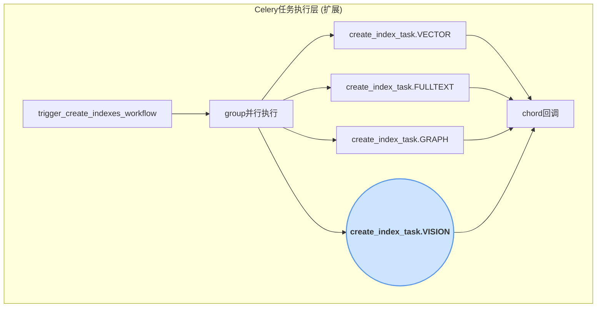
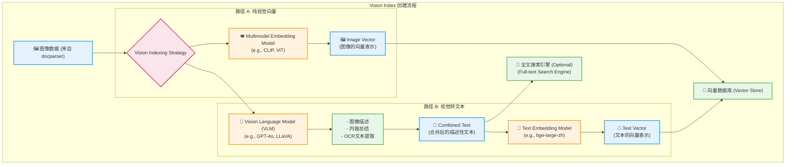

# ApeRAG Vision Index 创建流程技术文档

## 1. 概述

本文档旨在为 ApeRAG 系统设计一套全新的 "Vision Index" 方案。随着多媒体数据的日益增多，为图像等视觉内容建立高效的索引和召回机制变得至关重要。Vision Index 将作为对现有 Vector Index、FullText Index 和 Graph Index 的补充，专门处理图像等多媒体文档，增强系统对视觉信息的理解和检索能力。

### 1.1 设计目标

- **无缝集成**: Vision Index 将遵循现有的 `indexing_architecture` 双链路设计，作为一种新的 `DocumentIndexType` 无缝集成到系统中。
- **双路径索引**: 提供两种核心的图像索引方式：
    1.  **纯向量路径 (Pure Vision Embedding)**: 直接通过多模态模型获取图像的向量表示，用于相似性召回。
    2.  **视觉转文本路径 (Vision-to-Text)**: 通过视觉语言模型（VLM）对图像进行描述、总结和光学字符识别（OCR），将生成的文本内容进行二次索引（如文本向量化），利用文本相似性进行召ow。
- **可扩展性**: 架构设计应支持未来轻松扩展，以兼容新的多模态模型、VLM 和图像处理技术。
- **性能考量**: 异步处理图像，并考虑计算资源的消耗，确保不影响系统整体性能。

### 1.2 与现有架构的融合

Vision Index 将作为 `create_index_task` 的一个新类型并行执行，与 `VECTOR`, `FULLTEXT`, `GRAPH` 索引的创建流程保持一致。



## 2. 核心设计思路

### 2.1 数据库与模型服务扩展

#### 2.1.1 数据库模型扩展
为了支持 Vision Index，`DocumentIndex` 模型需要扩展。

**`aperag/db/models.py`**
```python
class DocumentIndexType(str, Enum):
    VECTOR = "VECTOR"
    FULLTEXT = "FULLTEXT"
    GRAPH = "GRAPH"
    VISION = "VISION"  # 新增索引类型
```

#### 2.1.2 Model Provider 扩展
系统中的 `Model Provider` 模块需要扩展，以识别和管理用于 Vision Index 的模型。

- **模型类型**: 新增 `MULTIMODAL_EMBEDDING` 和 `VLM` 两种模型类型。
- **模型注册**: 在模型配置文件中（如 `alibaba_bailian_models_completion.json`），需要为支持的模型添加相应的类型标注。

#### 2.1.3 Collection (数据集) 配置
在用户创建 Collection 时，UI层面需提供以下配置选项：
- **启用 Vision Index**: 一个开关，决定是否为该 Collection 创建视觉索引。
- **选择多模态嵌入模型**: 如果启用，用户可以从已注册的 `MULTIMODAL_EMBEDDING` 模型中选择一个，用于“纯视觉向量”路径。
- **选择VLM模型**: 用户可以从已注册的 `VLM` 模型中选择一个，用于“视觉转文本”路径。

用户可以只选择其中一种模型，也可以两种都选。系统将根据用户的配置，在创建索引时执行一个或两个路径。这些配置将随 Collection 信息一同存储，并传递给索引任务。

### 2.2 图像处理与解析 (`DocParser` 扩展)

`DocParser` 的职责需要扩展，以实现“从文档提取图片”的能力。其输出应为图像内容的列表（如二进制数据或临时文件路径），供后续的 `create_index_task.VISION` 任务使用。

具体处理逻辑如下：
- **PDF 文档**: 将每一页渲染成一张图片。
- **DOCX 文档**: 解析文档内容，提取所有嵌入的图片。
- **doc-ray 集成**: 如果系统配置了 `doc-ray`，可用于将 `doc/docx/ppt/pptx` 等文档统一转换为 PDF，然后按页提取图片。
- **原生图片**: 对于 `JPEG, PNG` 等原始图片文件，直接返回其二进制内容。
- **输出格式**: `parse_document_task` 的输出 `ParsedDocumentData` 中需要包含一个图像列表字段，例如 `images: List[bytes]`。

### 2.3 Vision Index 创建任务

`create_index_task` 将增加对 `VISION` 类型的处理逻辑。这个任务将是 Vision Index 的核心，它会根据 Collection 的配置决定执行哪几种索引路径。

```python
# config/celery_tasks.py

@current_app.task(...)
def create_index_task(self, document_id: str, index_type: str, ...):
    # ...
    if index_type == DocumentIndexType.VISION:
        # 调用 vision_indexer.create_index()
        result = vision_indexer.create_index(document_id, parsed_data, ...)
    # ...
```

一个新的 `aperag/index/vision_index.py` 文件将包含 `VisionIndexer` 类，负责具体的实现。该类将继承自 `aperag/index/base.py` 中的 `BaseIndexer`。

### 2.4 现有服务扩展

#### 2.4.1 `EmbeddingService` 扩展
`aperag/llm/embed/embedding_service.py` 需要进行如下扩展：

- **重载输入类型**: `embed_documents` 方法的输入参数 `texts: List[str]` 需要重载，使其能够接受 `List[Union[str, Image]]`，其中 `Image` 可以是图像的二进制数据或路径。
- **逻辑分支**: 在方法内部，需要增加类型检查。如果输入是图像，则调用多模态 embedding 模型的特定逻辑；如果输入是文本，则保持现有逻辑。
- **底层调用**: `_embed_batch` 方法中，调用 `litellm.embedding` 时，需要根据输入类型构建不同的 `input` 参数，以符合多模态模型的要求。

#### 2.4.2 `CompletionService` 扩展
`aperag/llm/completion/completion_service.py` 需要进行如下扩展：

- **支持多模态消息**: `_build_messages` 方法需要改造，使其能构建符合 VLM（如 GPT-4o）要求的图文混合消息体。例如，`content` 字段可以是一个包含文本和图像 URL 的列表。
- **接口参数调整**: `agenerate` 等核心方法的 `prompt` 参数需要能够接收图像信息。
- **底层调用**: 调用 `litellm.acompletion` 时，`messages` 参数需要能正确传递这种多模态结构。

## 3. Vision Index 详细数据流

Vision Index 的创建流程可以分为两条并行的子路径，最终的结果可以合并或独立存储。



### 3.1 路径 A: 纯视觉向量 (Pure Vision Embedding)

1.  **输入**: `DocParser` 提取的图像数据列表。
2.  **处理**: 根据 Collection 配置，初始化一个 `EmbeddingService` 实例，并传入选定的多模态 Embedding 模型。调用其 `embed_documents` 方法（传入图像列表）来生成每个图像的向量。
3.  **输出**: 一组能够代表各图像内容的向量。
4.  **存储**: 将向量存入向量数据库。向量记录的元数据需包含图像来源信息（如原文档ID、页码/图片序号）。

### 3.2 路径 B: 视觉转文本 (Vision-to-Text)

1.  **输入**: `DocParser` 提取的图像数据列表。
2.  **处理**: 根据 Collection 配置，初始化一个 `CompletionService` 实例，并传入选定的 VLM 模型。遍历图像列表，调用其 `agenerate` 方法（传入图像和相应的文本提示）来执行 VLM 任务。
    - **VLM任务**: VLM 对每个图像执行多项任务：
        - **图像描述 (Description)**: 生成一段描述图像场景、物体、人物等的文字。
        - **内容总结 (Summary)**: 对图像核心内容进行一句话总结。
        - **OCR**: 提取图像中包含的所有可读文本。
3.  **文本合并**: 将上述三部分生成的文本（描述、总结、OCR）合并成一个单一的文档，使用明确的分隔符（如换行符）以区分不同部分的内容。
4.  **文本向量化**: 使用扩展后的 `EmbeddingService`，传入合并后的文本，生成文本向量。
5.  **存储**:
    - 将生成的文本向量存入向量数据库。
    - （可选）将合并后的原始文本存入全文搜索引擎，以支持对图像内容的关键词搜索。

### 3.3 存储层设计

在向量数据库中，我们需要能够区分不同来源的向量。这可以通过在元数据（metadata）中添加字段来实现。

**向量记录元数据示例**:
```json
// 路径 A 的向量
{
  "document_id": "doc_xyz",
  "source_type": "vision_direct",
  "model_used": "clip-vit-large-patch14"
}

// 路径 B 的向量
{
  "document_id": "doc_xyz",
  "source_type": "vision_to_text",
  "model_used": "text-embedding-ada-002",
  "vlm_model_used": "gpt-4o",
  "raw_text_ref": "path/to/generated_text.txt" // 指向生成的原始文本
}
```

**向量等同性与去重**:
- **等同处理**: 路径 A 和路径 B 产生的向量在召回时被视为等同，使用相同的相似度计算方式进行检索。
- **结果去重**: 在召回结果呈现时，如果多个召回的向量（无论是纯视觉向量还是文本向量）指向同一张源图片或同一文档的同一页，应将其视为单一来源进行去重，避免结果冗余。

## 4. 召回与重排（Rerank）策略

当用户提问时，系统利用 Vision Index 的策略如下：

### 4.1 召回流程
1.  **文本问题**: 用户输入文本问题。系统将问题文本进行向量化，然后在向量数据库中进行相似性搜索。搜索范围将同时覆盖常规的文本向量、路径A的纯视觉向量以及路径B的视觉转文本向量。
2.  **图像问题**: 用户上传一张图片作为问题。系统可以并行执行以下两种召回方式：
    - **视觉相似性召回 (Vision-to-Vision)**: 直接对问题图片进行向量化，在库中寻找相似的纯视觉向量（路径A的结果）。
    - **图生文召回 (Image-to-Text)**: 使用 VLM 将问题图片转换为文本描述，再用此文本描述去进行向量相似性搜索（可召回所有类型的向量）。

### 4.2 融合与重排（Rerank）
召回结果的融合与重排将采用分层策略：

- **文本内容重排**:
  - 从 **Vision Index 路径 B** 召回的结果（本质是文本）将与从 **Vector Index** 召回的常规文本结果合并。
  - 这批合并后的纯文本内容，将统一进入现有的 **Rerank** 模块进行重排序。
- **视觉内容排序**:
  - 从 **Vision Index 路径 A** 召回的结果（纯视觉匹配）**不进入** Rerank 模块。
  - 这部分结果将直接根据向量相似度得分进行排序，取前k个。
- **最终结果呈现**:
  - 系统将 Rerank 后的文本结果和按相似度排序的视觉结果分开聚合展示。例如，在UI上可以设计两个区域，一个用于展示文本召回结果，另一个用于展示图片召回结果。

## 5. 实现优先级（草案）

### 第一阶段：核心框架与单一路径
1.  在数据库模型中添加 `VISION` 类型。
2.  实现 `VisionIndexer` 的基本框架和 `create_index_task` 的调度逻辑。
3.  优先实现 **路径 B (Vision-to-Text)**，因为它可以复用现有的文本 Embedding 和全文检索引擎，集成成本较低。
4.  在 `docparser` 中增加对常见图片格式（JPEG, PNG）的支持。

### 第二阶段：双路径实现与优化
1.  实现 **路径 A (Pure Vision Embedding)**，集成一个主流的多模态模型。
2.  设计并实现两种路径向量在存储和召回时的区分与融合策略。
3.  完善 `docparser` 对复合文档中图像的提取能力。

### 第三阶段：高级功能
1.  实现基于图像输入的查询功能。
2.  开发高级的 rerank 策略，用于融合多模态召回结果。
3.  性能监控与优化，特别是对 VLM 和多模态模型服务的调用。

## 6. 异常处理

Vision Index 的创建任务将完全融入现有的异步任务体系，因此也继承了其强大的异常处理机制。
- **任务级重试**: `create_index_task` 任务在执行 `VisionIndexer` 逻辑时，如果发生临时性错误（如网络超时、外部服务5xx错误），Celery 会根据预设策略（如重试3次）自动重试。
- **状态标记**: 如果任务在所有重试后仍然失败，`DocumentIndex` 表中对应的记录状态将被标记为 `FAILED`，并记录错误信息，以便后续排查或手动触发重建。
- **版本验证**: 任务执行前会验证版本号，防止对已过期的状态进行操作，确保数据一致性。

## 7. 总结

本方案为 ApeRAG 设计了一个可扩展、高内聚的 Vision Index 框架。它不仅在功能上补全了系统对多媒体数据的处理能力，在架构上也与现有设计哲学深度融合。

### 核心技术特点

1.  **架构一致性**: 完全遵循双链路、状态驱动的异步索引架构，作为一种新的索引类型无缝集成。
2.  **服务复用与扩展**: 通过扩展现有的 `EmbeddingService` 和 `CompletionService` 来支持多模态能力，避免了引入新的服务层，保持了架构的精简和高内聚。
3.  **双路径索引**: 创新地结合了“纯视觉向量”和“视觉转文本”两种路径，最大化地利用了图像信息，兼顾了视觉相似性与语义相似性两种召回模式。
4.  **配置灵活**: 用户可在创建 Collection 时自主选择是否启用视觉索引，并指定使用的具体模型，满足不同场景的需求。
5.  **生产就绪**: 方案内置了完整的错误处理、重试机制和状态管理，确保了在生产环境中的稳定性和可靠性。

通过这些设计，Vision Index 不仅是一个功能模块的增加，更是对 ApeRAG 整个 RAG 体系能力的有力增强。
