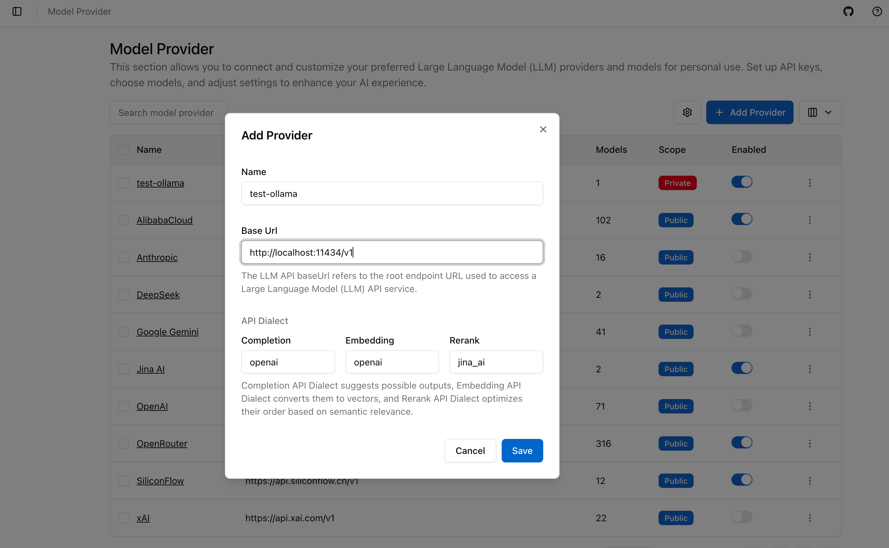
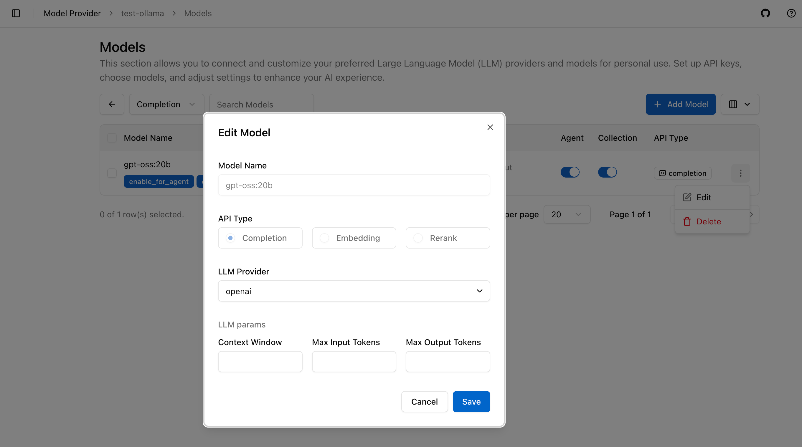
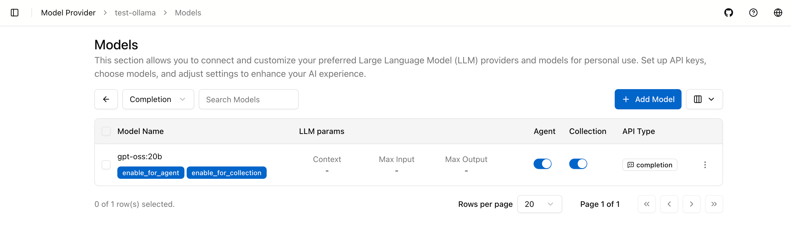
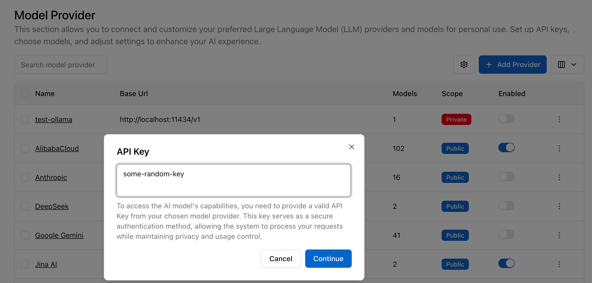
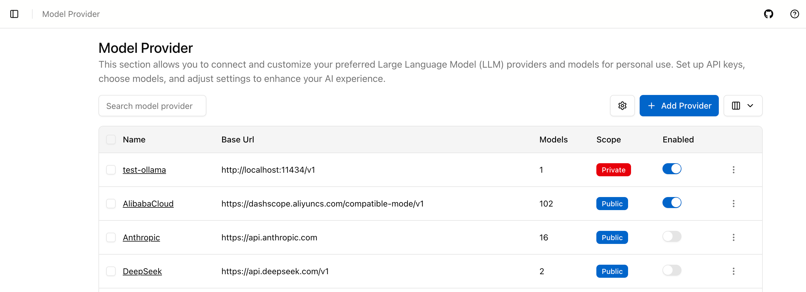

# 如何在 ApeRAG 中配置本地 Ollama

本指南介绍如何在 ApeRAG 部署中配置本地 Ollama 模型。

## 前提条件

- ApeRAG 在本地运行
- [Ollama](https://ollama.ai/) 已安装并运行
- Ollama 模型已下载

## 步骤 1: 添加 Ollama 提供商

在 ApeRAG 界面中导航到 **设置 > 模型**，点击 **"添加提供商"**。

输入提供商名称（例如 "local-ollama"）并设置 **Base URL** 为：`http://localhost:11434/v1`

点击 **保存**。

## 步骤 2: 添加 Ollama 模型

点击新创建提供商右侧的 **三个点**，选择 **"Models"** 进入模型管理页面。

点击 **"添加模型"** 并配置：
- **模型名称**: 输入您的模型名称（例如 `gpt-oss:20b`）
- **模型类型**: 选择 `Completion`
- **LLM 提供商**: 选择 `openai`（因为 Ollama 兼容 OpenAI）

点击 **保存**。

## 步骤 3: 启用模型

您会注意到每个模型都有两个切换开关：**Agent** 和 **Collection**。您可以同时启用它们：

- **Agent**: 允许模型用于回答问题
- **Collection**: 允许模型在构建 Collection 索引时使用

## 步骤 4: 启用 Ollama 提供商

返回提供商页面，点击您刚才添加的 Ollama 提供商右侧的 **三个点**，选择 **"启用"**。

当提示输入 API 密钥时，输入任意随机字符串即可，因为 Ollama 是自托管的，不需要真实的身份验证。

您的 Ollama 模型现在应该出现在模型列表中，可以使用了。

## 使用方法

配置完成后，您的本地 Ollama 模型将可用于：

- **Collection**: 在创建或配置集合时在 LLM 设置中选择 Ollama 模型
- **聊天**: 在聊天界面中选择 Ollama 模型进行对话

您的本地 Ollama 模型现在已准备好与 ApeRAG 一起使用！
