# Document Upload Design

## 1. What is Document Upload

Document upload is the entry point of ApeRAG, allowing you to add various formats of documents to your knowledge base. The system automatically processes, indexes, and makes this knowledge searchable and conversational.

### 1.1 What Can You Upload

ApeRAG supports 20+ document formats, covering virtually all file types used in daily work:


**Document Types**:

| Category | Formats | Typical Use |
|----------|---------|-------------|
| **Office Docs** | PDF, Word, PPT, Excel | Annual reports, meeting minutes, data sheets |
| **Text Files** | TXT, MD, HTML, JSON | Technical docs, notes, config files |
| **Images** | PNG, JPG, GIF | Product screenshots, designs, charts |
| **Audio** | MP3, WAV, M4A | Meeting recordings, interviews |
| **Archives** | ZIP, TAR, GZ | Batch document packages |

### 1.2 What Happens After Upload


**Simply put**: You just upload files, the system automatically handles everything!

## 2. Practical Applications

See how document upload works in real scenarios.

### 2.1 Enterprise Knowledge Base

**Scenario**: Company building internal knowledge base.

**Upload Content**:
- 📋 Policy documents: Employee handbook, attendance policies, reimbursement procedures
- 📊 Business materials: Product introductions, sales data, financial reports
- 🔧 Technical docs: System architecture, API documentation, deployment guides
- 📁 Project materials: Project proposals, meeting records, retrospectives

**Results**:

```
Employee asks: "What's the business trip reimbursement process?"
System: Finds reimbursement process section from "Finance Policy.pdf"

New hire asks: "What products does the company have?"
System: Extracts product list from "Product Manual.pptx"

Developer: "How to call this API?"
System: Finds calling example from "API Docs.md"
```

### 2.2 Research Material Organization

**Scenario**: Graduate student organizing papers and study materials.

**Upload Content**:
- 📖 Academic papers (PDF)
- 📝 Reading notes (Markdown)
- 🎓 Course slides (PPT)
- 📊 Experiment data (Excel)

**Results**:

```
Q: "What research exists on Graph RAG?"
A: Finds relevant content from multiple papers

Q: "What are an author's main contributions?"
A: Analyzes papers, summarizes research directions
```

### 2.3 Personal Knowledge Management

**Scenario**: Developer accumulating technical notes.

**Upload Content**:
- 💻 Study notes (Markdown)
- 📸 Technical screenshots (PNG)
- 🎬 Tutorial audio
- 📚 Technical books (PDF)

**Results**:

```
Q: "How did I solve Redis connection issues before?"
A: Finds solution from "Redis Troubleshooting.md"

Q: "What are best practices for this tech?"
A: Summarizes best practices from multiple documents
```

### 2.4 Multimodal Content Processing

**Scenario**: Product team's design materials.

**Upload Content**:
- 🎨 UI designs (images)
- 📋 Product PRDs (Word)
- 🎤 User interview recordings
- 📊 Data analysis reports (Excel)

**System Processing**:
- Designs → OCR extract text + Vision understand design intent
- PRD → Extract product requirements and features
- Recordings → Transcribe to text, extract user feedback
- Reports → Extract key metrics

**Result**: All content integrated, searchable together!

## 3. Upload Experience

### 3.1 Batch Upload is Simple

Suppose you need to upload 50 company documents:

**Step 1: Select Files (10 seconds)**

```
Click "Upload Documents" → Select 50 PDFs → Click "Start Upload"
```

**Step 2: Quick Upload (30 seconds)**

```
Progress: 1/50, 2/50, 3/50... 50/50 ✅
All files uploaded to staging in seconds, no wait for processing
```

**Step 3: Preview and Confirm (1 minute)**

```
View uploaded file list:
- ✅ annual_report.pdf (5.2 MB)
- ✅ product_manual.pdf (3.1 MB)
- ❌ personal_notes.pdf (shouldn't upload) → Uncheck
- ✅ technical_docs.pdf (2.8 MB)
...

Click "Save to Knowledge Base"
```

**Step 4: Background Processing (5-30 minutes)**

```
System auto processes:
- Parse document content
- Build multiple indexes
- You can continue other work, no need to wait
```

**Step 5: Completion Notification**

```
Notification: "49 documents processed, ready for retrieval"
```

### 3.2 Processing Time Reference

Different sized documents have different processing speeds:

| Document Type | Size | Upload Time | Processing Time | Example |
|--------------|------|-------------|-----------------|---------|
| 🏃 Small | < 5 pages | < 1 sec | 1-3 minutes | Notices, emails |
| 🚶 Medium | 10-50 pages | < 3 sec | 3-10 minutes | Reports, manuals |
| 🐌 Large | 100+ pages | < 10 sec | 10-30 minutes | Books, paper collections |

**Key Points**:
- ✅ Upload always fast (seconds)
- ⏳ Processing happens in background (non-blocking)
- 📊 Can view processing progress in real-time

### 3.3 Real-time Progress Tracking

After upload, you can check document status anytime:

```
Document List:

📄 annual_report.pdf
   Status: Processing (60%)
   ├─ ✅ Document Parsing: Complete
   ├─ ✅ Vector Index: Complete
   ├─ 🔄 Full-text Index: In Progress
   └─ ⏳ Graph Index: Waiting

📄 product_manual.pdf
   Status: Complete ✅
   Can retrieve

📄 meeting_notes.pdf
   Status: Failed ❌
   Error: File corrupted
   Action: Re-upload
```

## 4. Core Features

ApeRAG document upload has unique features making it more convenient.

### 4.1 Staging Area Design

**Core Idea**: Upload first, select later - gives you a chance to "regret".

**Like online shopping**:

```
Shopping process:
1. Add to cart (staging)
2. Review cart, remove unwanted items
3. Submit order (confirm)

Document upload:
1. Upload to staging (quick upload)
2. Review list, cancel unneeded ones
3. Save to knowledge base (confirm addition)
```

**Benefits**:

- ✅ **Fast Upload**: 20 files uploaded in 5 seconds, no wait for processing
- ✅ **Selective Addition**: Upload 100, save only the 80 needed
- ✅ **Save Quota**: Staging files don't consume quota
- ✅ **Easy Correction**: Found error? Cancel directly, no need to delete

### 4.2 Smart Processing

**Auto Format Recognition**:

System auto recognizes file type and selects appropriate processing:

- 📄 PDF → Extract text, tables, images, formulas
- 📋 Word → Convert format, extract content
- 📊 Excel → Recognize table structure
- 🎨 Images → OCR text + understand content
- 🎤 Audio → Transcribe to text

**No extra operations needed**, system handles automatically!

### 4.3 Background Processing

After upload, system auto processes in background:

```mermaid
sequenceDiagram
    participant U as You
    participant S as System
    
    U->>S: Upload file
    S-->>U: Second-level return ✅
    Note over U: Continue work, no wait
    
    S->>S: Parse document...
    S->>S: Build indexes...
    S-->>U: Processing complete notification 🔔
```



**Advantages**:
- No wait, upload then do other things
- System auto retries failed documents
- Real-time view processing progress

### 4.4 Auto Cleanup

Staging area files not confirmed in 7 days are auto cleaned, preventing storage waste.

## 5. Document Parsing Principles

After upload, system needs to "understand" the document. Different formats have different processing methods.

### 5.1 Parser Workflow

System has multiple parsers, auto selects most suitable:


**Parser Priority**:

1. **MinerU**: Most powerful, commercial API, paid
   - Good at: Complex PDFs, academic papers, documents with formulas
   
2. **DocRay**: Open source, free, strong layout analysis
   - Good at: Tables, charts, multi-column layouts
   
3. **MarkItDown**: Generic, fallback, supports all formats
   - Good at: Simple documents, text files

**Auto degradation benefits**:
- Try best parser first
- Auto switch to next if fails
- Always one succeeds

### 5.2 Specific Examples

**Example 1: Complex PDF**

```
Upload: annual_report.pdf (50 pages, with tables and charts)
    ↓
DocRay parser auto:
- 📝 Extract all text content
- 📊 Recognize tables, maintain structure
- 🎨 Extract images and charts
- 📐 Recognize LaTeX formulas
    ↓
Get:
- Complete Markdown document
- 50 page screenshots (if vision index needed)
```

**Example 2: Image Screenshot**

```
Upload: product_screenshot.png
    ↓
ImageParser auto:
- 📸 OCR recognize text in image
- 👁️ Vision AI understand image content
    ↓
Get:
- Text: "Product name: ApeRAG, Version: 2.0..."
- Description: "This is a product intro page with name, version, and feature list"
```

**Example 3: Meeting Recording**

```
Upload: meeting.mp3 (30 minutes)
    ↓
AudioParser auto:
- 🎤 Speech-to-text (STT)
- 📝 Generate meeting transcript
    ↓
Get:
- "Meeting starts. Host John: Hello everyone, today we discuss product planning..."
- Complete meeting text transcript
```

### 5.3 Duplicate File Handling

System auto detects duplicate uploads:

```
First upload report.pdf → Create new document ✅
Second upload report.pdf (same content) → Return existing document ✅
Third upload report.pdf (different content) → Conflict warning, need rename ⚠️
```

**Advantages**:
- Avoid duplicate documents
- Network retries don't create multiple documents
- Save storage space

## 6. Index Building

After document parsing, system auto builds multiple indexes for different retrieval methods.

### 6.1 Why Multiple Indexes Needed

Different questions need different retrieval methods:

```
Q: "How to optimize database performance?"
→ Need: Vector index (semantic similarity search)

Q: "Where is PostgreSQL config file?"
→ Need: Full-text index (exact keyword search)

Q: "What's the relationship between John and Mike?"
→ Need: Graph index (relationship query)

Q: "What's this document mainly about?"
→ Need: Summary index (quick overview)

Q: "What's in this image?"
→ Need: Vision index (image content search)
```

### 6.2 Five Index Types


**Index Comparison**:

| Index | Required | Suitable Questions | Speed |
|-------|----------|-------------------|-------|
| Vector | ✅ | Semantic similarity | Fast |
| Full-text | ✅ | Exact keywords | Fast |
| Graph | ❌ | Relationship queries | Slow |
| Summary | ❌ | Quick overview | Medium |
| Vision | ❌ | Image content | Medium |

**Recommended Config**:

- 💰 Save cost: Only enable vector + full-text
- ⚡ Prioritize speed: Disable graph (slowest)
- 🎯 Full features: Enable all

### 6.3 Parallel Building

Multiple indexes can build simultaneously, saving time:

```
Document parsing complete
    ↓
5 indexes start building simultaneously:
- Vector index: 1 minute
- Full-text index: 30 seconds
- Graph index: 10 minutes ⏱️ (slowest)
- Summary index: 3 minutes
- Vision index: 2 minutes
    ↓
Total time: 10 minutes (the slowest one)
If serial: 16.5 minutes

Saved: 40% time!
```

### 6.4 Auto Retry

If an index build fails, system auto retries:

```
1st retry: After 1 minute
2nd retry: After 5 minutes
3rd retry: After 15 minutes
Still fails → Mark as failed, notify user
```

Most temporary errors (network issues, service restarts) auto recover!

## 7. Technical Implementation

> 💡 **Reading Tip**: This chapter contains technical details, mainly for developers and ops. General users can skip.

### 7.1 Storage Architecture

**File Storage Location**:

```
Local storage (dev):
.objects/user-xxx/collection-xxx/doc-xxx/
    ├── original.pdf
    └── images/page_0.png

Cloud storage (production):
s3://bucket/user-xxx/collection-xxx/doc-xxx/
    ├── original.pdf
    └── images/page_0.png
```

**Configuration**:

```bash
# Local storage
export OBJECT_STORE_TYPE=local

# Cloud storage (S3/MinIO)
export OBJECT_STORE_TYPE=s3
export OBJECT_STORE_S3_BUCKET=aperag
```

### 7.2 Parser Configuration

**Enable Different Parsers**:

```bash
# DocRay (recommended, free, good performance)
export USE_DOC_RAY=true
export DOCRAY_HOST=http://docray:8639

# MinerU (optional, paid, highest precision)
export USE_MINERU_API=false
export MINERU_API_TOKEN=your_token

# MarkItDown (default enabled, fallback)
export USE_MARKITDOWN=true
```

**Selection Recommendations**:
- 💰 Free solution: DocRay + MarkItDown
- 🎯 High precision: MinerU + DocRay + MarkItDown

### 7.3 Index Configuration

Control which indexes to enable in Collection config:

```json
{
  "enable_vector": true,          // Vector index (required)
  "enable_fulltext": true,        // Full-text index (required)
  "enable_knowledge_graph": true, // Graph index (optional)
  "enable_summary": false,        // Summary index (optional)
  "enable_vision": false          // Vision index (optional)
}
```

### 7.4 Performance Tuning

**File Size Limits**:

```bash
export MAX_DOCUMENT_SIZE=104857600  # 100 MB
export MAX_EXTRACTED_SIZE=5368709120  # 5 GB
```

**Concurrency Settings**:

```bash
export CELERY_WORKER_CONCURRENCY=16  # Process 16 docs concurrently
export CELERY_TASK_TIME_LIMIT=3600   # Single task timeout 1 hour
```

**Quota Settings**:

```bash
export MAX_DOCUMENT_COUNT=1000  # Max 1000 docs per user
export MAX_DOCUMENT_COUNT_PER_COLLECTION=100  # Max 100 docs per collection
```

## 8. Common Questions

### 8.1 File Upload Failed?

**Possible Causes and Solutions**:

| Issue | Cause | Solution |
|-------|-------|----------|
| File too large | Over 100 MB | Compress or split file |
| Format not supported | Special format | Convert to PDF or other common format |
| Name conflict | Same name different content exists | Rename file |
| Quota full | Reached document count limit | Delete old docs or upgrade quota |

### 8.2 Document Processing Failed?

System auto retries 3 times, if still fails:

```
View error message → Fix based on prompt → Re-upload → System auto retries
```

Common errors:
- File corrupted → Recreate file
- Content unrecognizable → Try converting format
- Temporary network issues → System auto retries

### 8.3 How to Speed Up Processing?

**Method 1**: Disable unneeded indexes

```json
{
  "enable_knowledge_graph": false  // Graph slowest, can disable
}
```

**Method 2**: Use faster LLM models

Select faster responding models in Collection config.

### 8.4 Will Staging Files Be Lost?

- ✅ Within 7 days: Won't be lost, can confirm anytime
- ⚠️ After 7 days: Auto cleanup (save storage)
- 💡 Recommendation: Confirm promptly after upload

## 9. Summary

ApeRAG document upload makes it easy to add various format documents to your knowledge base.

### Core Advantages

1. ✅ **Supports 20+ formats**: PDF, Word, Excel, images, audio, etc.
2. ✅ **Second-level upload response**: No wait, immediate return
3. ✅ **Staging area design**: Upload first, select later, avoid mistakes
4. ✅ **Smart parsing**: Auto recognize format, select best parser
5. ✅ **Multi-index building**: Build 5 indexes simultaneously, meet different retrieval needs
6. ✅ **Background processing**: Async execution, non-blocking
7. ✅ **Auto retry**: Failures auto retry, improve success rate
8. ✅ **Quota management**: Only consume on confirmation, reasonable resource control

### Performance

| Operation | Time |
|-----------|------|
| Upload 100 files | < 1 minute |
| Confirm addition | < 1 second |
| Small doc processing (< 10 pages) | 1-3 minutes |
| Medium doc (10-50 pages) | 3-10 minutes |
| Large doc (100+ pages) | 10-30 minutes |

### Suitable Scenarios

- 📚 Enterprise knowledge base building
- 🔬 Research material organization
- 📖 Personal note management
- 🎓 Learning material archiving

The system is both **simple to use** and **powerful**, suitable for various scales of knowledge management needs.

---

## Related Documentation

- 📋 [System Architecture](./architecture.md) - ApeRAG overall architecture design
- 📖 [Graph Index Creation Process](./graph_index_creation.md) - Graph index details
- 🔗 [Index Pipeline Architecture](./indexing_architecture.md) - Complete indexing process
