# Graph Index Creation Process

## 1. What is Graph Index

Graph Index is a core feature of ApeRAG that automatically extracts structured knowledge graphs from unstructured text.

### 1.1 A Simple Example

Imagine you have a document about company organization:

> "John is the head of the database team and specializes in PostgreSQL and MySQL. Mike works in the frontend team and often collaborates with John's team to develop backend management systems."

**Transformation from Document to Knowledge Graph**:


Traditional vector search can only find "semantically similar" paragraphs but cannot answer these questions:
- What does John lead?
- What is the relationship between John and Mike?
- What technologies does the database team use?

**Graph Index can do**: Accurately answer these relationship-focused questions by making implicit knowledge relationships explicit.

### 1.2 Core Value

Compared to traditional retrieval methods, Graph Index provides unique capabilities:

| Capability | Vector Search | Full-text Search | Graph Index |
|------------|---------------|------------------|-------------|
| Semantic Similarity | ✅ Strong | ❌ Weak | ✅ Strong |
| Exact Keyword Match | ❌ Weak | ✅ Strong | ✅ Medium |
| Relationship Query | ❌ Not Supported | ❌ Not Supported | ✅ Strong |
| Multi-hop Reasoning | ❌ Not Supported | ❌ Not Supported | ✅ Supported |
| Suitable Questions | "How to optimize performance" | "PostgreSQL config" | "John and Mike's relationship" |

**Core Advantage**: Graph Index allows AI to "understand" the connections between knowledge, not just text similarity.

## 2. What Problems Can Graph Index Solve

Graph Index excels at handling scenarios that require "understanding relationships". Let's look at practical applications.

### 2.1 Enterprise Knowledge Management

**Scenario**: Companies have extensive documentation including organizational structure, project materials, and technical docs.

**Graph Index Value**:

- 📊 **Organizational Relationships**: "Who is on John's team?" → Quickly find team members
- 🔗 **Collaboration Networks**: "Who has worked with John?" → Discover work networks
- 🛠️ **Skill Mapping**: "Who is skilled in PostgreSQL?" → Locate technical experts
- 📁 **Project History**: "Which projects has John participated in?" → Track project experience

**Real Effect**:

```
Question: "Who leads the database team?"
Traditional Search: Returns dozens of paragraphs containing "database team" and "lead"
Graph Index: Directly returns "John" + relevant background information
```

### 2.2 Research and Learning

**Scenario**: Analyzing academic papers and technical documentation to understand knowledge lineage.

**Graph Index Value**:

- 👥 **Author Networks**: "Who has this author collaborated with?" → Discover research teams
- 📖 **Citation Relationships**: "What papers does this cite?" → Trace research lineage
- 🔬 **Technology Evolution**: "How has this technology evolved?" → Understand tech history
- 💡 **Concept Connections**: "What's the relationship between tech A and B?" → Connect knowledge points

### 2.3 Products and Services

**Scenario**: Product documentation, user manuals, API documentation.

**Graph Index Value**:

- ⚙️ **Feature Dependencies**: "What needs to be configured before enabling feature A?" → Understand dependencies
- 🔧 **Configuration Relationships**: "Which features does this config affect?" → Avoid misconfigurations
- 🐛 **Problem Diagnosis**: "What might cause error X?" → Quick troubleshooting
- 📚 **API Relationships**: "Which APIs are typically used together?" → Learn best practices

### 2.4 Comparison: When to Use Graph Index

Different questions suit different retrieval methods:

| Question Type | Example | Best Solution |
|--------------|---------|---------------|
| **Concept Understanding** | "What is RAG?" | Vector Search |
| **Exact Lookup** | "PostgreSQL config file path" | Full-text Search |
| **Relationship Query** | "What's John and Mike's relationship?" | Graph Index ✨ |
| **Multi-hop Reasoning** | "What tech stack does John's team use?" | Graph Index ✨ |
| **Knowledge Tracing** | "What modules does this feature depend on?" | Graph Index ✨ |

**Best Practice**: ApeRAG supports vector search, full-text search, and graph index simultaneously, intelligently selecting or combining based on question type.

## 3. Construction Process Overview

When you upload a document and enable graph indexing, ApeRAG automatically completes the following steps. Here's a simple overview; details are in later chapters.

### 3.1 Five Key Steps

```mermaid
flowchart TB
    subgraph Step1["1️⃣ Document Chunking"]
        A1[Original Document] --> A2[Smart Chunking]
        A2 --> A3[Generate Chunks]
    end
    
    subgraph Step2["2️⃣ Entity Relationship Extraction"]
        B1[Chunks] --> B2[Call LLM]
        B2 --> B3[Identify Entities]
        B2 --> B4[Identify Relationships]
    end
    
    subgraph Step3["3️⃣ Connected Component Analysis"]
        C1[Entity Relationship Network] --> C2[BFS Algorithm]
        C2 --> C3[Grouping]
    end
    
    subgraph Step4["4️⃣ Concurrent Merging"]
        D1[Group 1] --> D2[Entity Deduplication]
        D3[Group 2] --> D4[Entity Deduplication]
        D5[Group N] --> D6[Entity Deduplication]
        D2 --> D7[Relationship Aggregation]
        D4 --> D7
        D6 --> D7
    end
    
    subgraph Step5["5️⃣ Multi-storage Writing"]
        E1[Graph Database] 
        E2[Vector Database]
        E3[Text Storage]
    end
    
    A3 --> B1
    B3 --> C1
    B4 --> C1
    C3 --> D1
    C3 --> D3
    C3 --> D5
    D7 --> E1
    D7 --> E2
    A3 --> E3
    
    style Step1 fill:#e3f2fd
    style Step2 fill:#fff3e0
    style Step3 fill:#f3e5f5
    style Step4 fill:#e8f5e9
    style Step5 fill:#fce4ec
```



**Simply put**: Chunk document → Extract entities/relationships → Smart grouping → Concurrent merging → Write to storage.

The entire process is fully automated - you just upload documents, and the system handles everything.

### 3.2 Processing Time Reference

Processing time varies by document size:

| Document Size | Entity Count | Processing Time | Example |
|--------------|--------------|-----------------|---------|
| Small (< 5 pages) | ~50 | 10-30 seconds | Company notices, meeting notes |
| Medium (10-50 pages) | ~200 | 1-3 minutes | Technical docs, product manuals |
| Large (100+ pages) | ~1000 | 5-15 minutes | Research reports, books |

**Factors**:
- LLM response speed (main bottleneck)
- Document complexity (tables, images slow processing)
- Concurrency settings (configurable for speed)

> 💡 **Tip**: Processing is asynchronous - upload multiple documents and the system processes them in parallel.

### 3.3 Real-time Progress Tracking

You can check document processing progress anytime:

```
Document Status: Processing
- ✅ Document Parsing: Complete
- ✅ Document Chunking: Complete (25 chunks generated)
- 🔄 Entity Extraction: In Progress (15/25)
- ⏳ Relationship Extraction: Waiting
- ⏳ Graph Construction: Waiting
```

Once processing completes, document status changes to "Active" and graph queries become available.

## 4. Detailed Construction Process

The previous sections covered what graph index does and the overall process. This chapter details the technical implementation of each step.

> 💡 **Reading Tip**: If you only want to understand basic concepts and usage, skip to Chapter 9 for practical applications.

### 4.1 Document Chunking

First step: Split long documents into appropriately sized chunks.

**Why Chunk?**
- LLMs have input length limits (typically thousands to tens of thousands of tokens)
- Too large: Extraction quality decreases, LLM may "miss" information
- Too small: Loses context, can't understand complete semantics

**Smart Chunking Strategy**:


**Chunking Parameters**:
- Default size: 1200 tokens (approximately 800-1000 English words)
- Overlap size: 100 tokens (ensures context continuity)
- Priority: Paragraph > Sentence > Character

### 4.2 Entity Relationship Extraction

Use LLM to identify entities and relationships from each chunk.

**Extraction Process**:


**Concurrency Optimization**: Multiple chunks can call LLM simultaneously, default 20 concurrent requests.

### 4.3 Connected Component Analysis

Divide entity relationship network into independent subgraphs for parallel processing.

**Why This Step?**

Tech team entities and finance department entities aren't connected - they can be processed completely in parallel!


**Performance Boost**: 3 independent components = 3x speedup!

### 4.4 Concurrent Merging

Same-name entities need deduplication, same relationships need aggregation.


**Fine-grained Locks**: Only lock entities being merged, others can process concurrently.

### 4.5 Multi-storage Writing

Knowledge graph written to three storage systems:


Different storages support different query types, complementing each other.

## 5. Core Technical Design

This chapter introduces core technical designs including data isolation and concurrency control.

> 💡 **Reading Tip**: These are system architecture and implementation details, mainly for developers and technical decision-makers.

### 5.1 Workspace Data Isolation

Each Collection has an independent namespace for complete data isolation.

**Naming Convention**:

```python
# Entity naming
entity:{entity_name}:{workspace}
# Example
entity:John:collection_abc123

# Relationship naming
relationship:{source}:{target}:{workspace}
# Example
relationship:John:Database Team:collection_abc123
```

**Isolation Effect**:


"John" in two Collections is completely independent, no interference!

### 5.2 Stateless Instance Management

Each processing task creates an independent graph index instance, destroyed after completion.

**Lifecycle Management**:


**Advantages**:
- ✅ Zero state pollution: Each task independent, no interference
- ✅ Easy scaling: Can run multiple workers simultaneously
- ✅ Resource management: Automatic cleanup, no memory leaks

### 5.3 Connected Component Concurrency Optimization

Intelligent concurrent processing through graph topology analysis.

**Algorithm Principle**:


**Performance Boost**: 3 components concurrent processing = 3x speedup!

### 5.4 Fine-grained Concurrency Control

Precise entity-level locking:

**Lock Hierarchy**:


**Lock Strategy**:
1. Extraction phase: No locks, fully parallel
2. Merging phase: Lock only needed entities
3. Sorted lock acquisition: Prevents deadlock

### 5.5 Smart Summarization

Automatically compress overly long descriptions:

```python
if len(description) > 2000 tokens:
    summary = await llm_summarize(description)
else:
    summary = description
```

**Effect**: Compress 2500 tokens to 200 tokens, retaining core information.

### 5.6 Multi-storage Backend Support

ApeRAG supports two graph databases: Neo4j and PostgreSQL.

**How to Choose?**

| Scenario | Recommended | Reason |
|----------|-------------|--------|
| **Small Scale** (< 100K entities) | PostgreSQL | Simple ops, low cost |
| **Medium Scale** (100K-1M) | PostgreSQL or Neo4j | Based on query complexity |
| **Large Scale** (> 1M) | Neo4j | Better graph query performance |
| **Limited Budget** | PostgreSQL | No extra deployment |
| **Complex Graph Algorithms** | Neo4j | Built-in graph algorithms |

**Switching**:

```bash
# Use PostgreSQL (default)
export GRAPH_INDEX_GRAPH_STORAGE=PGOpsSyncGraphStorage

# Use Neo4j
export GRAPH_INDEX_GRAPH_STORAGE=Neo4JSyncStorage
```

## 6. Complete Data Flow

The entire graph index construction is a data transformation pipeline, from unstructured text to structured knowledge graph:


### Data Transformation Example

A concrete example showing step-by-step data transformation:

**Input Document**:

```text
John heads the database team and specializes in PostgreSQL and MySQL.
Mike works in the frontend team and often collaborates with John's team to develop backend systems.
Alice is an accountant in the finance department, responsible for financial reports.
```

**Step 1: Chunking**

```json
[
  {
    "chunk_id": "chunk-001",
    "content": "John heads the database team and specializes in PostgreSQL and MySQL.",
    "tokens": 15
  },
  {
    "chunk_id": "chunk-002",
    "content": "Mike works in the frontend team and often collaborates with John's team...",
    "tokens": 18
  },
  {
    "chunk_id": "chunk-003",
    "content": "Alice is an accountant in the finance department, responsible for financial reports.",
    "tokens": 14
  }
]
```

**Step 2: Entity Relationship Extraction**

```json
{
  "entities": [
    {"name": "John", "type": "Person", "source": "chunk-001"},
    {"name": "Database Team", "type": "Organization", "source": "chunk-001"},
    {"name": "PostgreSQL", "type": "Technology", "source": "chunk-001"},
    {"name": "MySQL", "type": "Technology", "source": "chunk-001"},
    {"name": "Mike", "type": "Person", "source": "chunk-002"},
    {"name": "Frontend Team", "type": "Organization", "source": "chunk-002"},
    {"name": "Alice", "type": "Person", "source": "chunk-003"},
    {"name": "Finance Department", "type": "Organization", "source": "chunk-003"}
  ],
  "relationships": [
    {"source": "John", "target": "Database Team", "relation": "heads"},
    {"source": "John", "target": "PostgreSQL", "relation": "specializes in"},
    {"source": "John", "target": "MySQL", "relation": "specializes in"},
    {"source": "Mike", "target": "Frontend Team", "relation": "belongs to"},
    {"source": "Mike", "target": "John", "relation": "collaborates"},
    {"source": "Alice", "target": "Finance Department", "relation": "belongs to"}
  ]
}
```

**Step 3: Connected Component Analysis**

```
Connected Component 1 (Technical Department):
- Entities: John, Mike, Database Team, Frontend Team, PostgreSQL, MySQL
- Relationships: 6

Connected Component 2 (Finance Department):
- Entities: Alice, Finance Department
- Relationships: 1
```

**Step 4: Concurrent Merging**

Two components can process in parallel!

**Step 5: Final Knowledge Graph**


### Performance Optimization Features

1. **Fine-grained Concurrency Control**
   - Entity-level locks: `entity:John:collection_abc`
   - Lock only during merging, fully parallel during extraction

2. **Connected Component Concurrency**
   - Technical and Finance departments can process in parallel
   - Zero lock contention, full multi-core CPU utilization

3. **Smart Summarization**
   - Description < 2000 tokens: Keep original
   - Description > 2000 tokens: LLM summary compression

## 7. Performance Optimization Strategies

### 7.1 Concurrency Control

Graph index construction involves extensive LLM calls and database operations requiring proper concurrency control.

**Concurrency Hierarchy**:


**Concurrency Parameters**:

| Parameter | Default | Description |
|-----------|---------|-------------|
| `llm_model_max_async` | 20 | LLM concurrent calls |
| `embedding_func_max_async` | 16 | Embedding concurrent calls |
| `max_batch_size` | 32 | Batch processing size |

**Tuning Recommendations**:

```python
# Scenario 1: Strict LLM API rate limits
llm_model_max_async = 5  # Reduce concurrency to avoid rate limiting

# Scenario 2: Sufficient performance, want speedup
llm_model_max_async = 50  # Increase concurrency to speed up processing

# Scenario 3: Limited memory
max_batch_size = 16  # Reduce batch size to lower memory usage
```

### 7.2 LLM Call Optimization

LLM calls are the most time-consuming part, main optimization strategies:

1. **Concurrent Calls**: Multiple chunks extract simultaneously (default 20 concurrent)
2. **Batch Processing**: Reduce LLM call count
3. **Cache Reuse**: Reuse summary results for similar descriptions

**Performance Boost**: Concurrent calling is 4x faster than serial.

### 7.3 Storage Optimization

Batch writing significantly improves performance:

| Method | 100 Entity Write Time |
|--------|---------------------|
| Individual Write | ~10 seconds |
| Batch Write (32/batch) | ~1 second |

**Optimization Effect**: 10x speedup!

### 7.4 Memory Optimization

Memory management strategies for large documents:

- Stream chunking: Don't load entire document at once
- Immediate release: Free memory immediately after processing
- Batch processing: Control memory peaks

### 7.5 Performance Monitoring

System outputs detailed performance statistics:

```
Graph Index Construction Complete:
✓ Document Chunking: 10 chunks, 0.5 seconds
✓ Entity Extraction: 120 entities, 25 seconds
✓ Relationship Extraction: 85 relationships, 25 seconds
✓ Concurrent Merging: 15 seconds
✓ Storage Writing: 2 seconds
━━━━━━━━━━━━━━━━━━━━━━━━━
Total: 42.7 seconds
```

**Bottleneck Analysis**: Entity/relationship extraction takes 60% of time, can optimize by increasing LLM concurrency.

## 8. Configuration Parameters

### 8.1 Core Configuration

Graph index construction can be tuned with the following parameters:

**Chunking Parameters**:

```python
# Chunk size (tokens)
CHUNK_TOKEN_SIZE = 1200

# Overlap size (tokens)
CHUNK_OVERLAP_TOKEN_SIZE = 100
```

**Tuning Recommendations**:
- Small docs (< 5000 tokens): `CHUNK_TOKEN_SIZE = 800`
- Large docs (> 50000 tokens): `CHUNK_TOKEN_SIZE = 1500`
- Need more context: Increase `CHUNK_OVERLAP_TOKEN_SIZE`

**Concurrency Parameters**:

```python
# LLM concurrent calls
LLM_MODEL_MAX_ASYNC = 20

# Embedding concurrent calls
EMBEDDING_FUNC_MAX_ASYNC = 16

# Batch processing size
MAX_BATCH_SIZE = 32
```

**Tuning Recommendations**:
- Strict LLM API limits: Lower `LLM_MODEL_MAX_ASYNC` to 5-10
- Sufficient performance for speedup: Increase to 50-100
- Limited memory: Lower `MAX_BATCH_SIZE` to 16

**Entity Extraction Parameters**:

```python
# Entity extraction retry count (0 = extract once only)
ENTITY_EXTRACT_MAX_GLEANING = 0

# Summary max tokens
SUMMARY_TO_MAX_TOKENS = 2000

# Force summary description fragment count
FORCE_LLM_SUMMARY_ON_MERGE = 10
```

**Tuning Recommendations**:
- Extraction quality important: `ENTITY_EXTRACT_MAX_GLEANING = 1` (extract twice)
- Speed priority: `ENTITY_EXTRACT_MAX_GLEANING = 0`
- Descriptions often long: Lower `SUMMARY_TO_MAX_TOKENS` to 1000

### 8.2 Knowledge Graph Configuration

Configure in Collection settings:

```json
{
  "knowledge_graph_config": {
    "language": "English",
    "entity_types": [
      "organization",
      "person",
      "geo",
      "event",
      "product",
      "technology",
      "date",
      "category"
    ]
  }
}
```

**Parameter Description**:

- **language**: Extraction language, affects LLM prompts
  - `English`: English
  - `simplified chinese`: Simplified Chinese
  - `traditional chinese`: Traditional Chinese

- **entity_types**: Entity types to extract
  - Default: 8 types (organization, person, location, event, product, technology, date, category)
  - Customizable: e.g., extract only people and organizations

### 8.3 Storage Configuration

Configure storage backends via environment variables:

```bash
# KV storage (key-value)
export GRAPH_INDEX_KV_STORAGE=PGOpsSyncKVStorage

# Vector storage
export GRAPH_INDEX_VECTOR_STORAGE=PGOpsSyncVectorStorage

# Graph storage
export GRAPH_INDEX_GRAPH_STORAGE=Neo4JSyncStorage
# Or use PostgreSQL
export GRAPH_INDEX_GRAPH_STORAGE=PGOpsSyncGraphStorage
```

**Storage Selection Recommendations**:

| Scenario | KV Storage | Vector Storage | Graph Storage |
|----------|-----------|----------------|---------------|
| **Default** | PostgreSQL | PostgreSQL | PostgreSQL |
| **High-performance Vector Search** | PostgreSQL | Qdrant | Neo4j |
| **Large-scale Graph** | PostgreSQL | Qdrant | Neo4j |
| **Simple Deployment** | PostgreSQL | PostgreSQL | PostgreSQL |

### 8.4 Complete Configuration Example

```bash
# Chunking configuration
export CHUNK_TOKEN_SIZE=1200
export CHUNK_OVERLAP_TOKEN_SIZE=100

# Concurrency configuration
export LLM_MODEL_MAX_ASYNC=20
export MAX_BATCH_SIZE=32

# Extraction configuration
export ENTITY_EXTRACT_MAX_GLEANING=0
export SUMMARY_TO_MAX_TOKENS=2000

# Storage configuration
export GRAPH_INDEX_KV_STORAGE=PGOpsSyncKVStorage
export GRAPH_INDEX_VECTOR_STORAGE=PGOpsSyncVectorStorage
export GRAPH_INDEX_GRAPH_STORAGE=PGOpsSyncGraphStorage

# Database connection (PostgreSQL)
export POSTGRES_HOST=127.0.0.1
export POSTGRES_PORT=5432
export POSTGRES_DB=aperag
export POSTGRES_USER=postgres
export POSTGRES_PASSWORD=your_password

# Database connection (Neo4j, optional)
export NEO4J_HOST=127.0.0.1
export NEO4J_PORT=7687
export NEO4J_USERNAME=neo4j
export NEO4J_PASSWORD=your_password
```

## 9. Practical Application Scenarios

Graph index is particularly suitable for these scenarios:

### 9.1 Enterprise Knowledge Base

**Scenario**: Companies have extensive documentation including organizational structure, project materials, technical docs.

**Graph Index Value**:

- 📊 **Organizational Relationships**: "Who is on John's team?" → Quickly find team members
- 🔗 **Collaboration Networks**: "Who has worked with John?" → Discover work networks
- 🛠️ **Skill Mapping**: "Who is skilled in PostgreSQL?" → Locate technical experts
- 📁 **Project History**: "Which projects has John participated in?" → Track project experience

**Real Effect**:

```
Question: "Who leads the database team?"
Traditional Search: Returns dozens of paragraphs containing "database team" and "lead"
Graph Index: Directly returns "John" + relevant background info
```

### 9.2 Research and Learning

**Scenario**: Analyzing academic papers and technical documentation to understand knowledge lineage.

**Graph Index Value**:

- 👥 **Author Networks**: "Who has this author collaborated with?" → Discover research teams
- 📖 **Citation Relationships**: "What papers does this cite?" → Trace research lineage
- 🔬 **Technology Evolution**: "How has this technology evolved?" → Understand tech history
- 💡 **Concept Connections**: "What's the relationship between tech A and B?" → Connect knowledge points

**Query Examples**:

```
User: "What research is related to Graph RAG?"
Graph Index: Query papers --research--> Graph RAG relationships
Result: Paper A, Paper B, Paper C

User: "Who has an author collaborated with?"
Graph Index: Query author --collaborates--> other authors relationships
Result: Collaborator list and collaboration projects
```

### 9.3 Products and Services

**Scenario**: Product documentation, user manuals, API documentation.

**Graph Index Value**:

- ⚙️ **Feature Dependencies**: "What needs configuration before enabling feature A?" → Understand dependencies
- 🔧 **Configuration Relationships**: "Which features does this config affect?" → Avoid misconfigurations
- 🐛 **Problem Diagnosis**: "What might cause error X?" → Quick troubleshooting
- 📚 **API Relationships**: "Which APIs are typically used together?" → Learn best practices

**Query Examples**:

```
User: "How to configure graph index?"
Graph Index: Query config items --affects--> graph index relationships
Result: GRAPH_INDEX_GRAPH_STORAGE, knowledge_graph_config

User: "What's the difference between Neo4j and PostgreSQL?"
Graph Index: Query Neo4j, PostgreSQL properties and relationships
Result: Performance comparison, applicable scenarios, configuration methods
```

### 9.4 Conversation Scenario Comparison

Let's see how different retrieval methods perform in actual conversations:

**Question: "What's the relationship between John and Mike?"**

| Retrieval Method | Can Answer | Answer Quality |
|-----------------|-----------|----------------|
| **Pure Vector Search** | ⚠️ Partial | Finds paragraphs mentioning both, but unclear relationship |
| **Pure Full-text Search** | ⚠️ Partial | Finds paragraphs containing "John" and "Mike" |
| **Graph Index** | ✅ Yes | Directly returns: John and Mike have a collaboration relationship |

**Question: "Where is the PostgreSQL config file?"**

| Retrieval Method | Can Answer | Answer Quality |
|-----------------|-----------|----------------|
| **Pure Vector Search** | ✅ Yes | Finds relevant config paragraphs |
| **Pure Full-text Search** | ✅ Yes | Exact match "PostgreSQL" and "config" |
| **Graph Index** | ✅ Yes | Finds PostgreSQL --config--> file relationships |

**Question: "How to improve system performance?"**

| Retrieval Method | Can Answer | Answer Quality |
|-----------------|-----------|----------------|
| **Pure Vector Search** | ✅ Strong | Finds all performance optimization content |
| **Pure Full-text Search** | ⚠️ Medium | Needs exact keywords "performance", "optimize" |
| **Graph Index** | ✅ Strong | Finds optimization methods --improves--> performance relationships |

**Best Practice**: Combine multiple retrieval methods!

## 10. Summary

ApeRAG's graph index provides production-grade knowledge graph construction capabilities with high performance, reliability, and scalability.

### Key Features

1. **Workspace data isolation**: Each Collection completely independent, supporting true multi-tenancy
2. **Stateless architecture**: Each task independent instance, zero state pollution
3. **Connected component concurrency**: Intelligent concurrency strategy, 2-3x performance boost
4. **Fine-grained lock management**: Entity-level locks, maximizing concurrency
5. **Smart summarization**: Automatically compress overly long descriptions, saving storage and improving retrieval efficiency
6. **Multi-storage support**: Flexible choice between Neo4j or PostgreSQL

### Suitable Scenarios

- ✅ **Enterprise Knowledge Base**: Understanding organizational structure, personnel relationships, project history
- ✅ **Research Paper Analysis**: Author collaboration networks, citation relationships, research lineage
- ✅ **Product Documentation**: Feature dependencies, configuration relationships, problem diagnosis
- ✅ **Any scenario requiring "relationship" understanding**

### Performance

- Process 10,000 entities: approximately 2-5 minutes (depending on LLM speed)
- Connected component concurrency: 2-3x performance boost
- Memory usage: approximately 400 MB (10,000 entities)
- Storage space: approximately 100 MB (10,000 entities)

### Next Steps

After graph index construction completes, you can perform graph queries. ApeRAG supports three graph query modes:

- **Local Mode**: Query local information about an entity
- **Global Mode**: Query overall relationships and patterns
- **Hybrid Mode**: Comprehensive queries

For detailed retrieval process, see [System Architecture Documentation](./architecture.md#42-knowledge-graph-query).

---

## Related Documentation

- 📋 [System Architecture](./architecture.md) - ApeRAG overall architecture design
- 📖 [Entity Extraction and Merging Mechanism](./lightrag_entity_extraction_and_merging.md) - Core algorithm details
- 🔗 [Connected Component Optimization](./connected_components_optimization.md) - Concurrency optimization principles
- 🌐 [Index Pipeline Architecture](./indexing_architecture.md) - Complete indexing process
